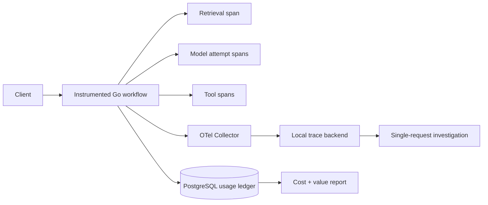
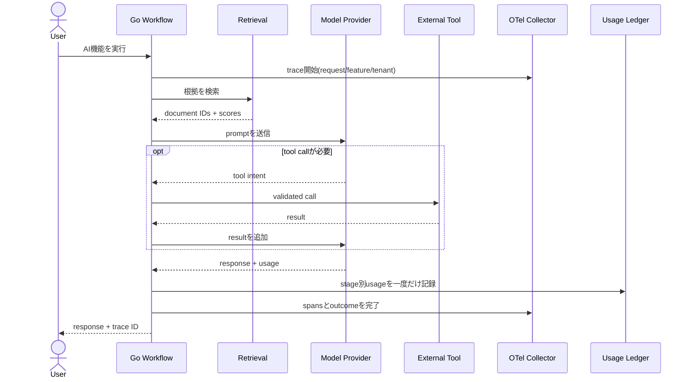

# AI Observability and Cost Attribution

「遅くて内容も間違っていた」という1回のAI処理をend-to-endで追跡し、費用増をmodel名ではなく機能・顧客・workflow・処理段階へ帰属させる仕組みをGoとOpenTelemetryで学ぶworkspaceです。

- Workspace status: `prepared`
- Active Section: `Section 1 — AI request identityとspan model`
- Current files: `README.md`のみ。これは意図した初期状態です。

## 学習の進め方

AIが欠落span、二重cost、secret leakageを検知するtestを書き、学習者がtrace context、structured event、usage ledger、redaction、samplingを実装します。local scripted LLM/RAG/tool workflowとOTel Collectorを使い、外部monitoring accountは不要です。

## 最終成果

1つのuser requestからretrieval、rerank、model、tool、retry、fallbackまで同じtraceで辿れます。各attemptのTTFT、latency、token、cache、error、quality signalを記録し、usageをtenant・feature・workflow・stageへ一度だけ計上します。PII/secretを保存せずにincident replayと月次cost差分を作れます。

## Scope / Non-goals

対象はtrace/span、correlation ID、structured event、GenAI attributes、quality feedback、usage/cost ledger、redaction、sampling、SLOです。vendor dashboard構築、prompt本文の無制限保存、billing invoice代替、production alert routingは対象外です。

## ユースケースと不変条件

- user request、agent run、model attempt、tool execution、retrieval queryを共通traceへ関連付ける。
- retry/fallback attemptを残しつつ、final usageとcostを二重計上しない。
- tenant、feature、workflow、stage、config versionを全usage recordへ持たせる。
- raw prompt、document body、tool secret、個人情報をdefaultでtelemetryへ保存しない。
- successだけでなくtimeout、cancel、parse error、partial streamをterminal outcomeとして残す。
- quality feedbackをresponse/traceへ結び付け、集計値から具体的な失敗へdrill-downできる。
- samplingしてもcost ledgerとcritical errorは欠落させない。

## システム全体像



### 代表シーケンス



## 外部システム

- OpenTelemetry Collector + local trace backend: OTLP trace/metricをDocker内で受け取り検索する。
- Docker PostgreSQL: immutable usage event、price table version、cost allocation、quality feedbackを保持する。
- local scripted workflow: retrieval、model retry、fallback、tool、partial streamを決定的に再現する。
- Prometheus互換local endpoint: RED/TTFT/token/cache/cost metricをtestから取得する。

## データモデルとtransaction境界

`AIRequest(trace_id,tenant,feature,workflow,config_version)`、`Attempts(provider,model,outcome,usage)`、`UsageEvents(idempotency_key,stage,units,price_version)`、`QualityFeedback`、`CostAllocations`を扱います。provider response受領とusage event appendを同一local transactionへまとめ、非同期exportはOutboxで行います。telemetry送信失敗はuser responseをrollbackしません。

## 目標layout

```text
ai-observability-cost-attribution/
├── README.md
├── go.mod
├── docker-compose.yml
├── migrations/
├── internal/{trace,metrics,redaction,usage,pricing,allocation,quality,postgres}/
├── cmd/{demo,report}/
└── test/{collector,fixtures,integration,e2e}/
```

## Section roadmap

| Section | State | 学ぶこと | 成果物 | 決定的なテスト |
| --- | --- | --- | --- | --- |
| 1. Request identityとspan | `active` | trace context、span hierarchy、config identity | trace model | 1 requestの全stageが同じtraceとparent関係を持つ |
| 2. Model/retrieval/tool telemetry | `locked` | TTFT、usage、cache、document/tool metadata | instrumentation hooks | success/error/cancelを共通attributeで記録する |
| 3. Redactionとdata policy | `locked` | PII、secret、hash、allowlist | safe attribute encoder | adversarial inputにもraw secretをexportしない |
| 4. Usage ledger | `locked` | attempt/final usage、idempotency、reconcile | immutable usage events | retry/fallbackでも同じunitを二重計上しない |
| 5. Cost attribution | `locked` | price version、tenant/feature/workflow/stage | allocation report | 月次増分を4軸とrequest traceへ分解する |
| 6. Quality/value linkage | `locked` | feedback、task success、business event | value report | 高cost低successのsegmentを特定できる |
| 7. SamplingとSLO | `locked` | head/tail sampling、critical keep、TTFT SLO | telemetry policy | normal traceをsampleしてもerrorとusageを保持する |
| 8. Incident E2E | `locked` | slow/wrong response、fallback、cost spike | investigation bundle | 1件の報告から原因attempt・data・config・costを再現する |

## Active Section — AI request identityとspan model

**Question:** 複数stageとretryを持つ1回の処理を、重複も孤児もなくどう表すか。

**Learn:** trace/span、parent/child、attempt、logical operation、correlation、config provenance。

**Decide:** request IDとtrace IDの役割、stage名、retryのspan表現、tenant/feature label、high-cardinality制御。

**Build:** RequestContext、Stage、Attempt、SpanAttributesのpure modelとvalidationを作る。

**Current micro-step:** AIがvalid workflow、orphan span、異なるtraceのparent、duplicate attempt、terminal outcomeなしのtestを書いてRedを作る。

**Tests:** hierarchy、propagation、attempt numbering、terminal state、attribute allowlist。

**Done when:** `go test ./internal/trace -count=1`がGreenになり、1 requestの全処理を一意なtreeとして表せる。

**Notes/evidence:** まだなし。

## Final acceptance

- unit、PostgreSQL、OTLP integration、race、cancel、retry/fallback、incident E2E testが成功する。
- 指定traceから全stage、config version、error、TTFT、usage、quality feedbackを復元できる。
- provider attemptの合計とusage ledgerが一致し、tenant/feature/workflow/stage別costの総和も一致する。
- secret fixtureがspan、metric、log、DBのどこにも平文で存在しない。

## Sources

- [OpenTelemetry GenAI semantic conventions](https://opentelemetry.io/docs/specs/semconv/gen-ai/)
- [OpenTelemetry traces](https://opentelemetry.io/docs/concepts/signals/traces/)
- [OpenTelemetry Collector](https://opentelemetry.io/docs/collector/)
- [OpenAI usage object](https://developers.openai.com/api/reference/resources/responses/methods/create)
