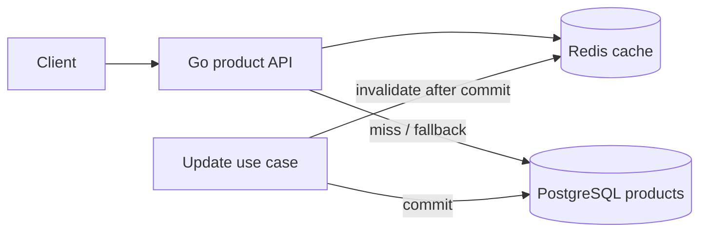
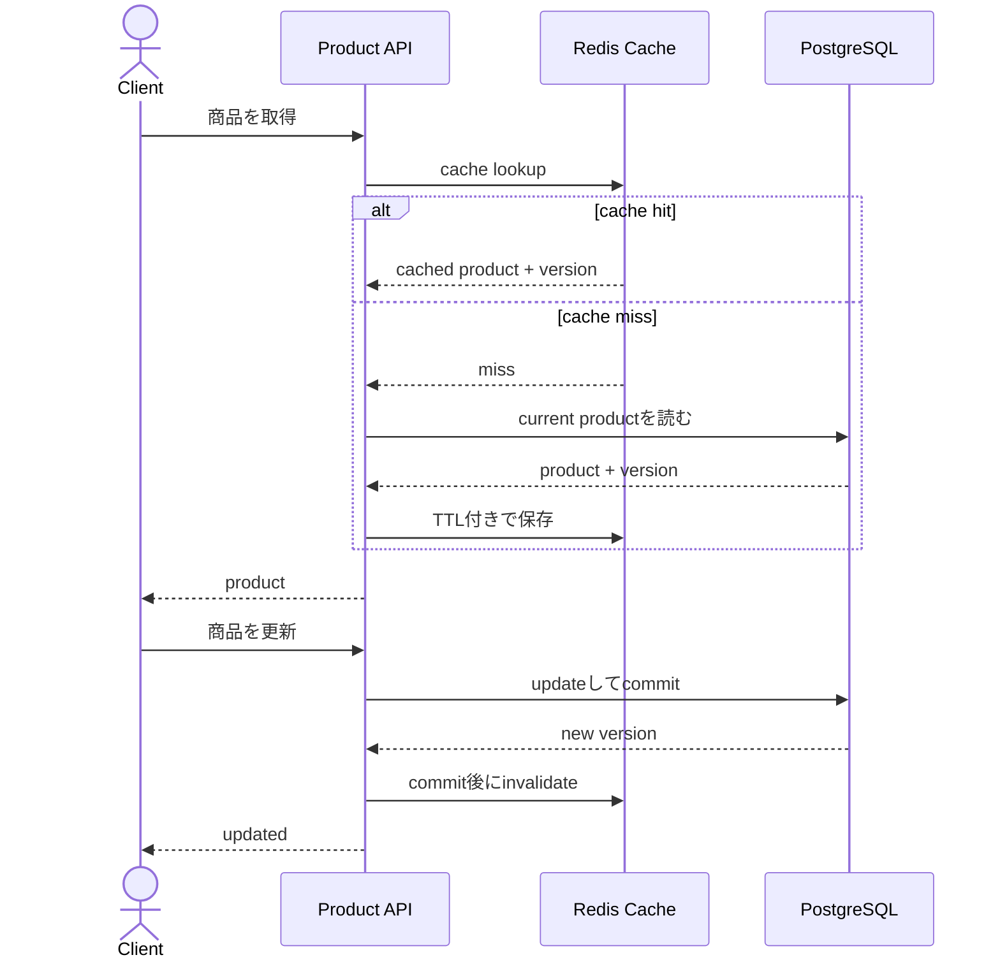

# Cache Consistency and Stampede Control

PostgreSQLをsource of truth、Redisをcacheとして使い、stale data、invalidation race、cache stampedeを意図的に再現して防ぐworkspaceです。

- Workspace status: `prepared`
- Active Section: `Section 1 — Cache-asideのread contract`
- Current files: `README.md`のみ。これは意図した初期状態です。

## 学習の進め方

AIがfake cacheと実Redisを使い分けてfailure testを書き、学習者がrepository、cache-aside、version、singleflight/leaseを実装します。cache hitだけを確認して終わりにはしません。

## 最終成果

商品detail APIにcache-asideを導入し、DB更新後に古いcacheを無効化します。更新とcache missが競合しても古いversionを再投入せず、hot keyの同時missを1回のDB loadへまとめます。Redis停止時はDBへ安全にfallbackし、negative cacheとTTL jitterも扱います。

## Scope / Non-goals

対象はcache-aside、versioned value、invalidation、stampede、negative cache、TTL jitter、fail-openです。CDN/browser cache、multi-region cache coherence、Redis Cluster運用、write-behindをsource of truthにする構成は対象外です。

## ユースケースと不変条件

- cache miss時はPostgreSQLから読み、結果をRedisへ保存する。
- cacheはDBより新しいversionを作らず、同じkeyのversionを後退させない。
- DB updateをcommitしてからcacheをinvalidateする。
- 同時missで多数のrequestが来てもDB loadを可能な限り1回へまとめる。
- not foundも短時間cacheするが、作成後のinvalidationで見えるようにする。
- Redis障害はread APIの正しさを壊さず、latency/DB負荷の劣化として扱う。
- PostgreSQLがsource of truth、Redisは失ってよいderived stateである。

## システム全体像



### 代表シーケンス



## 外部システム

- PostgreSQL（Docker）: productとmonotonic versionのsource of truth。
- Redis（Docker）: version付きserialized value、negative marker、TTL、stampede leaseを保持する。

## データモデルとtransaction境界

`products(id,name,price,version,updated_at)`と`CacheEntry(found,version,payload,cached_at)`を扱います。DB update transactionとRedis invalidationはatomicにはできないため、versioned cache writeと再試行可能なinvalidationでraceを制御します。

## 目標layout

```text
cache-consistency/
├── README.md
├── go.mod
├── compose.yaml
├── migrations/
├── cmd/api/
├── internal/{products,postgres,cache,service,httpapi}/
└── test/{integration,e2e}/
```

## Section roadmap

| Section | State | 学ぶこと | 成果物 | 決定的なテスト |
| --- | --- | --- | --- | --- |
| 1. Cache-aside read | `active` | hit/miss、source of truth、contract | read-through service boundary | hitはDBを読まず、missはDB結果をcacheする |
| 2. Real PostgreSQL/Redis | `locked` | serialization、TTL、integration | repositoryとcache adapter | Redisを空にしてもDBから同じresponseを返す |
| 3. Updateとinvalidation | `locked` | commit順序、partial failure、retry | update use case | rollback時はcacheを消さず、commit後に無効化する |
| 4. Version race | `locked` | stale repopulation、CAS、monotonic version | versioned cache write | 遅い旧readが新versionを上書きしない |
| 5. Stampede control | `locked` | singleflight、distributed lease、jitter | load coalescer | 100 concurrent missでDB loadがboundedになる |
| 6. Negative cache | `locked` | penetration、短TTL、create race | not-found entry | 存在しないkey連打を抑え、create後は取得できる |
| 7. Failure policy | `locked` | timeout、fallback、stale-if-error | resilient read path | Redis停止/遅延時もpolicyどおりDBまたはstaleを返す |
| 8. HTTPとE2E | `locked` | observable cache behavior、metrics | product API | hit/miss/update/race/failureを実境界で再現する |

## Active Section — Cache-asideのread contract

**Question:** cacheとrepositoryの責務をどこで分け、hit/miss/not-foundを曖昧にせず表すか。

**Learn:** cache-aside、source of truth、cache missとcached not-foundの違い、port/interface ownership。

**Decide:** cache result型、serialization前のdomain型、not-found error、cache write failureをresponse failureにするか。

**Build:** Product、Repository、Cache、GetProduct serviceの最小境界を作る。

**Current micro-step:** AIがcache hitではrepositoryを呼ばず、missではrepository結果を返すtestを書いてRedを作る。

**Tests:** hit、miss、DB not found、cache read/write error、nil/zero value。

**Done when:** `go test ./internal/service -run 'TestGetProduct' -count=1`がGreenになり、cache error policyを説明できる。

**Notes/evidence:** まだなし。

## Final acceptance

- PostgreSQL/Redis integration、race injection、100 concurrent miss、Redis failure、HTTP E2Eが成功する。
- 古いDB readを意図的に遅延させてもcache versionが後退しない。
- cache全削除後にもsource of truthから復旧し、結果の正しさが変わらない。

## Sources

- [Redis key expiration](https://redis.io/docs/latest/develop/data-types/strings/#key-expiration)
- [Redis distributed locks](https://redis.io/docs/latest/develop/clients/patterns/distributed-locks/)
- [PostgreSQL transaction isolation](https://www.postgresql.org/docs/current/transaction-iso.html)
