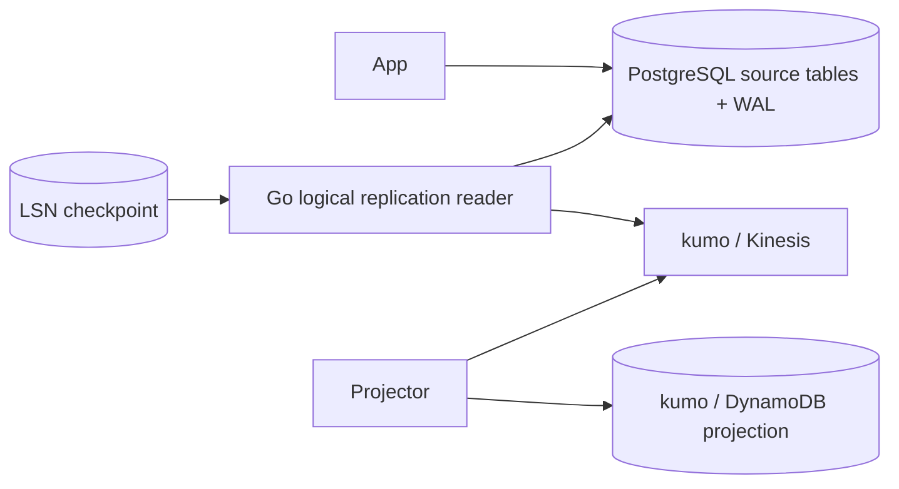

# PostgreSQL CDC Projection Pipeline

PostgreSQLのlogical replication streamをGoで読み、変更をKinesis経由でDynamoDB projectionへ反映するCDC workspaceです。

- Workspace status: `prepared`
- Active Section: `Section 1 — Change envelopeとordering identity`
- Current files: `README.md`のみ。これは意図した初期状態です。

## 学習の進め方

AIがLSN、duplicate、snapshot境界のtestを書き、学習者がreplication設定、decoder、checkpoint、Kinesis/DynamoDB adapterを実装します。Outboxとの設計差もevidenceとして残します。

## 最終成果

商品tableのinsert/update/deleteをlogical replication slotから取得し、normalized change eventとしてkumo/Kinesisへ送り、DynamoDBのcatalog projectionを更新します。consumer再起動、duplicate、schema追加、初期snapshotとlive streamの接続でも欠落しません。

## Scope / Non-goals

対象はlogical decoding、LSN、replication slot、snapshot、checkpoint、idempotent sink、schema evolution、backfill/catch-upです。Debezium、managed DMS、multi-database transaction、DDL自動変換、production WAL容量運用は対象外です。

## ユースケースと不変条件

- 同じLSN/change identityを再処理してもprojection effectを重複させない。
- source transaction内のchange順序を保持する。
- checkpointはsink effect成功後だけ進める。
- initial snapshotとstream開始位置の間に欠落を作らない。
- 未知column追加は既知fieldのdecodeを壊さないpolicyにする。
- replication slot停止中のWAL保持量を観測できる。
- PostgreSQLがsource of truth、Kinesis/DynamoDBは再生成可能なderived stateである。

## システム全体像



## 外部システム

- PostgreSQL（Docker）: `wal_level=logical`、publication、replication slot、real WAL/LSNを扱う。
- kumo/Kinesis: partition key、retry可能なchange transportを再現する。
- kumo/DynamoDB: version/LSN conditional writeを持つread projection。

## データモデルとtransaction境界

`ChangeEnvelope(source,table,operation,transaction_id,lsn,key,before,after,schema_version)`と`cdc_checkpoints`を扱います。source commitはCDC外で完了済みです。sinkはchange適用とprocessed LSNをconditionalに進め、reader acknowledgementはその後に行います。

## 目標layout

```text
cdc-projection-pipeline/
├── README.md
├── go.mod
├── compose.yaml
├── migrations/
├── cmd/{source-api,cdc-reader,projector,snapshot}/
├── internal/{changes,pgoutput,checkpoint,kinesis,dynamodb,snapshot}/
└── test/e2e/
```

## Section roadmap

| Section | State | 学ぶこと | 成果物 | 決定的なテスト |
| --- | --- | --- | --- | --- |
| 1. Change envelope | `active` | identity、operation、ordering、version | normalized change model | insert/update/deleteを安定したidentityで表す |
| 2. Logical replication setup | `locked` | WAL、publication、slot、LSN | Docker PostgreSQL config | committed changeだけをslotから読める |
| 3. pgoutput decode | `locked` | relation metadata、transaction boundary | Go decoder | multi-row transactionを順序付きでdecodeする |
| 4. Kinesis publication | `locked` | partition key、retry、checkpoint timing | stream publisher | publish失敗時にLSNを進めず再送できる |
| 5. DynamoDB projection | `locked` | idempotency、conditional write、delete | projector | duplicate/stale changeが新stateを上書きしない |
| 6. Initial snapshot | `locked` | consistent snapshot、high-water mark | snapshot loader | snapshotとlive streamを欠落・重複なく接続する |
| 7. Schema evolution/recovery | `locked` | added column、decoder restart、WAL lag | compatibility policy | additive changeとconsumer停止から復旧する |
| 8. E2EとOutbox比較 | `locked` | CDC semantics、business eventとの差 | full pipeline evidence | SQL変更→DynamoDB収束とtrade-offを確認する |

## Active Section — Change envelopeとordering identity

**Question:** database row changeをtransportやsinkに依存せず、retryと順序判定に必要な情報を持つ形へどう正規化するか。

**Learn:** LSN、transaction ID、row key、before/after、database changeとdomain eventの違い。

**Decide:** change ID、delete payload、schema version、同一transaction内sequence、unknown column policy。

**Build:** ChangeEnvelope、Operation、Position、ordering/idempotency validationをpure domainで作る。

**Current micro-step:** AIがinsert/update/deleteと同一transaction内sequenceを表し、不正positionを拒否するtestを書いてRedを作る。

**Tests:** empty key、LSN ordering、duplicate position、delete without after、unknown operation、schema version。

**Done when:** `go test ./internal/changes -count=1`がGreenになり、change identityとbusiness event IDを混同しない。

**Notes/evidence:** まだなし。

## Final acceptance

- real logical replication、kumo Kinesis/DynamoDB、restart、duplicate、snapshot、schema evolution、E2Eが成功する。
- reader/projectorを任意箇所で停止し、再開後にsourceとprojectionが一致する。
- Outboxでは表せるがCDCでは失われるbusiness intentを具体例で記録する。

## Sources

- [PostgreSQL Logical Replication](https://www.postgresql.org/docs/current/logical-replication.html)
- [PostgreSQL Logical Decoding Concepts](https://www.postgresql.org/docs/current/logicaldecoding-explanation.html)
- [Amazon Kinesis key concepts](https://docs.aws.amazon.com/streams/latest/dev/key-concepts.html)
- [kumo](https://github.com/sivchari/kumo)
