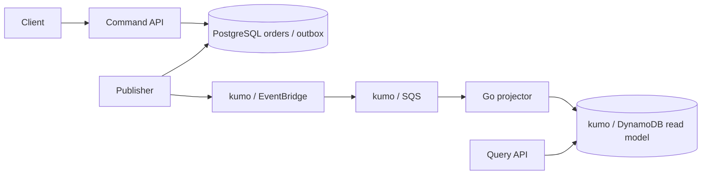
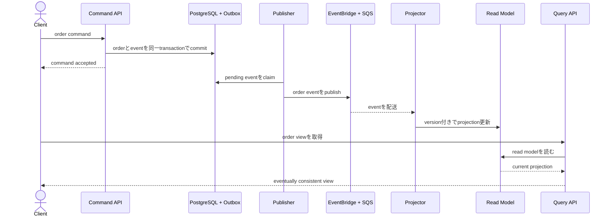

# CQRS Order Projection

注文の更新に適したwrite modelと、一覧表示に適したread modelを分離し、eventから非同期projectionを作るworkspaceです。

- Workspace status: `prepared`
- Active Section: `Section 1 — Commandとorder lifecycle`
- Current files: `README.md`のみ。これは意図した初期状態です。

## 学習の進め方

AIがcommandとprojectionのbehavior testを書き、学習者がdomain、PostgreSQL、outbox publisher、projector、DynamoDB accessを実装します。eventual consistencyを隠さずtestします。

## 最終成果

注文作成・支払済み・発送済みというcommandをPostgreSQLのwrite modelへ適用し、Outbox eventをEventBridgeからSQSへ配送します。projectorがDynamoDBのuser別注文一覧を更新し、duplicate・順不同eventを安全に処理します。read modelを全eventから再構築できます。

## Scope / Non-goals

対象はCQRS、Transactional Outbox、event version、idempotent projection、gap検出、read-your-write token、rebuildです。microservice分割、複数region、full event sourcing、検索engine、BI analyticsは対象外です。

## ユースケースと不変条件

- write modelは`created -> paid -> shipped`の順だけを許可する。
- state changeとdomain eventはPostgreSQLでatomicにcommitする。
- 同じeventを再処理してもprojectionは増えない。
- 古いversionを新しいprojectionへ上書きしない。
- version gapを検出したprojectionは勝手に飛び越さずreconcile対象にする。
- PostgreSQLのorder/eventがsource of truth、DynamoDB projectionは再構築可能である。

## システム全体像



### 代表シーケンス



## 外部システム

- PostgreSQL（Docker）: write model、aggregate version、outbox eventのsource of truth。
- kumo/EventBridge: event typeによるrouting boundary。
- kumo/SQS: projectorへのbufferと再配信。
- kumo/DynamoDB: `user_id + updated_at/order_id`のquery向けread model。

## データモデルとtransaction境界

`orders(id,user_id,status,version)`、`outbox_events(event_id,aggregate_id,aggregate_version,type,payload)`、`order_summaries(user_id,sort_key,status,total,version)`を扱います。command transactionはorder updateとoutbox insertをatomicにします。projection更新はevent IDとaggregate versionのconditional writeで守ります。

## 目標layout

```text
cqrs-order-projection/
├── README.md
├── go.mod
├── compose.yaml
├── migrations/
├── cmd/{command-api,publisher,projector,query-api,rebuild}/
├── internal/{orders,postgres,outbox,events,projection,dynamodb,httpapi}/
└── test/e2e/
```

## Section roadmap

| Section | State | 学ぶこと | 成果物 | 決定的なテスト |
| --- | --- | --- | --- | --- |
| 1. Commandとlifecycle | `active` | aggregate、state transition、version | Order domain | 不正遷移を拒否し成功ごとにversionが1増える |
| 2. Write modelとOutbox | `locked` | atomic commit、optimistic lock | PostgreSQL command store | stateとeventが共にcommit/rollbackする |
| 3. EventBridge routing | `locked` | publish、event type、retry | outbox publisherとrule | order eventだけがprojector queueへ届く |
| 4. Idempotent projection | `locked` | duplicate、conditional write、ordering | DynamoDB projector | duplicate/stale eventがread modelを壊さない |
| 5. Query model | `locked` | access pattern、pagination、denormalization | user別order API | joinなしで安定したcursor paginationを返す |
| 6. Consistency contract | `locked` | lag、read-your-write、version token | pending/ready query | clientが要求versionへの追従を判定できる |
| 7. Rebuildとschema version | `locked` | replay、blue/green projection | versioned rebuild command | 新table完成まで現行readを壊さず切替できる |
| 8. E2E | `locked` | commandからqueryまでのeventual outcome | full system test | HTTP command後にDynamoDB queryが期待versionへ収束 |

## Active Section — Commandとorder lifecycle

**Question:** write modelが許す状態遷移と、各変更から発生するevent/versionをどう一つのaggregateで表すか。

**Learn:** command、aggregate invariant、domain event、optimistic version。

**Decide:** lifecycle、idempotent commandの応答、totalの表現、event payloadに含める最小情報。

**Build:** Order、status transition、version、pending domain eventをpure domainで作る。

**Current micro-step:** AIがnew orderの初期状態と、未支払orderを発送できないtestを書いてRedを作る。

**Tests:** valid transition、不正順序、同じcommand再適用、version、生成event。

**Done when:** `go test ./internal/orders -count=1`がGreenになり、状態とeventの対応がtable-driven testで読める。

**Notes/evidence:** まだなし。

## Final acceptance

- domain、PostgreSQL、kumo EventBridge/SQS/DynamoDB、rebuild、HTTP E2Eのtestが成功する。
- duplicate、stale、gap eventを注入してprojectionの収束または保留を観測できる。
- source eventから空のread modelを再生成し、既存queryと同じ結果になる。

## Sources

- [AWS Prescriptive Guidance: CQRS pattern](https://docs.aws.amazon.com/prescriptive-guidance/latest/cloud-design-patterns/cqrs.html)
- [Amazon EventBridge event buses](https://docs.aws.amazon.com/eventbridge/latest/userguide/eb-event-bus.html)
- [DynamoDB condition expressions](https://docs.aws.amazon.com/amazondynamodb/latest/developerguide/Expressions.ConditionExpressions.html)
- [kumo](https://github.com/sivchari/kumo)
