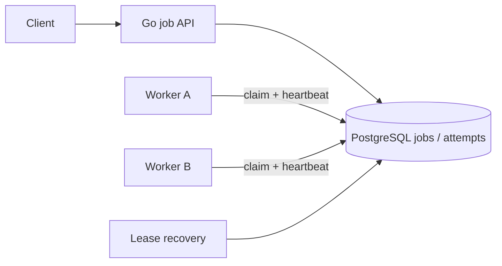
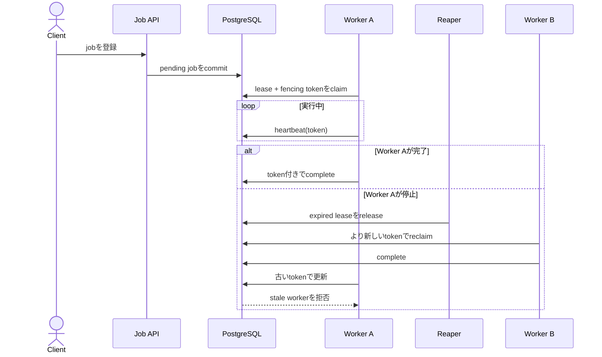

# Distributed Job Scheduler

複数のGo workerで予約jobを安全にclaimし、crash、retry、cancel、lease切れがあっても処理を継続できる汎用job基盤を学ぶworkspaceです。

- Workspace status: `prepared`
- Active Section: `Section 1 — Job lifecycleと実行可能条件`
- Current files: `README.md`のみ。これは意図した初期状態です。

## 学習の進め方

AIがfake clockとfailure injectionを使うtestを書き、学習者がdomain、SQL、worker、lease、runtime設定を実装します。process内goroutineが動いただけでは完了にしません。

## 最終成果

即時・予約・priority付きjobを登録し、複数workerが重複claimせず実行します。worker停止時はlease expiryから回収し、retryable failureはbackoff後に再実行、permanent failureはdead状態へ移します。cancelと実行開始のrace、古いworkerの遅延完了も安全に扱います。

## Scope / Non-goals

対象はdurable queue、scheduled execution、lease、heartbeat、fencing token、retry、cancel、priority、graceful shutdownです。cron式parser、workflow DAG、multi-region scheduler、exactly-once executionは対象外です。

## ユースケースと不変条件

- queuedかつ`run_at <= now`のjobだけをclaimできる。
- 同じ時点で1 jobを所有する有効leaseは最大1つである。
- expired leaseは別workerが回収できる。
- 古いfencing tokenを持つworkerは新ownerの結果を上書きできない。
- attempt上限を超えたjobはdeadになり無限retryしない。
- cancel済みjobは新しく開始しない。実行中cancelの意味はpolicyで明示する。
- PostgreSQLがjobとattempt historyのsource of truthである。

## システム全体像



### 代表シーケンス



## 外部システム

- PostgreSQL（Docker）: durable job、lease、attempt、fencing tokenをtransactionとrow lockで所有する。
- AWSサービスは使わない。中心課題をPostgreSQLの`SKIP LOCKED`とtest clockだけで再現できるためである。

## データモデルとtransaction境界

`jobs(id,type,payload,status,run_at,priority,attempts,max_attempts,lease_until,fencing_token)`と`job_attempts`を扱います。claim transactionは実行可能jobをlockし、owner、lease、token、attemptをatomicに更新します。business effectは別resourceになり得るため、handler側にもidempotencyが必要です。

## 目標layout

```text
distributed-job-scheduler/
├── README.md
├── go.mod
├── compose.yaml
├── migrations/
├── cmd/{api,worker}/
├── internal/{jobs,postgres,scheduler,worker,httpapi}/
└── test/{concurrency,e2e}/
```

## Section roadmap

| Section | State | 学ぶこと | 成果物 | 決定的なテスト |
| --- | --- | --- | --- | --- |
| 1. Job lifecycle | `active` | state machine、time、retry分類 | Job domain | 実行可能時刻と一方向の状態遷移を守る |
| 2. PostgreSQL queue | `locked` | schema、index、transaction | durable job repository | due/priority順でjobを取得し不正状態をDBが拒否 |
| 3. 並行claim | `locked` | `SKIP LOCKED`、worker競合 | claim operation | 複数workerが同じjobを同時所有しない |
| 4. Leaseとheartbeat | `locked` | failure detection、renew、clock | renewable ownership | 稼働ownerは維持し停止ownerだけ回収する |
| 5. Fencing token | `locked` | stale worker、monotonic token | guarded completion | lease切れworkerの遅い完了を拒否する |
| 6. Retryとdead job | `locked` | exponential backoff、jitter、上限 | attempt policy | retry時刻とdead遷移がfake clockで決定的になる |
| 7. Cancelとshutdown | `locked` | race、context cancel、drain | worker lifecycle | claim/cancel競合とshutdownでjobを失わない |
| 8. APIとE2E | `locked` | enqueue/status/retry、観測 | job system test | crash→lease回収→成功まで実DBで再現する |

## Active Section — Job lifecycleと実行可能条件

**Question:** queued、running、succeeded、failed、dead、cancelledのどの遷移だけを許し、時刻をどう判定するか。

**Learn:** durable state machine、fake clock、retryable/permanent failure、executionとeffectの違い。

**Decide:** status、attempt countの増加点、cancel semantics、failure分類、zero timeの扱い。

**Build:** Job、Status、ExecutionDecision、RetryPolicyのpure domainを作る。

**Current micro-step:** AIが未来jobは実行不可、due jobは実行可能、terminal jobは再claim不可というtestを書いてRedを作る。

**Tests:** exactly run_at、cancelled/dead、invalid transition、attempt上限、clock境界。

**Done when:** `go test ./internal/jobs -count=1`がsleepなしでGreenになる。

**Notes/evidence:** まだなし。

## Final acceptance

- domain、PostgreSQL integration、100並行claim、lease recovery、race、HTTP E2Eが成功する。
- workerを意図的に停止し、lease後に別workerが同じjobを完了できる。
- stale token、duplicate completion、cancel/retryでもterminal effectが増えない。

## Sources

- [PostgreSQL SELECT locking clause](https://www.postgresql.org/docs/current/sql-select.html#SQL-FOR-UPDATE-SHARE)
- [PostgreSQL explicit locking](https://www.postgresql.org/docs/current/explicit-locking.html)
- [AWS Builders' Library: timeouts, retries and backoff with jitter](https://aws.amazon.com/builders-library/timeouts-retries-and-backoff-with-jitter/)
