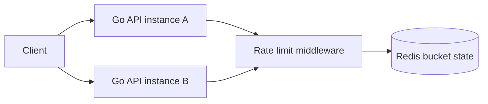

# Distributed Rate Limiter

複数のGo API instanceで共有できるrate limitを、Redisの原子操作と明示的な障害方針で作るworkspaceです。

- Workspace status: `prepared`
- Active Section: `Section 1 — Token bucketの時間モデル`
- Current files: `README.md`のみ。これは意図した初期状態です。

## 学習の進め方

AIがfake clockを使うalgorithm testから始め、学習者がRedis script、middleware、header、fallbackを実装します。sleepに依存するflaky testは作りません。

## 最終成果

tenant・API route単位のtoken bucket limiterを提供し、複数instanceから同時requestが来てもcapacityを超えて許可しません。`Retry-After`と残量を返し、Redis timeout時にfail-open/fail-closedをroute policyで選べます。

## Scope / Non-goals

対象はtoken bucket、Redis atomicity、key設計、clock、burst、HTTP middleware、failure policyです。WAF/DDoS防御、global multi-region quota、billing quota、Redis Clusterの実運用benchmarkは対象外です。

## ユースケースと不変条件

- bucket tokenは0未満、capacity超過にならない。
- 同じ時刻・同じstate・同じcostなら判定は決定論的である。
- refillは経過時間に比例し、clockが逆行してtokenを増やさない。
- Redis上のread/refill/decrementを1つのatomic operationにする。
- tenantとrouteが異なるrequestは独立したquotaを持つ。
- Redis障害時の許可/拒否は暗黙の偶然ではなくpolicyで決める。

## システム全体像



## 外部システム

- Redis（Docker）: bucket tokenとlast refill時刻を保持し、Lua scriptで判定を原子的に行う。
- PostgreSQL/AWSは使わない。中心課題に不要な境界を増やさない。

## データモデルとtransaction境界

`BucketKey(tenant,route)`、`Policy(capacity,refill_rate,cost,fail_mode)`、`BucketState(tokens,last_refill)`を扱います。1 requestのrefill・allow判定・decrementがRedis scriptのatomic境界です。policyは初期版ではprocess内設定とします。

## 目標layout

```text
distributed-rate-limiter/
├── README.md
├── go.mod
├── compose.yaml
├── internal/{bucket,redislimiter,middleware}/
├── cmd/api/
└── test/{integration,e2e}/
```

## Section roadmap

| Section | State | 学ぶこと | 成果物 | 決定的なテスト |
| --- | --- | --- | --- | --- |
| 1. Token bucket model | `active` | capacity、refill、fake clock | pure bucket transition | burst、refill、clock逆行で不変条件を守る |
| 2. Policyとkey設計 | `locked` | tenant isolation、route scope、cost | policy resolver | tenant/routeごとに独立bucketを選ぶ |
| 3. Redis atomic script | `locked` | Lua、race、TTL | shared limiter | 100 concurrent requestの許可数がcapacityと一致 |
| 4. HTTP contract | `locked` | 429、Retry-After、headers | middleware | allow/denyとheader値が同じdecision由来になる |
| 5. Failure policy | `locked` | timeout、fail-open/closed、budget | resilient wrapper | Redis停止時にroute別policyどおり応答する |
| 6. Dynamic policy cache | `locked` | config version、stale policy | reloadable policy store | 更新中も旧/新versionのどちらか一方を使う |
| 7. E2E | `locked` | multi-instance共有、observability | 2 API instance test | 両instance合計でquotaを超えない |

## Active Section — Token bucketの時間モデル

**Question:** wall clockとRedisを使う前に、token refillと消費を決定論的なstate transitionとしてどう表すか。

**Learn:** token bucket、burst capacity、monotonic elapsed time、integer/fixed-point計算。

**Decide:** token精度、refill単位、境界時刻、1 requestのcost、clock逆行時の扱い。

**Build:** BucketState、Policy、Allow(now,cost)のpure transitionを作る。

**Current micro-step:** AIが満杯bucket、capacityを超えるburst、時間経過後のrefillをfake timeで固定するtestを書いてRedを作る。

**Tests:** exactly capacity、1超過、partial refill、長時間経過、clock逆行、invalid policy。

**Done when:** `go test ./internal/bucket -count=1`がsleepなしでGreenになる。

**Notes/evidence:** まだなし。

## Final acceptance

- pure model、Redis integration、concurrency、HTTP、Redis failure、race testが成功する。
- 2つのAPI instanceへ並行requestしても合計許可数がpolicyに一致する。
- deny responseのretry時刻と内部refill計算が矛盾しない。

## Sources

- [Redis scripting](https://redis.io/docs/latest/develop/programmability/eval-intro/)
- [Redis command atomicity and transactions](https://redis.io/docs/latest/develop/interact/transactions/)
- [HTTP 429 Too Many Requests](https://www.rfc-editor.org/rfc/rfc6585#section-4)
