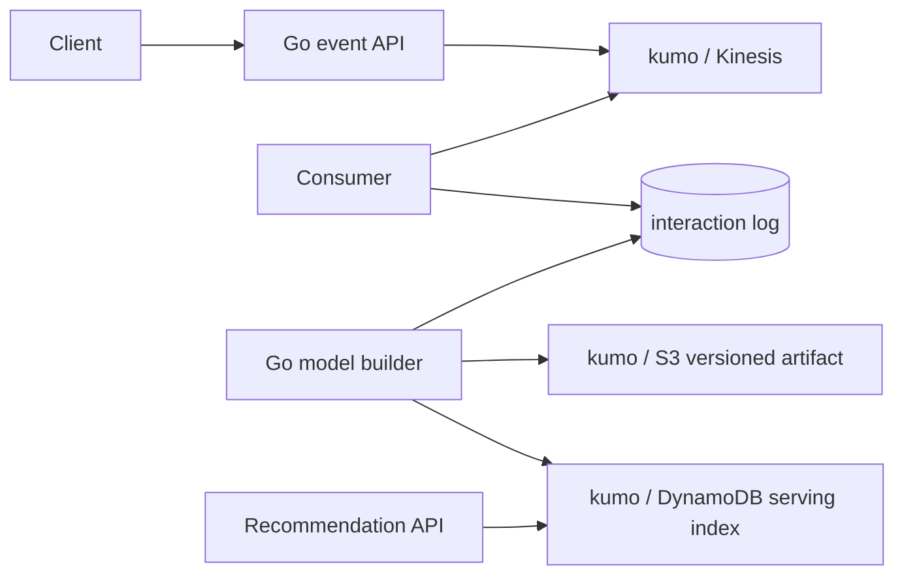
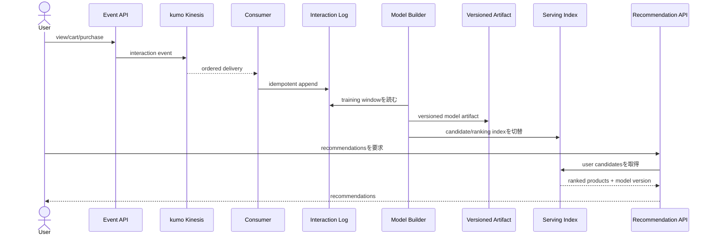

# Ecommerce Recommendation System

ECサイトの閲覧・cart・purchase履歴から、外部ML APIを使わずに商品推薦を作るpipelineを学ぶworkspaceです。

- Workspace status: `prepared`
- Active Section: `Section 1 — Interactionと推薦結果の評価`
- Current files: `README.md`のみ。これは意図した初期状態です。

## 学習の進め方

AIが小さなbehavior testを書き、期待するRedと次の実装を説明します。学習者がGo実装・schema・runtime設定を入力し、各Sectionをtest evidenceで閉じます。

## 最終成果

view、cart、purchaseのeventを取り込み、item-to-item co-visitationからcandidateを作り、在庫・既購入・category偏重を考慮してuserごとのTop-Nを返します。履歴のないuserにはpopularity fallbackを返し、model versionを切り替えてもread中の結果を壊しません。

## Scope / Non-goals

対象はimplicit feedback、重み付け、co-visitation、candidate生成、rule-based ranking、batch artifact、online servingです。deep learning、embedding生成、A/B testing基盤、広告auction、Amazon Personalizeや外部feature storeは対象外です。

## ユースケースと不変条件

- 同じevent IDは一度だけ学習入力へ反映する。
- purchaseはcartより、cartはviewより強いsignalとして扱う。
- 非公開・在庫切れ・本人が購入済みの商品を結果から除外できる。
- score同値時の順序は決定論的にする。
- modelはversion単位でimmutableに公開し、途中生成物をonline readへ見せない。
- event logがsource、S3のmodel artifactとDynamoDB serving rowsは再生成可能なderived stateである。

## システム全体像



### 代表シーケンス



## 外部システム

- kumo/Kinesis: event ingestionとpartition keyによるuser内順序を観察する。
- kumo/S3: versioned model artifactを保存する。
- kumo/DynamoDB: userまたはitemごとのonline candidateを低latency key-value readとして表す。
- 外部MLサービスは使わず、small datasetとGoの決定論的algorithmでtestする。

## データモデルとtransaction境界

`Interaction(event_id,user_id,item_id,kind,occurred_at)`、`Item`、`ItemSimilarity(model_version,item_id,related_item_id,score)`、`Recommendation(model_version,user_id,rank,item_id,score,reasons)`を扱います。ingestionの冪等性とmodel publishのversion切替は別境界です。build完了前のversionをactiveにしません。

## 目標layout

```text
ecommerce-recommendation/
├── README.md
├── go.mod
├── compose.yaml
├── cmd/{ingest,model-builder,api}/
├── internal/{interaction,covisitation,ranking,pipeline,awsstore,httpapi}/
├── testdata/
└── test/e2e/
```

## Section roadmap

| Section | State | 学ぶこと | 成果物 | 決定的なテスト |
| --- | --- | --- | --- | --- |
| 1. Interactionと評価 | `active` | implicit feedback、score、fixture | eventと期待Top-Nのdomain | purchase/cart/viewの重みとtie-breakが決定論的 |
| 2. Popularity fallback | `locked` | cold start、集計、filter | 全体/category人気候補 | 履歴なしuserにも禁止商品なしでN件返す |
| 3. Co-visitation candidate | `locked` | item-item協調filter、正規化 | similarity builder | 共起の強い商品が無関係商品より上位になる |
| 4. Kinesis ingestion | `locked` | partition、重複、checkpoint | event consumer | duplicate eventを1回だけ反映しuser内順序を保つ |
| 5. Versioned batch artifact | `locked` | batch、immutable artifact、atomic publish | S3 model artifact | 失敗buildはactive versionを変更しない |
| 6. DynamoDB serving index | `locked` | access pattern、batch write、version key | online read model | version切替前後で混在結果を返さない |
| 7. Rankingとdiversity | `locked` | candidate/ranker分離、business rule | Top-N ranker | 在庫・購入済み除外とcategory偏重抑制が効く |
| 8. APIとE2E | `locked` | offline/online接続、観測 | recommendation API | event投入→build→Top-N responseをkumo上で再現 |

## Active Section — Interactionと推薦結果の評価

**Question:** 行動の強さと推薦の良さを、外部ML modelなしでどうtest可能な値として定義するか。

**Learn:** implicit feedback、weighted signal、training/servingの入力契約、precision@kの最小概念。

**Decide:** event kindの重み、同一user/itemの反復をどう数えるか、同点の安定順序、Top-NのN。

**Build:** Interaction kind、weighted signal、ranked item、small fixtureの評価関数を作る。

**Current micro-step:** AIがview/cart/purchaseの重み順と未知kind拒否を固定するtestを書き、domain modelのRedを作る。

**Tests:** signal weight、zero/unknown value、同点、入力順を変えた決定性。

**Done when:** `go test ./internal/interaction -count=1`がGreenになり、small fixtureの期待scoreを説明できる。

**Notes/evidence:** まだなし。

## Final acceptance

- pure algorithm test、kumo integration、duplicate/retry、model publish failure、HTTP E2Eが成功する。
- cold userと履歴ありuserの両方で、除外ruleを守った決定論的Top-Nを返す。
- 同じevent setから同じmodel version artifactを再生成できる。

## Sources

- [Amazon Kinesis Data Streams concepts](https://docs.aws.amazon.com/streams/latest/dev/key-concepts.html)
- [Amazon S3 data consistency model](https://docs.aws.amazon.com/AmazonS3/latest/userguide/Welcome.html#ConsistencyModel)
- [DynamoDB partition key design](https://docs.aws.amazon.com/amazondynamodb/latest/developerguide/bp-partition-key-design.html)
- [kumo](https://github.com/sivchari/kumo)
