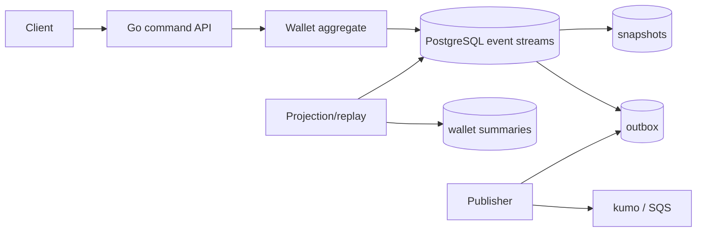
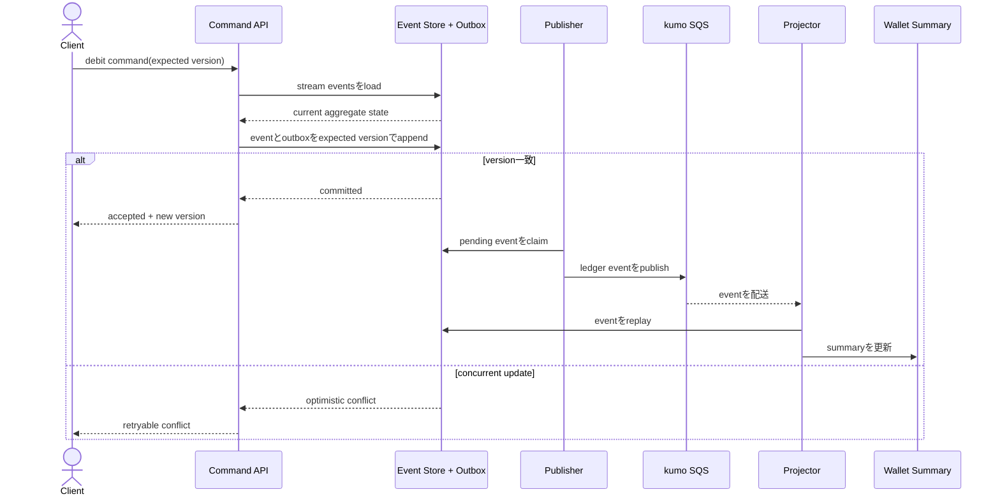

# Event-Sourced Wallet Ledger

walletのcredit/debitをappend-only eventとして保存し、current balance、snapshot、projectionを履歴から再構築するworkspaceです。

- Workspace status: `prepared`
- Active Section: `Section 1 — Eventから状態をfoldする`
- Current files: `README.md`のみ。これは意図した初期状態です。

## 学習の進め方

AIがevent historyとcommandのtestを書き、学習者がaggregate、PostgreSQL event store、snapshot、projection、publisherを実装します。金融サービスそのものではなくevent sourcingの学習用です。

## 最終成果

walletへcredit/debit commandを適用し、event streamへexpected version付きでappendします。並行debitの二重消費を防ぎ、同じcommand retryを冪等にし、snapshotから高速復元します。event全件replayでbalanceとtransaction history projectionを再構築し、新eventをSQSへ配信します。

## Scope / Non-goals

対象はevent sourcing、aggregate fold、optimistic concurrency、idempotent command、snapshot、projection、replay、Outboxです。会計帳簿の法的要件、複式簿記、為替、決済network、event削除/GDPRの完全解は対象外です。金額は最小通貨単位の整数にします。

## ユースケースと不変条件

- balanceはevent historyからのみ導出し、直接上書きしない。
- debit後のbalanceを0未満にしない。
- stream versionはeventごとに1増え、同じversionを2件appendしない。
- 同一command IDのretryは新eventを追加せず元のresultへ収束する。
- snapshotはderived stateで、壊れたり消えたりしても全eventから復元できる。
- PostgreSQL event streamがsource of truth、projectionとSQSは再構築/再配信可能である。

## システム全体像



### 代表シーケンス



## 外部システム

- PostgreSQL（Docker）: ordered event stream、expected version constraint、command receipt、snapshot、projection、outboxを保存する。
- kumo/SQS: committed ledger eventを後続へ配送し、publisher retryを確認する。

## データモデルとtransaction境界

`wallet_events(stream_id,version,event_id,command_id,type,payload,occurred_at)`、`wallet_snapshots(stream_id,version,state)`、`wallet_summaries`、`outbox_events`を扱います。command transactionはexpected versionを検査してeventとcommand receipt/outboxをatomic appendします。aggregate stateはloadしたhistoryをfoldして得ます。

## 目標layout

```text
event-sourced-ledger/
├── README.md
├── go.mod
├── compose.yaml
├── migrations/
├── cmd/{api,projector,publisher,rebuild}/
├── internal/{wallet,eventstore,postgres,snapshot,projection,outbox,httpapi}/
└── test/e2e/
```

## Section roadmap

| Section | State | 学ぶこと | 成果物 | 決定的なテスト |
| --- | --- | --- | --- | --- |
| 1. Event fold | `active` | event/state分離、rehydration、不変条件 | Wallet aggregate | historyをfoldしてbalance/versionを再現する |
| 2. Command decision | `locked` | decide/evolve、domain error、event生成 | credit/debit command | insufficient fundsはeventを生成しない |
| 3. PostgreSQL event store | `locked` | append-only、stream version、transaction | event repository | expected version競合の片方だけがappend成功 |
| 4. Command idempotency | `locked` | retry identity、response replay | command receipt | 同じcommand再送でstream versionが増えない |
| 5. Snapshot | `locked` | performance cache、version、fallback | snapshot store | snapshot+tailと全replayが同じstateになる |
| 6. Projectionとrebuild | `locked` | read model、checkpoint、replay | wallet summary/history | 空projectionを全eventから同じ結果へ戻せる |
| 7. OutboxとSQS | `locked` | commit/publish境界、duplicate | event publisher | SQS停止後のretryで全committed eventが届く |
| 8. HTTPとE2E | `locked` | command/query/audit、concurrency | wallet API | 並行debit、retry、rebuildをend-to-end確認 |

## Active Section — Eventから状態をfoldする

**Question:** mutable balanceを保存する代わりに、ordered event historyから同じstateを毎回導けるか。

**Learn:** event sourcing、rehydration、decide/evolve分離、event version、money integer。

**Decide:** WalletOpenedを必要にするか、credit/debit event payload、zero amount、overflow、empty historyの扱い。

**Build:** WalletID、Money、Credited/Debited event、Fold/ApplyによるWallet stateをpure domainで作る。

**Current micro-step:** AIがcredit/debit historyからbalanceとversionを復元し、不正event historyを拒否するtestを書いてRedを作る。

**Tests:** empty history、creditのみ、credit→debit、負amount、insufficient history、event順序、overflow。

**Done when:** `go test ./internal/wallet -run 'TestFold' -count=1`がGreenになり、stateを直接書き換えるpublic APIがない。

**Notes/evidence:** まだなし。

## Final acceptance

- domain、PostgreSQL append/concurrency、snapshot、projection rebuild、kumo SQS、HTTP E2Eが成功する。
- 同時debitとcommand retryでもnegative balanceやduplicate eventを作らない。
- snapshot/projectionを削除してもevent streamから同じbalanceと履歴を復元できる。

## Sources

- [AWS Prescriptive Guidance: Event sourcing pattern](https://docs.aws.amazon.com/prescriptive-guidance/latest/cloud-design-patterns/event-sourcing.html)
- [PostgreSQL transaction isolation](https://www.postgresql.org/docs/current/transaction-iso.html)
- [PostgreSQL unique constraints](https://www.postgresql.org/docs/current/ddl-constraints.html#DDL-CONSTRAINTS-UNIQUE-CONSTRAINTS)
- [kumo](https://github.com/sivchari/kumo)
