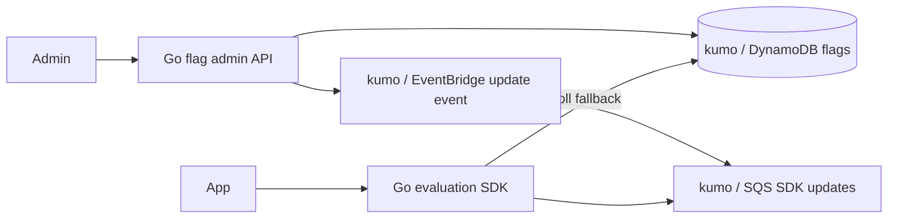

# Feature Flag and Dynamic Configuration Service

外部feature flag SaaSを使わず、version付きflag、stable percentage rollout、tenant/user override、kill switchを提供するworkspaceです。

- Workspace status: `prepared`
- Active Section: `Section 1 — Flag evaluation precedence`
- Current files: `README.md`のみ。これは意図した初期状態です。

## 学習の進め方

AIが同一actorの安定割当とoverride precedenceのtestを書き、学習者がevaluator、DynamoDB store、EventBridge通知、SDK cache、admin APIを実装します。

## 最終成果

boolean/variant flagをenvironmentごとに管理し、global default、tenant override、user override、percentage rolloutを決定論的に評価します。config更新はversion付きでDynamoDBへ保存し、kumo/EventBridge経由でSDK cacheへ通知します。通知欠落時もpollingで収束し、invalid configとstale versionを拒否します。

## Scope / Non-goals

対象はevaluation、stable bucketing、override、version、cache、event/polling更新、audit、kill switchです。実験統計、A/B有意差、UI、mobile SDK、multi-region consistency、外部identity providerは対象外です。

## ユースケースと不変条件

- 同じflag/version/actorは毎回同じbucketへ割り当てる。
- rollout率を上げたとき既存enabled cohortを可能な限り維持する。
- user override、tenant override、rule、percentage、defaultのprecedenceを固定する。
- stale config eventで新しいcache versionを上書きしない。
- invalid variant/percentageはpublish前に拒否する。
- event通知を失ってもpollingでlatest versionへ収束する。
- DynamoDBがpublished flagのsource of truth、SDK cacheはderived stateである。

## システム全体像



## 外部システム

- kumo/DynamoDB: environment+flag key、published version、conditional updateを保存する。
- kumo/EventBridge/SQS: config update notificationを配送する。通知はhintでありsource of truthではない。
- PostgreSQL/Redisは使わない。DynamoDB access patternとSDK cacheに焦点を当てる。

## データモデルとtransaction境界

`Flag(key,environment,version,type,variants,default,rules,rollout,status)`、`Override`、`AuditChange`を扱います。draft validation後、expected version条件付きでpublished recordを更新しeventを送ります。event送信失敗はpollingで回復可能ですがauditには残します。

## 目標layout

```text
feature-flag-service/
├── README.md
├── go.mod
├── compose.yaml
├── cmd/{admin-api,example-app}/
├── internal/{flags,evaluator,dynamodb,events,sdk,httpapi}/
└── test/e2e/
```

## Section roadmap

| Section | State | 学ぶこと | 成果物 | 決定的なテスト |
| --- | --- | --- | --- | --- |
| 1. Evaluation precedence | `active` | rule order、default、variant、context | pure evaluator | override/rule/percentage/defaultの優先順を守る |
| 2. Stable bucketing | `locked` | hash、cohort、rollout増減 | percentage evaluator | 同actorが安定し率がfixture分布へ近づく |
| 3. Config validation | `locked` | schema、unknown variant、safety | draft validator | invalid rule/percentageをpublish前に拒否する |
| 4. DynamoDB version store | `locked` | conditional write、access pattern、audit | flag repository | concurrent publishの片方だけがversion更新成功 |
| 5. Update event | `locked` | EventBridge routing、duplicate、stale | config notifier | SDKが新versionだけをcacheへ適用する |
| 6. SDK cache/polling | `locked` | stale fallback、TTL、event loss | Go SDK | notification欠落後もpollでlatestへ追いつく |
| 7. Kill switch/admin | `locked` | emergency path、authorization、audit | admin API | disableがoverrideより優先し変更者を記録する |
| 8. E2E | `locked` | publishからevaluationまで | example app test | rollout更新→event/poll→stable評価をkumoで通す |

## Active Section — Flag evaluation precedence

**Question:** 複数のoverrideとruleが一致したとき、順序に依存する曖昧さなく1つのvariantを返せるか。

**Learn:** pure evaluation、context、precedence、default、reason code。

**Decide:** flag type、override順、first-match、missing attribute、disabled semantics、evaluation reason。

**Build:** Flag、Rule、EvaluationContext、EvaluationResultのpure domainを作る。

**Current micro-step:** AIがuser override、tenant override、rule、defaultの優先順とreasonを固定するtestを書いてRedを作る。

**Tests:** multiple match、missing context、disabled、unknown variant、default、determinism。

**Done when:** `go test ./internal/evaluator -count=1`がGreenになり、全resultにvariantとreasonがある。

**Notes/evidence:** まだなし。

## Final acceptance

- evaluator、distribution、kumo DynamoDB/EventBridge/SQS、cache、poll fallback、admin E2Eが成功する。
- duplicate/stale/missing notificationでもSDKがlatest published versionへ収束する。
- 同じactorの割当がprocess再起動やinstance差で変わらない。

## Sources

- [DynamoDB condition expressions](https://docs.aws.amazon.com/amazondynamodb/latest/developerguide/Expressions.ConditionExpressions.html)
- [Amazon EventBridge event buses](https://docs.aws.amazon.com/eventbridge/latest/userguide/eb-event-bus.html)
- [kumo](https://github.com/sivchari/kumo)
