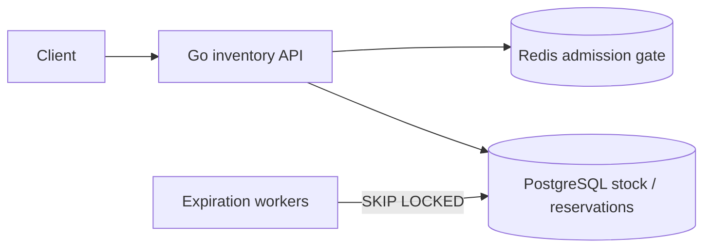

# Flash Sale Inventory Reservation

同じ少数商品へ注文が集中するflash saleで、oversellを防ぎながら在庫を一時確保・確定・解放するworkspaceです。

- Workspace status: `prepared`
- Active Section: `Section 1 — 在庫とreservationの状態遷移`
- Current files: `README.md`のみ。これは意図した初期状態です。

## 学習の進め方

AIが境界値と競合testを段階的に追加し、学習者がdomain、SQL、lock、Redis admission controlを実装します。速度より先に在庫不変条件を証明します。

## 最終成果

限られたstockに対するreserve、confirm、cancel、expireを提供します。数百の並行requestでもconfirmed+active reserved quantityがstockを超えず、同じrequestのretryは同じreservationを返します。期限切れstockは回収され、Redis障害時の受付方針も明示します。

## Scope / Non-goals

対象はhigh contention row、reservation TTL、idempotency、pessimistic/optimistic concurrency比較、expiration worker、admission controlです。決済、配送、multi-warehouse allocation、実際の数万RPS benchmarkは対象外です。

## ユースケースと不変条件

- `available >= 0`を常に守る。
- confirmed quantityと期限内reserved quantityの合計はinitial stockを超えない。
- 同一idempotency keyのreserveは同じ結果へ収束する。
- confirm/cancel/expireは一方向のstate transitionで、quantityを二重に戻さない。
- expiration workerが並行しても同じreservationを一度だけ回収する。
- PostgreSQLがstockとreservationのsource of truth、Redisは負荷を減らすadmission layerである。

## システム全体像



## 外部システム

- PostgreSQL（Docker）: inventory row、reservation、idempotency key、state transitionをtransactionとconstraintで守る。
- Redis（Docker）: token/admission gateとして瞬間的なDB流入を抑える。stock数のsource of truthにはしない。

## データモデルとtransaction境界

`inventory(sku,on_hand,reserved,version)`、`reservations(id,sku,quantity,status,expires_at,idempotency_key)`を扱います。reserve transactionはinventoryをlock/conditional updateし、reservation insertと数量更新をatomicにします。confirm/cancel/expireもreservation stateとinventoryを同時に変えます。

## 目標layout

```text
flash-sale-inventory/
├── README.md
├── go.mod
├── compose.yaml
├── migrations/
├── cmd/{api,expiration-worker}/
├── internal/{inventory,postgres,admission,httpapi,worker}/
└── test/{concurrency,e2e}/
```

## Section roadmap

| Section | State | 学ぶこと | 成果物 | 決定的なテスト |
| --- | --- | --- | --- | --- |
| 1. Reservation lifecycle | `active` | aggregate、不変条件、time | reserve/confirm/cancel/expire domain | quantityと一方向遷移を守り二重解放しない |
| 2. PostgreSQL constraints | `locked` | CHECK、UNIQUE、FK、clock | schema/migration | 負数stockと重複idempotency keyをDBが拒否 |
| 3. Atomic reserve | `locked` | row lock、conditional update、rollback | repository transaction | 在庫1へ同時reserveして成功は1件だけ |
| 4. Idempotent request | `locked` | request identity、response replay | retry-safe API use case | timeout後再送でreservationが増えない |
| 5. Expiration reclaim | `locked` | SKIP LOCKED、batch、test clock | expiration worker | 複数workerでも期限切れを一度だけ戻す |
| 6. Redis admission | `locked` | overload protection、atomic counter、fallback | admission gate | burstを制限しRedis停止時の方針どおり動く |
| 7. Contention comparison | `locked` | pessimistic/optimistic、retry budget | benchmark harness | 両方式が正しく、競合数とretryを比較できる |
| 8. HTTPとE2E | `locked` | public contract、system outcome | reservation API | 並行reserve→confirm/expire後の総量が一致する |

## Active Section — 在庫とreservationの状態遷移

**Question:** reserve、confirm、cancel、expireのどの順序だけを許し、quantityをいつ戻すべきか。

**Learn:** finite state machine、invariant、idempotent transition、wall clockをdomainへ直接埋め込まない設計。

**Decide:** status、quantity単位、expiration境界時刻、同じtransition再送の結果。

**Build:** Inventory、Reservation、Clock/now引数、状態遷移resultをpure domainで作る。

**Current micro-step:** AIがstock 1をreserveでき、0以下quantityとstock超過を拒否するtestを書いてRedを作る。

**Tests:** quantity境界、二重confirm、cancel後confirm、期限前後、retry。

**Done when:** `go test ./internal/inventory -count=1`がGreenになり、全status transitionがtest tableに現れる。

**Notes/evidence:** まだなし。

## Final acceptance

- PostgreSQL/Redis integration、100以上の並行request、expiration、race、HTTP E2Eが成功する。
- すべての終了状態でstock conservationを式としてassertする。
- Redisを停止しても選んだfail-open/fail-closed方針とDB不変条件を守る。

## Sources

- [PostgreSQL explicit locking](https://www.postgresql.org/docs/current/explicit-locking.html)
- [PostgreSQL SELECT locking clause](https://www.postgresql.org/docs/current/sql-select.html#SQL-FOR-UPDATE-SHARE)
- [Redis scripting](https://redis.io/docs/latest/develop/programmability/eval-intro/)
