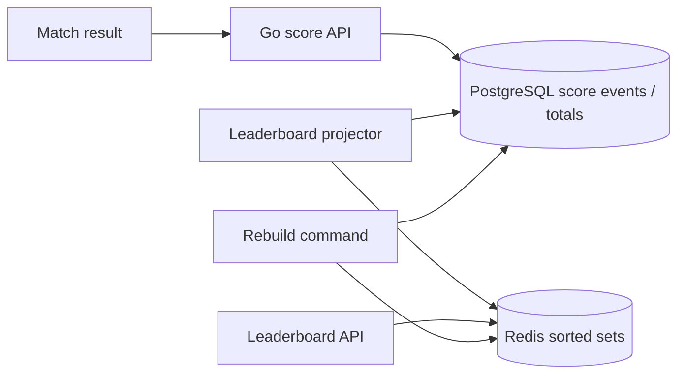
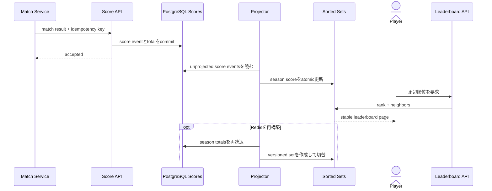

# Durable Game Leaderboard

Redis Sorted Setで高速な順位参照を行いながら、PostgreSQLのscore historyから再構築できるseason制leaderboardを学ぶworkspaceです。

- Workspace status: `prepared`
- Active Section: `Section 1 — Score updateと順位規則`
- Current files: `README.md`のみ。これは意図した初期状態です。

## 学習の進め方

AIが同点・再送・season境界のtestを書き、学習者がscore domain、PostgreSQL ledger、Redis projection、APIを実装します。Redisだけをsource of truthにはしません。

## 最終成果

match resultからscoreを冪等更新し、top-N、自分の順位、前後playerを低latencyで返します。同点の順位規則を固定し、daily/season board、season close、Redis消失後のrebuild、遅延match resultを扱います。

## Scope / Non-goals

対象はscore event、ranking、tie-break、Redis Sorted Set、durable history、season、rebuild、paginationです。MMR計算、anti-cheat、賞金配布、global multi-region leaderboardは対象外です。

## ユースケースと不変条件

- 同じmatch result IDを再送してもscoreを二重加算しない。
- score同点時の順序と表示rank semanticsを明示する。
- closed seasonへ通常のlate updateを適用しない。
- PostgreSQL commit済みscoreだけをRedisへ反映する。
- Redisが空でもhistory/current scoreから同じboardを再構築できる。
- top-Nとaround-meは同じsnapshot/versionの順位を返す。
- PostgreSQLがscore event/current scoreのsource of truth、Redisはderived rankingである。

## システム全体像



### 代表シーケンス



## 外部システム

- PostgreSQL（Docker）: match result receipt、score event、season、current totalをtransactionで保存する。
- Redis（Docker）: season/rule別Sorted Setとquery用metadataを保持する。

## データモデルとtransaction境界

`seasons`、`score_events(result_id,season_id,player_id,delta)`、`player_scores`を扱います。result receiptとtotal更新をatomicにし、projection versionを進めます。Redis member/tie-break representationはranking ruleから一意に導きます。

## 目標layout

```text
game-leaderboard/
├── README.md
├── go.mod
├── compose.yaml
├── migrations/
├── cmd/{api,projector,rebuild}/
├── internal/{leaderboard,postgres,redisboard,httpapi}/
└── test/e2e/
```

## Section roadmap

| Section | State | 学ぶこと | 成果物 | 決定的なテスト |
| --- | --- | --- | --- | --- |
| 1. Score/rank rules | `active` | event、tie、rank semantics、season | pure leaderboard model | 同点・delta・closed seasonを決定論的に扱う |
| 2. Durable score update | `locked` | idempotency、transaction、constraint | PostgreSQL repository | result再送でもtotalを一度だけ更新する |
| 3. Redis projection | `locked` | Sorted Set、member、atomic update | leaderboard adapter | DB totalとRedis scoreが一致する |
| 4. Top/around-me query | `locked` | rank、window、pagination | query service | top-Nと本人前後を安定順で返す |
| 5. Projection retry | `locked` | partial failure、version、reconcile | projector | Redis停止後に未反映scoreを追いつかせる |
| 6. Season lifecycle | `locked` | close、late event、archive、新season | season service | close後順位を固定し新seasonを0から開始する |
| 7. Rebuild | `locked` | derived state、batch、atomic swap | rebuild command | Redis全削除後に同一順位を復元する |
| 8. HTTPとE2E | `locked` | public contract、concurrency | score/leaderboard API | 並行result→top/around→rebuildを実境界で通す |

## Active Section — Score updateと順位規則

**Question:** score同点、負delta、season境界を含め、同じ入力から常に同じ順位を導けるか。

**Learn:** score event、competition/dense/ordinal rank、stable tie-break、season aggregate。

**Decide:** rank方式、同点tie-break、負score、closed seasonのlate result、delta範囲。

**Build:** ScoreEvent、PlayerTotal、RankingPolicy、RankedPlayerをpure domainで作る。

**Current micro-step:** AIがscore降順、同点時のstable順、同result IDの重複を固定するtestを書いてRedを作る。

**Tests:** tie、negative delta、duplicate result、empty board、closed season、boundary score。

**Done when:** `go test ./internal/leaderboard -count=1`がGreenになり、rank方式をtest名から判別できる。

**Notes/evidence:** まだなし。

## Final acceptance

- domain、PostgreSQL/Redis integration、concurrency、season、rebuild、HTTP E2Eが成功する。
- Redisを削除・停止してもsource dataを失わず、復旧後に同じ順位へ収束する。
- duplicate/late match resultと同点を含むfixtureで全queryが一貫する。

## Sources

- [Redis sorted sets](https://redis.io/docs/latest/develop/data-types/sorted-sets/)
- [Redis ZRANK](https://redis.io/docs/latest/commands/zrank/)
- [PostgreSQL unique constraints](https://www.postgresql.org/docs/current/ddl-constraints.html#DDL-CONSTRAINTS-UNIQUE-CONSTRAINTS)
