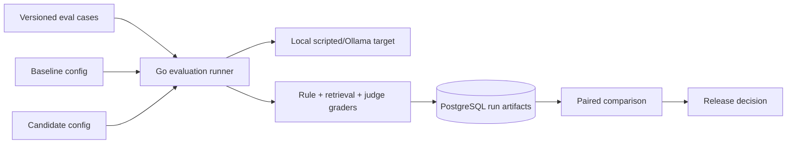
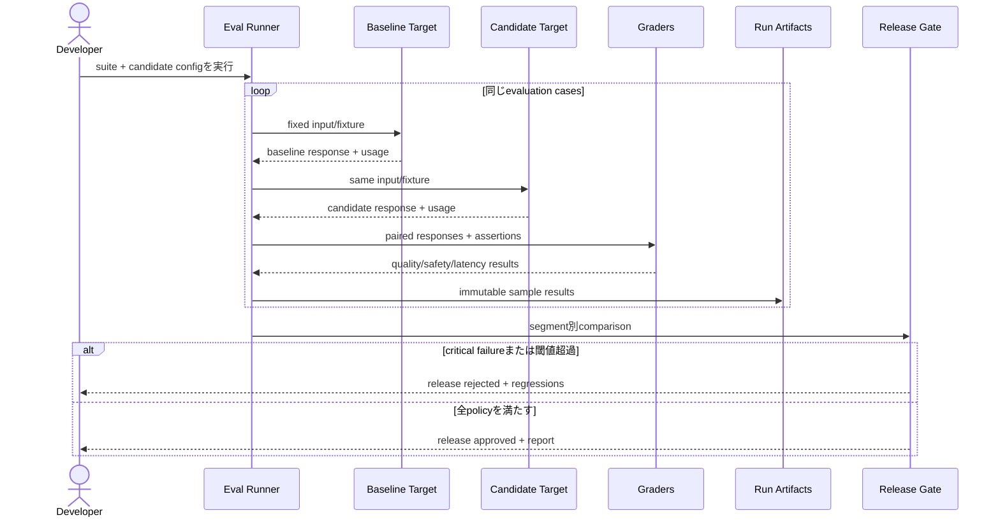

# LLM Evaluation Release Gate

prompt、model、retrieval、tool schemaの変更で既存AI機能が壊れていないかを、固定dataset、複数metric、人手評価との校正、release gateで判定する仕組みをGoで学ぶworkspaceです。

- Workspace status: `prepared`
- Active Section: `Section 1 — Evaluation caseと期待値`
- Current files: `README.md`のみ。これは意図した初期状態です。

## 学習の進め方

AIが評価器そのものを検証するtestとgold fixtureを書き、学習者がrunner、grader、metric、comparison、gateを実装します。model responseはrecord/replayとlocal scripted providerで決定的に再現し、任意でOllamaを試せます。

## 最終成果

version付きevaluation suiteに対してbaselineとcandidateを同条件で実行し、task success、groundedness、安全性、latency、token/cost budgetを集計します。AI judgeは人間labelとのagreementを測った補助信号として使い、重大caseのhard failureと統計的なregressionからrelease可否を機械判定します。

## Scope / Non-goals

対象はtest corpus、deterministic grader、LLM-as-a-Judge、human calibration、paired comparison、threshold、artifact、CI gateです。prompt自動最適化、model training、A/B配信基盤、万人に共通する単一scoreは対象外です。

## ユースケースと不変条件

- case、input、期待するconstraint、grader versionを変更不可のrun artifactとして残す。
- baselineとcandidateは同じcase、seed、timeout、tool fixtureで比較する。
- safetyやpermissionなど重大caseは平均scoreで相殺しない。
- AI judgeのscoreだけでreleaseを決めず、人間labelとのagreementと誤判定例を保持する。
- parse error、timeout、tool loopも失敗結果として集計し、欠測扱いで除外しない。
- prompt/model/retriever/tool定義のversionを各resultへ記録する。
- quality、latency、costを別metricとして示し、重み付き1指標へ隠さない。

## システム全体像



### 代表シーケンス



## 外部システム

- Docker PostgreSQL: suite、case、config、run、sample result、human label、gate decisionを保存する。
- local scripted provider: timeout、invalid JSON、tool loop、既知の良/悪responseを決定的に返す。
- 任意のOllama: 非決定的なlocal modelで実地runするadapter。CIの必須条件にはしない。
- GitHub Actions: fixture replayを実行し、release reportをartifact化する。

## データモデルとtransaction境界

`suites`、`cases(severity,tags,input,assertions)`、`configs(prompt_version,model,retriever_version,toolset_version)`、`runs`、`sample_results`、`grader_results`、`human_labels`、`gate_decisions`を扱います。runはimmutableにし、集計はsample result完成後に別transactionで確定します。grader変更時は既存responseを再利用して再採点できます。

## 目標layout

```text
llm-evaluation-release-gate/
├── README.md
├── go.mod
├── docker-compose.yml
├── migrations/
├── evals/{cases,fixtures,policies}/
├── internal/{suite,runner,target,grader,metrics,comparison,gate,postgres}/
├── cmd/eval/
└── test/{integration,e2e}/
```

## Section roadmap

| Section | State | 学ぶこと | 成果物 | 決定的なテスト |
| --- | --- | --- | --- | --- |
| 1. Evaluation case | `active` | input、assertion、severity、tag、version | case schema | invalid期待値を拒否し重大caseを識別する |
| 2. Target runner | `locked` | timeout、seed、record/replay、failure capture | repeatable runner | timeout/parse errorも結果として必ず保存する |
| 3. Deterministic graders | `locked` | exact、schema、citation、tool trace | rule graders | fixtureのpass/fail理由を安定して返す |
| 4. Retrieval metrics | `locked` | recall@k、MRR、nDCG、no-answer | retrieval grader | gold evidence順位からmetricを正しく計算する |
| 5. AI judge calibration | `locked` | rubric、position bias、agreement、blind review | calibrated judge | swap testとhuman labelで偏り・誤判定を可視化する |
| 6. Paired comparison | `locked` | baseline/candidate、confidence、segment | comparison report | 全体平均に隠れたtag別regressionを検知する |
| 7. Release policy | `locked` | hard gate、budget、waiver、audit | gate engine | critical failureまたは閾値超過でreleaseを止める |
| 8. Change E2E | `locked` | prompt/model/retrieval/tool change | CI workflow | 意図的に壊した4種類のcandidateをそれぞれrejectする |

## Active Section — Evaluation caseと期待値

**Question:** responseの文言を固定せず、守るべき振る舞いをどうtest caseとして残すか。

**Learn:** behavioral assertion、severity、slice/tag、gold evidence、versioned fixture。

**Decide:** exact matchが必要な箇所、許容する表現揺れ、critical case、dataset更新review、secret/PIIの扱い。

**Build:** EvaluationCase、Assertion、Severity、DatasetVersionのmodelとJSON validationを作る。

**Current micro-step:** AIがvalid case、assertionなし、unknown severity、duplicate ID、critical tag不足のtestを書いてRedを作る。

**Tests:** schema validation、stable serialization、duplicate、tag filtering、critical classification。

**Done when:** `go test ./internal/suite -count=1`がGreenになり、caseが「どの変更を止める証拠か」を説明できる。

**Notes/evidence:** まだなし。

## Final acceptance

- unit、PostgreSQL、race、record/replay、judge calibration、release E2Eが成功する。
- prompt、model、retrieval、tool schemaをそれぞれ壊したcandidateが対応するcaseでrejectされる。
- AI judgeのhuman agreement、false positive/negative、sample数をreportに残す。
- critical failure 0、quality下限、latency上限、cost上限を独立したrelease条件として判定する。

## Sources

- [OpenAI evaluation best practices](https://developers.openai.com/api/docs/guides/evaluation-best-practices)
- [OpenAI graders](https://developers.openai.com/api/docs/guides/graders)
- [NIST AI Risk Management Framework](https://www.nist.gov/itl/ai-risk-management-framework)
- [Ollama API](https://docs.ollama.com/api/introduction)
