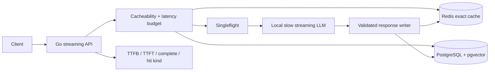
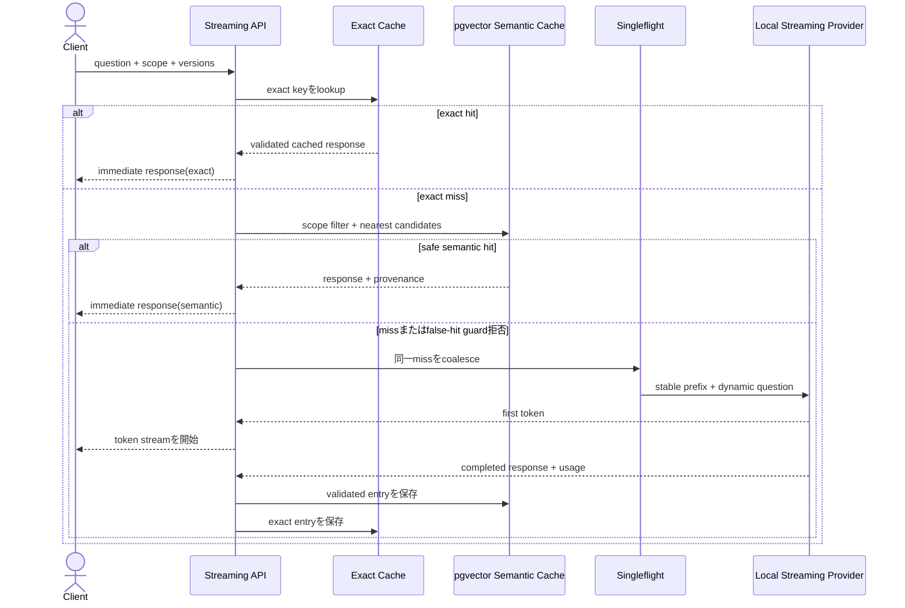

# LLM Low-Latency Response

LLM機能を体感的にも実測上も速くするため、provider prompt cache、exact response cache、semantic response cache、request coalescing、streaming、TTFTを分離してGoで実装・比較するworkspaceです。

- Workspace status: `prepared`
- Active Section: `Section 1 — Latency budgetとcache境界`
- Current files: `README.md`のみ。これは意図した初期状態です。

## 学習の進め方

AIがcache hitだけでなく危険なfalse hitを先にtestへ書き、学習者が計測、cache key、semantic reuse、invalidation、singleflight、streamingを実装します。Redis、PostgreSQL + pgvector、固定遅延を返すlocal LLM serverを使い、API登録なしでmissとhitの差を証明します。

## 先に区別する4つの仕組み

1. **Provider prompt cache:** 同じprompt prefixのKV計算を再利用し、input処理のcostとresponse開始までを減らす。完成responseはcacheせず、毎回新しく生成する。
2. **Exact response cache:** tenant・prompt/model/policy version・入力などが完全一致したとき、保存済み完成responseを返す。最速だがhit範囲は狭い。
3. **Semantic response cache:** embeddingが近い質問へ既存responseを再利用する。hitを増やせる一方、数値・否定・固有名詞・権限・freshnessの違いによる誤回答が最大のriskになる。
4. **Latency hiding:** low-TTFT model、streaming、navigation前のrequest開始、connection/preflight warm-upで、cache missでも待ち時間を短く感じさせる。

## nani.nowから取り入れる観点

[Nani翻訳の技術的な話](https://zenn.dev/catnose99/articles/nani-translate)では、体感速度への効果として、server requestをページ遷移より先に開始する、streamingを遷移中も維持する、TTFTの小さいmodelを選ぶ、OPTIONSを事前に済ませる、frontend bundleを軽くする、という複数の施策が説明されています。Redisはrate limitと小さなdata cacheに使われていますが、記事は「似た翻訳の完成responseをsemantic cacheから返している」とは述べていません。

実際に同じ日本語文をnani.nowへ2回入力した観察でも、毎回別result IDが作られ、主翻訳は同じでも解説文には揺れがありました。これは少なくとも単純なexact response replayだけで説明できず、provider生成とlatency hidingを分けて考える材料になります。ただしclient観察だけで内部実装は断定しません。

## 最終成果

requestごとのtime to headers、TTFT、time to completeを計測し、cacheable policyに応じてexact、semantic、providerの順に処理します。cache entryはtenant/ACL、prompt/model/tool/policy/data version、locale、freshnessへ結び付けます。危険な類似queryはmissへ倒し、cache stampedeを抑え、miss時はすぐstreamを開始します。

## Scope / Non-goals

対象はlatency budget、prompt layout、provider cache usage計測、exact/semantic response cache、false-hit guard、TTL/invalidation、stampede、streaming、warm-upです。provider-managed KV cacheの内部実装、CDN、model serving/GPU optimization、翻訳modelの品質改善は対象外です。provider prompt cacheはreplayed usage metadataでcontractを学び、実providerの性能をlocal testで証明したとは主張しません。

## ユースケースと不変条件

- prompt cache hitをresponse cache hitと数えず、providerはcache hit時も新responseを生成する前提にする。
- exact keyはtenant/authorization scope、task、canonical input、prompt/model/tool/policy/data version、locale、generation設定を含む。
- semantic候補は同じtenant・task・ACL・version・freshness class内だけから取得する。
- 数値、日付、否定、固有名詞、命令種別などmeaning anchorが変わる場合はvectorが近くても再利用しない。
- tool実行、個人化、high-risk、最新情報などcache禁止classをcodeで判定する。
- invalidation後にstale entryを返さず、singleflight waiterもcontext cancelできる。
- cache missでもheaders/first tokenを可能な限り早く返し、全latency phaseを別々に観測する。

## システム全体像



### 代表シーケンス



## 外部システム

- Docker Redis: exact response、TTL、generation counter、distributed singleflight/leaseを保持する。
- Docker PostgreSQL + pgvector: semantic candidate、embedding、meaning anchor、version、ACL scopeを検索する。
- local slow streaming LLM server: fixed TTFT、token interval、response variation、429、cancel、provider call countを再現する。
- local deterministic embedder: similar/dissimilar fixtureを安定したvectorへ変換する。任意でOllama adapterを追加できる。
- replayed provider usage fixture: `cached_tokens`などからprompt cache hit率を集計するが、local provider性能の代用にはしない。

## データモデルとtransaction境界

`CacheRequest(scope,task,input_hash,prompt_version,model,toolset,policy_version,data_version,locale)`、`ResponseEntry(response_hash,embedding,anchors,fresh_until)`、`CacheDecision(kind,reason,score)`、`LatencyTrace`を扱います。provider response完成後にvalidationし、DB entryとinvalidation generationをtransactionで確定してからRedisへwrite-throughします。cacheは外部effectのtransaction境界には使いません。

## 目標layout

```text
llm-low-latency-response/
├── README.md
├── go.mod
├── docker-compose.yml
├── migrations/
├── internal/{latency,cachekey,policy,exact,semantic,anchors,coalesce,provider,stream}/
├── cmd/{api,benchmark}/
└── test/{provider,fixtures,integration,evaluation,e2e}/
```

## Section roadmap

| Section | State | 学ぶこと | 成果物 | 決定的なテスト |
| --- | --- | --- | --- | --- |
| 1. Latencyとcache境界 | `active` | TTFB/TTFT/complete、hit kind、責任分離 | request/trace model | prompt/exact/semantic/missを混同せずphaseを計測する |
| 2. Provider prompt cache | `locked` | stable prefix、cached tokens、version、cost | prompt layout + usage parser | prefix変更時だけcache metricがmissになるfixtureを集計する |
| 3. Exact response cache | `locked` | canonical key、TTL、scope、versioning | Redis exact cache | exact matchはprovider 0 call、version/tenant違いはmissになる |
| 4. Semantic response cache | `locked` | embedding、top-k、threshold、reuse policy | pgvector semantic cache | safe paraphraseだけをhitし無関係queryをmissにする |
| 5. False-hit guard | `locked` | number/date/negation/entity、ACL、freshness | anchor/policy guard | 近い「10個/100個」「可能/不可能」を必ずmissへ倒す |
| 6. Invalidationとstampede | `locked` | generation、TTL、singleflight、cancel | coherent cache | version更新直後のstale readと同時100 missのprovider stormを防ぐ |
| 7. Streamingとwarm-up | `locked` | early flush、request overlap、connection/OPTIONS | low-TTFT HTTP path | missでもheaderとfirst chunkを完成前に受信しcancelを伝播する |
| 8. Latency/quality E2E | `locked` | hit ratio、p50/p95、false-hit rate、cost | benchmark + release report | exact/semantic/missを比較し速度目標と誤hit上限を同時に満たす |

## Active Section — Latency budgetとcache境界

**Question:** 「速い」を1つのelapsed timeで済ませず、どの処理を省略・再利用・隠蔽したかどう表すか。

**Learn:** time to headers、TTFT、time to complete、provider prompt cacheとresponse cacheの違い、cache provenance。

**Decide:** latency phase、CacheKind、hit/miss reason、cacheable class、response metadataとして何をcallerへ返すか。

**Build:** LatencyTrace、CacheDecision、CacheKind、CacheabilityPolicyのpure modelを作る。

**Current micro-step:** AIがprompt cache hitでもprovider生成は必要、exact/semantic hitではprovider call不要、high-risk requestはbypassになるtestを書いてRedを作る。

**Tests:** phase ordering、cache kind、provider-called flag、bypass reason、invalid timing、provenance。

**Done when:** `go test ./internal/latency ./internal/policy -count=1`がGreenになり、速さの理由をcache kindとlatency phaseで説明できる。

**Notes/evidence:** nani.nowで初回・同一文・類似文を観察。実装開始時に測定fixtureと仮説へ落とし込む。

## Final acceptance

- unit、Redis、PostgreSQL/pgvector、race、cancel、stampede、stream、latency/quality E2E testが成功する。
- controlled slow providerに対しexact hitはprovider call 0、semantic safe hitも0、missは1となる。
- exact/semantic hitのmedian complete timeが同じfixtureのmissより十分小さいことを相対値で証明する。
- adversarial similarity setでtenant/ACL leakage 0、meaning-anchor false hit 0を満たす。
- prompt/model/policy/data version変更直後に旧entryを返さず、同時missを1 provider callへ集約する。

## Sources

- [Nani翻訳の技術的な話](https://zenn.dev/catnose99/articles/nani-translate)
- [OpenAI prompt caching](https://developers.openai.com/api/docs/guides/prompt-caching)
- [pgvector](https://github.com/pgvector/pgvector)
- [Go singleflight](https://pkg.go.dev/golang.org/x/sync/singleflight)
- [HTTP server-sent events](https://html.spec.whatwg.org/multipage/server-sent-events.html)
