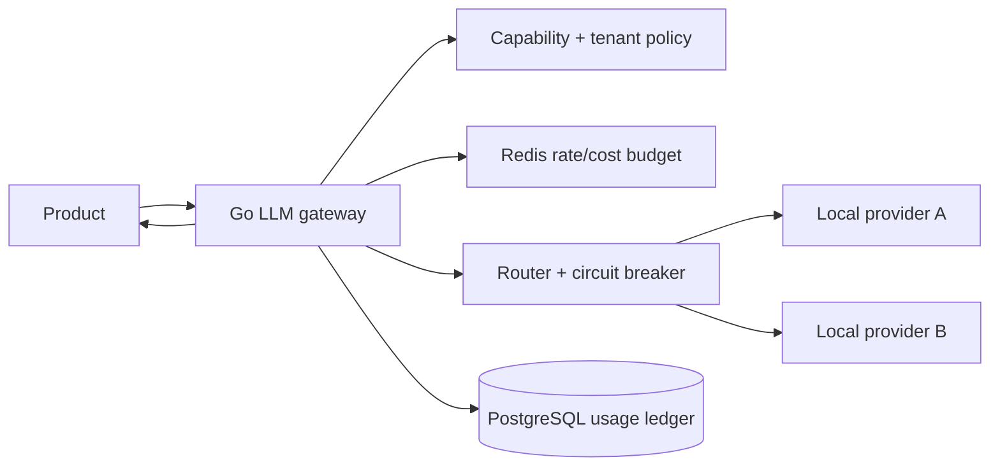

# LLM Request Gateway

複数model/providerへのrequestを一箇所で制御し、rate limit、timeout、retry、circuit breaker、fallback、degraded experienceを提供するGo gatewayを学ぶworkspaceです。

- Workspace status: `prepared`
- Active Section: `Section 1 — Capability付きrequest envelope`
- Current files: `README.md`のみ。これは意図した初期状態です。

## 学習の進め方

AIがprovider障害とstream failureをlocal HTTP serverで再現するtestを書き、学習者がnormalization、routing、quota、resilience、fallbackを実装します。実LLM API keyは使わず、複数のscripted providerでlatency、429、5xx、partial stream、能力差を再現します。

## 最終成果

tenant・機能・requestごとのpolicyを適用し、必要なcapabilityを満たすmodelへrouteします。operation全体のdeadlineとcost/token budget内で安全にretry/fallbackし、fallback modelの能力が足りないときはsilentに品質を落とさず、機能縮退や明示errorへ切り替えます。

## Scope / Non-goals

対象はprovider abstraction、capability routing、rate/cost limit、timeout、retry、circuit breaker、fallback、stream normalization、degradationです。prompt/semantic response cacheは`llm-low-latency-response`で扱い、prompt管理UI、model hosting、provider固有機能の完全互換は対象外です。

## ユースケースと不変条件

- requestが要求するcapabilityを満たさないmodelへfallbackしない。
- retryとfallbackを重ねても最初のoperation deadlineとtoken/cost budgetを超えない。
- 429、5xx、timeout、partial streamを区別し、生成済みstreamを別modelで黙って継ぎ足さない。
- tenant quotaとglobal provider quotaを別に管理し、1顧客が全体を枯渇させない。
- circuit open中はproviderへ送信せず速く代替判断する。
- degraded responseはmodel、欠落機能、理由をcallerへ明示する。
- prompt、tool argument、provider secretを通常logへ残さない。

## システム全体像



## 外部システム

- Docker Redis: tenant/provider rate limit、concurrency slot、短命circuit stateを保持する。
- Docker PostgreSQL: request、route decision、usage、cost attribution、degradation eventを保存する。
- local provider servers: capability、TTFT、stream、429/Retry-After、5xx、timeout、invalid payloadを決定的に返す。
- fake clock/rate table: wall clock待機や実provider pricingなしにbudgetをtestする。

## データモデルとtransaction境界

`GatewayRequest(tenant,feature,capabilities,budget,idempotency)`、`ProviderModel`、`RouteAttempt`、`UsageRecord`、`Degradation`を扱います。quota reservationはRedisのatomic script、確定usageはPostgreSQLへappendします。request処理とprovider callをDB transactionで囲まず、reservation IDで成功/失敗/期限切れをreconcileします。

## 目標layout

```text
llm-request-gateway/
├── README.md
├── go.mod
├── docker-compose.yml
├── migrations/
├── internal/{request,catalog,policy,router,limiter,retry,breaker,stream,usage}/
├── cmd/gateway/
└── test/{providers,integration,e2e}/
```

## Section roadmap

| Section | State | 学ぶこと | 成果物 | 決定的なテスト |
| --- | --- | --- | --- | --- |
| 1. Request envelope | `active` | feature、capability、budget、identity | canonical request | 同じlogical requestを正規化し不足capabilityを検出する |
| 2. Model catalogとrouting | `locked` | capability、policy、region、priority | deterministic router | 条件を満たす候補だけを安定順で選ぶ |
| 3. Rate/cost limiting | `locked` | token bucket、reservation、tenant fairness | Redis limiter | concurrent requestでもquotaを超過せずtenantを隔離する |
| 4. Timeout/retry/circuit | `locked` | budget、backoff、Retry-After、breaker | resilient attempt executor | 429/5xx/timeoutをbudget内で処理し障害を増幅しない |
| 5. Fallbackとdegradation | `locked` | capability gap、quality tier、UX contract | fallback policy | tool必須requestをtext-only modelへsilent fallbackしない |
| 6. Stream normalization | `locked` | SSE、usage、partial failure、cancel | provider-neutral stream | disconnect後にresourceを回収しpartial resultを識別する |
| 7. Usage ledger | `locked` | feature/tenant/workflow attribution、reconcile | cost records | attemptと最終usageを二重計上せず追跡する |
| 8. Provider outage E2E | `locked` | overload、recovery、degraded mode | executable gateway | primary障害時のfallback、quota、circuit、UXを証明する |

## Active Section — Capability付きrequest envelope

**Question:** provider固有payloadへ変換する前に、productが必要とする機能と予算をどう表すか。

**Learn:** canonical request、capability negotiation、idempotency、deadline、quality tier。

**Decide:** required/optional capability、stream要否、maximum cost/token、tenant/feature identity、unsupported時のerror。

**Build:** GatewayRequest、CapabilitySet、Budget、QualityTier、validationをpure modelとして作る。

**Current micro-step:** AIがtext-only、structured output必須、tool必須、期限切れ、負のbudget、unknown capabilityのtestを書いてRedを作る。

**Tests:** validation、canonicalization、capability subset、budget boundary、stable request identity。

**Done when:** `go test ./internal/request -count=1`がGreenになり、providerに依存せずrouting条件を確定できる。

**Notes/evidence:** まだなし。

## Final acceptance

- unit、Redis、PostgreSQL、race、cancel、fault provider、outage E2E testが成功する。
- primaryの429/5xx/timeout時もoperation budget内で終了し、quotaとusageを二重消費しない。
- capability不足のfallbackは拒否または明示degradedになり、silent quality lossがない。
- 1 tenantのburst中も他tenantのrequestがadmissionされる。

## Sources

- [OpenAI rate limits](https://developers.openai.com/api/docs/guides/rate-limits)
- [OpenAI streaming responses](https://developers.openai.com/api/docs/guides/streaming-responses)
- [AWS Builders' Library: timeouts, retries and backoff with jitter](https://aws.amazon.com/builders-library/timeouts-retries-and-backoff-with-jitter/)
- [Redis rate limiting patterns](https://redis.io/learn/howtos/ratelimiting/)
