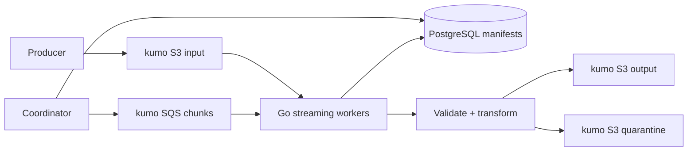
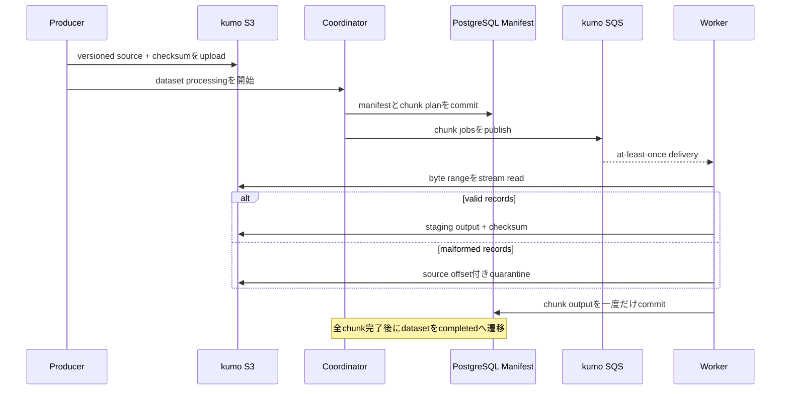

# ML Preprocessing Pipeline

巨大なCSV/JSONLなどをmemoryへ載せ切らずに読み、検証・変換・partition・再実行可能な出力まで行う、ML向けdata preprocessing pipelineをGoで学ぶworkspaceです。

- Workspace status: `prepared`
- Active Section: `Section 1 — Dataset manifestとjob identity`
- Current files: `README.md`のみ。これは意図した初期状態です。

## 学習の進め方

AIが先にfailureを固定するtestを書き、学習者がstreaming reader、worker、checkpoint、quality gateを実装します。object storageとqueueはkumo、metadataはDocker PostgreSQLで再現し、外部datasetやML APIは使いません。

## 最終成果

大きな入力を一定memoryで読み、schema validation、正規化、重複排除、partition出力を行います。workerが途中で落ちてもcompleted chunkを二重生成せずに再開でき、不正recordはquarantineへ分離され、manifestから入力と出力の対応を追跡できます。

## Scope / Non-goals

対象はstreaming I/O、chunking、bounded concurrency、backpressure、checkpoint、idempotency、schema evolution、data quality、lineageです。model training、feature store、Spark互換runtime、GPU処理、実S3のthroughput tuningは対象外です。

## ユースケースと不変条件

- 入力全体のsizeに比例してprocess memoryを増やさない。
- 同じdataset versionとpipeline versionの再実行は同じlogical outputを作る。
- chunkは高々1つのcommitted outputを持ち、partial outputを完成扱いしない。
- retry後もrecordの欠落・重複を発生させない。
- malformed recordは理由とsource offsetを残してquarantineする。
- input checksum、transform version、output checksumからlineageを追跡できる。
- worker数を増やしても設定したin-flight byte上限を超えない。

## システム全体像



### 代表シーケンス



## 外部システム

- Docker PostgreSQL: dataset、chunk、attempt、checkpoint、quality resultをtransactionで管理する。
- kumo S3: source、staging output、committed output、quarantineをobjectとして保持する。
- kumo SQS: chunk executionをat-least-onceで配送し、duplicateとvisibility timeoutをtestする。
- local fixture generator: seedから大規模入力と破損recordを再現可能に生成する。

## データモデルとtransaction境界

`datasets(id,version,input_uri,input_checksum,pipeline_version,state)`、`chunks(dataset_id,chunk_no,start_offset,end_offset,state,output_uri,checksum)`、`attempts`、`quality_results`を扱います。DB transactionはchunkのlease取得とcommit metadataを守りますが、S3書き込みを含めません。まず一意なstaging keyへ書き、checksum検証後にDB上でcommitするprotocolを取ります。

## 目標layout

```text
ml-preprocessing-pipeline/
├── README.md
├── go.mod
├── docker-compose.yml
├── migrations/
├── internal/{manifest,reader,transform,worker,quality,postgres,objectstore}/
├── cmd/{coordinator,worker}/
└── test/{fixtures,integration,e2e}/
```

## Section roadmap

| Section | State | 学ぶこと | 成果物 | 決定的なテスト |
| --- | --- | --- | --- | --- |
| 1. Dataset manifest | `active` | dataset identity、version、state machine | manifest domain | 同一input/versionを同一jobとして扱い不正遷移を拒否する |
| 2. Streaming decode | `locked` | buffered I/O、offset、長大record、cancel | bounded reader | 大入力でもreader buffer上限を超えずoffsetを返す |
| 3. Chunk planning | `locked` | record boundary、partition、backpressure | deterministic planner | worker数に依存せず全recordを重複なく分割する |
| 4. Transformとquality | `locked` | schema、normalization、dedupe、quarantine | transform pipeline | 正常recordと破損recordを件数・理由込みで分離する |
| 5. Object commit | `locked` | staging、checksum、atomic visibility | object writer | upload失敗時にpartial outputを公開しない |
| 6. Queue worker | `locked` | at-least-once、lease、bounded concurrency | kumo SQS worker | duplicate deliveryでもchunk outputが1つだけcommitされる |
| 7. Resumeとlineage | `locked` | checkpoint、version bump、再実行 | resumable coordinator | crash後にcompleted chunkをskipし新versionは再計算する |
| 8. Large-file E2E | `locked` | memory、throughput、data contract | executable pipeline | 生成datasetの件数・checksum・quarantine・再開をend-to-endで証明する |

## Active Section — Dataset manifestとjob identity

**Question:** 大きな処理を安全にretryするため、何を「同じdataset処理」とみなすか。

**Learn:** content identity、pipeline version、state transition、idempotency key。

**Decide:** dataset IDの構成、version bump条件、terminal state、failed jobの再開と再作成の境界。

**Build:** DatasetManifest、DatasetState、ChunkSpec、transition validationのpure domain modelを作る。

**Current micro-step:** AIが同じinput checksumとpipeline versionは同じidentityになり、version変更は別jobになり、不正なstate遷移を拒否するtestを書いてRedを作る。

**Tests:** identity、state transition、empty checksum、version change、cancelled/failed retry。

**Done when:** `go test ./internal/manifest -count=1`がGreenになり、manifestだけで再実行判断を説明できる。

**Notes/evidence:** まだなし。

## Final acceptance

- unit、PostgreSQL、kumo S3/SQS、race、cancel、crash-resume、E2E testが成功する。
- 入力件数 = committed出力件数 + quarantine件数となり、recordの重複・欠落がない。
- 同じjobの再実行でprovider writeが増えず、pipeline version変更時だけ新出力になる。
- controlled fixtureで入力sizeを増やしてもin-flight memoryが設定上限内に収まる。

## Sources

- [Amazon S3 multipart upload overview](https://docs.aws.amazon.com/AmazonS3/latest/userguide/mpuoverview.html)
- [Amazon SQS visibility timeout](https://docs.aws.amazon.com/AWSSimpleQueueService/latest/SQSDeveloperGuide/sqs-visibility-timeout.html)
- [Apache Parquet file format](https://parquet.apache.org/docs/file-format/)
- [kumo](https://github.com/sivchari/kumo)
