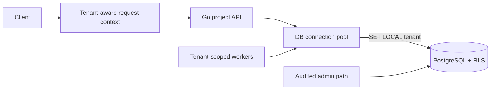

# Multi-tenant Data Isolation

複数企業が同じGo applicationとPostgreSQLを共有しても、tenant間のdata漏洩をapplicationとDBの両方で防ぐworkspaceです。

- Workspace status: `prepared`
- Active Section: `Section 1 — Tenant identityとscoped model`
- Current files: `README.md`のみ。これは意図した初期状態です。

## 学習の進め方

AIが意図的なtenant scope漏れを検出するtestを書き、学習者がdomain、schema、RLS、transaction context、quotaを実装します。WHERE句があることではなく、漏洩できないことを証明します。

## 最終成果

tenantごとのproject/task APIを作り、composite keyとPostgreSQL Row-Level Securityでcross-tenant read/writeを拒否します。connection poolでtenant contextが残留しないようtransaction-localに設定し、background job、admin access、tenant quota、auditも同じ境界で扱います。

## Scope / Non-goals

対象はshared-schema multi-tenancy、tenant-scoped identity、RLS、pool safety、admin bypass、quota、noisy neighbor観測です。database-per-tenantのprovisioning、billing、SSO、multi-region isolationは対象外です。

## ユースケースと不変条件

- 同じresource IDが別tenantに存在しても互いに見えない。
- resourceを参照するunique/FKはtenant IDを含む。
- tenant contextなしの通常queryはfail closedにする。
- connectionをpoolへ返す前後でtenant contextを持ち越さない。
- background jobもpayloadだけを信用せずtenant scopeを確立する。
- admin cross-tenant accessは専用roleとaudit reasonを必要とする。
- PostgreSQLがtenant dataとRLS policyのsource of truthである。

## システム全体像



## 外部システム

- PostgreSQL（Docker）: composite constraints、roles、RLS policy、transaction-local settingを実物で検証する。
- Redis（Docker、後半）: tenant別quota counterを保持するがdata authorizationには使わない。

## データモデルとtransaction境界

`tenants`、`projects(tenant_id,id)`、`tasks(tenant_id,id,project_id)`、`admin_access_log`を扱います。各request transaction開始時にtenant IDを`SET LOCAL`相当で設定し、RLSが全queryへ適用されます。pool connection単位の永続settingは使いません。

## 目標layout

```text
multi-tenant-data-isolation/
├── README.md
├── go.mod
├── compose.yaml
├── migrations/
├── cmd/api/
├── internal/{tenant,postgres,projects,quota,audit,httpapi}/
└── test/{security,e2e}/
```

## Section roadmap

| Section | State | 学ぶこと | 成果物 | 決定的なテスト |
| --- | --- | --- | --- | --- |
| 1. Tenant-scoped model | `active` | identity、aggregate boundary、composite key | TenantID付きresource | tenantなしresourceとcross-tenant relationを拒否 |
| 2. Composite schema | `locked` | PK/UNIQUE/FK、access pattern | PostgreSQL migration | DBがtenantをまたぐFKを拒否する |
| 3. Row-Level Security | `locked` | policy、role、fail closed | RLS-enabled repository | WHEREを書き忘れても他tenantを返さない |
| 4. Connection pool safety | `locked` | session state、SET LOCAL、transaction | tenant-aware executor | connection再利用で前tenantが漏れない |
| 5. Background jobs | `locked` | async context、payload validation | scoped worker | forged tenant/resource組を処理しない |
| 6. Admin and audit | `locked` | privileged path、reason、least privilege | admin repository | bypassは専用roleとaudit recordなしに実行不可 |
| 7. Quota/noisy neighbor | `locked` | tenant limit、metrics、fairness | Redis quota layer | hot tenantを制限し他tenantのrequestを通す |
| 8. HTTP security E2E | `locked` | auth boundary、attack test | project/task API | tenant A tokenでBのIDを総当たりしても0件漏洩 |

## Active Section — Tenant identityとscoped model

**Question:** resource IDだけが渡されてもtenant境界を落とさないdomain/APIをどう設計するか。

**Learn:** tenant-scoped identity、composite key、ambient contextと明示引数のtrade-off。

**Decide:** TenantID型、ResourceIDとの組、repository signature、admin identityを別型にするか。

**Build:** TenantID、ProjectKey、TaskKey、cross-tenant relation validationをpure domainで作る。

**Current micro-step:** AIが同じproject IDを別tenantで区別し、tenantの異なるproject/task関係を拒否するtestを書いてRedを作る。

**Tests:** empty tenant、same local ID/different tenant、cross-tenant relation、zero value、equality。

**Done when:** `go test ./internal/tenant -count=1`がGreenになり、tenantなしrepository lookupを表現できない。

**Notes/evidence:** まだなし。

## Final acceptance

- domain、PostgreSQL RLS、pool reuse、background job、admin audit、quota、HTTP attack E2Eが成功する。
- application queryからtenant filterを意図的に外してもDBが漏洩を防ぐ。
- parallel testでconnectionを再利用してもtenant contextが交差しない。

## Sources

- [PostgreSQL Row Security Policies](https://www.postgresql.org/docs/current/ddl-rowsecurity.html)
- [PostgreSQL SET](https://www.postgresql.org/docs/current/sql-set.html)
- [PostgreSQL multicolumn indexes](https://www.postgresql.org/docs/current/indexes-multicolumn.html)
