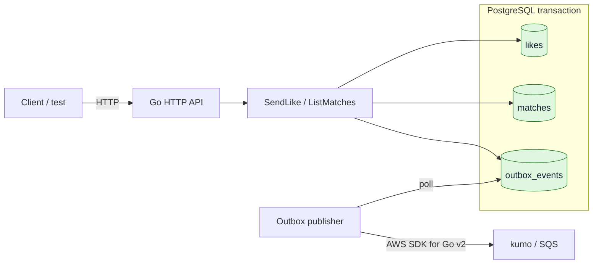

# 1:1 Mutual Matching System

マッチングアプリ型の「相互に好意を示した 2 人を 1 組の Match にする」仕組みを、Go とテストで小さく組み立てる学習用ワークスペースです。

- Workspace status: `in_progress`
- Active Section: `Section 2 — メモリ上の相互 Like`
- Current files: `README.md`, `go.mod`, learner-written `internal/matching/pair.go` and `internal/matching/pair_test.go`

## 学習の進め方

- 実装コード、テスト、SQL、Docker 設定は自分で入力する。
- AI は現在のマイクロステップに必要な空ファイルを作り、考え方と参考コードを会話に提示する。ファイル内容は自分で入力する。
- 各 Section の完了条件をテストで確認してから、次の Section を 1 つだけ開く。
- `次の Section へ` と依頼されたとき、AI は現在のコードとテスト結果を確認する。未完了なら修正せず、観測した差分とヒントを返す。
- 最後はコンパイルではなく、公開境界から永続化・非同期イベントまでの振る舞いをテストで再現する。

## このシステムで作るもの

ユーザー A が B に Like しただけでは Match は作らず、B も A に Like した時点で 2 人の Match を 1 件だけ作ります。

最終的には次を確認できる状態を目指します。

1. 一方向の Like は保存されるが、Match にはならない。
2. 逆方向の Like が存在すると、順序によらず同じ 2 人の Match が 1 件だけ成立する。
3. 同じ Like の再送、同時リクエスト、リトライでも Match は重複しない。
4. Like と Match は PostgreSQL に永続化される。
5. Match 成立とイベント記録は 1 つの DB トランザクションで確定する。
6. DB コミット後、`match.created` イベントが kumo 上の SQS に非同期配信される。
7. SQS が一時停止していても Match 成立は失われず、復旧後にイベントを配信できる。

これは待機中の 2 人を即時に組ませるキュー型マッチメイキングではありません。5 vs 5 の部屋編成、レーティング、検索・推薦は別ワークスペースで扱います。

## Scope

### 対象

- 既知のユーザー ID 間で Like を送る
- 相互 Like の検出
- 順序を持たない 2 人組の一意な Match
- 同一リクエストと並行実行に対する冪等性
- Match 一覧の取得
- Transactional Outbox から SQS へのイベント配信
- ドメイン、DB、HTTP、非同期境界、E2E のテスト

### 対象外

- ユーザー登録、認証、プロフィール
- 候補ユーザーの検索・推薦
- Unlike、ブロック、Match 解除
- チャット、Push 通知、メール送信
- 5 vs 5、ルーム、レーティングベースの組み分け
- 本番 AWS、Kubernetes、高可用性構成
- ベンチマークや大規模負荷試験

## ユースケースと不変条件

| 操作 | 期待結果 |
| --- | --- |
| A が B を Like | Like を 1 件保存し、Match は作らない |
| B が A を Like | A–B の Match と Outbox イベントを 1 件ずつ作る |
| A が B を再度 Like | 成功として扱ってよいが、状態は増えない |
| A が A 自身を Like | ドメインエラーとして拒否する |
| A→B と B→A が同時に到着 | 最終的に Match は 1 件だけ存在する |
| 同じ Match のイベント送信を再試行 | SQS 側の重複可能性を許容し、イベント ID で識別できる |

守りたい不変条件は次のとおりです。

- Like の向きは区別する。`A → B` と `B → A` は別の Like である。
- Match の向きは区別しない。`A–B` と `B–A` は同じ Match である。
- 自分自身への Like と、自分自身だけで構成された Match は存在しない。
- 同じ送信者・受信者の Like は最大 1 件である。
- 同じ 2 人の Match は最大 1 件である。
- Match が新規作成されたときだけ、対応する Outbox イベントを 1 件作る。
- PostgreSQL が Like、Match、未配信イベントの source of truth である。SQS は source of truth にしない。

## システム全体像



同期処理の成功条件は PostgreSQL のコミットです。SQS 送信を同じ処理の成功条件にはしません。これにより、キュー障害時にも成立済み Match を失わず、Outbox publisher が後で再試行できます。

## 外部システム

### PostgreSQL

- 用途: users、likes、matches、outbox_events の永続化と一意制約
- ローカル実行: Docker Compose で起動する
- テスト: モックではなく実際の PostgreSQL に対して migration、制約、transaction、並行実行を検証する
- 学習ポイント: アプリケーションの事前確認だけに頼らず、`CHECK`、`PRIMARY KEY`、`UNIQUE`、`FOREIGN KEY` でも不正状態を防ぐ

### kumo / Amazon SQS

- 用途: `match.created` を後続システムへ渡す非同期境界
- ローカル実行: kumo のコンテナを `4566` 番ポートで起動する
- クライアント: AWS SDK for Go v2 の SQS client にローカル endpoint を設定する
- テスト: キューの作成、メッセージ送信、受信内容、停止後の再送を kumo に対して検証する
- データ: 初期のテストでは kumo のデフォルトであるインメモリ動作を使い、テストごとに状態を作り直す

SQS Standard Queue は at-least-once delivery であり、重複受信の可能性があります。「必ず 1 回だけ届く」とは設計せず、安定したイベント ID と冪等な consumer を前提にします。このワークスペースでは publisher までを実装範囲とし、実際の通知 consumer は対象外です。

## 概念データモデル

この時点では設計上のレコードです。SQL ファイルはまだありません。

| Record | 主な情報 | 制約・役割 |
| --- | --- | --- |
| `users` | `id`, `created_at` | テスト fixture で用意する既知ユーザー |
| `likes` | `sender_id`, `receiver_id`, `created_at` | 方向あり。組を一意にし、自己 Like を禁止する |
| `matches` | `user_low_id`, `user_high_id`, `created_at` | 方向なし。常に小さい ID を先に保存し、組を一意にする |
| `outbox_events` | `id`, `event_type`, `aggregate_key`, `payload`, `occurred_at`, `published_at` | DB commit とイベント発生を結び、未配信を再試行可能にする |

`SendLike(A, B)` の目標トランザクションは次の流れです。

1. A と B、および自己 Like でないことを検証する。
2. A→B を重複安全に保存する。
3. B→A が存在するか調べる。
4. 存在する場合、正規化した A–B の Match を重複安全に作る。
5. Match を新規作成できた場合だけ、同じトランザクションで Outbox event を作る。
6. commit 後に publisher が Outbox event を SQS へ送り、成功を記録する。

並行実行の正しさは「先に存在確認したから大丈夫」ではなく、DB 制約とトランザクションを含むテストで証明します。

## 目標ディレクトリ構成

以下は全 Section 終了時の候補です。現在存在するのは `README.md` だけです。実際の名前は各 Section の判断で調整できます。

```text
one-to-one-matching/
├── README.md
├── go.mod
├── compose.yaml
├── cmd/
│   ├── api/
│   │   └── main.go
│   └── outbox-publisher/
│       └── main.go
├── internal/
│   ├── matching/
│   │   ├── pair.go
│   │   ├── service.go
│   │   └── *_test.go
│   ├── postgres/
│   │   ├── repository.go
│   │   └── repository_test.go
│   ├── httpapi/
│   │   ├── handler.go
│   │   └── handler_test.go
│   └── events/
│       ├── publisher.go
│       └── publisher_test.go
├── migrations/
│   ├── 001_init.up.sql
│   └── 001_init.down.sql
└── test/
    └── e2e/
        └── matching_test.go
```

## Section roadmap

| Section | State | 学ぶこと | 成果物 | 決定的なテスト |
| --- | --- | --- | --- | --- |
| 1. 2 人組の同一性 | `complete` | 値オブジェクト、方向あり/なし、正規化 | `UserID` と順序非依存な `Pair` | A–B と B–A が同一、自己・空 ID を拒否 |
| 2. メモリ上の相互 Like | `active` | 状態遷移、Repository 境界、table-driven test | DB を使わない最小 matching service | 片方向では未成立、相互で 1 件、再送で増えない |
| 3. PostgreSQL の制約 | `locked` | schema、migration、DB が守る不変条件 | Docker PostgreSQL と初期 migration | 不正 Like・重複 Like・重複 Match を DB が拒否 |
| 4. 永続化と transaction | `locked` | Repository、atomicity、rollback | PostgreSQL 版 `SendLike` | 逆 Like で Match と Outbox が同時に作られる |
| 5. 冪等性と並行実行 | `locked` | race、lock/constraint、retry | 競合に耐える use case | 多数の同時実行後も Like・Match・event が各 1 件 |
| 6. HTTP 境界 | `locked` | transport と domain の分離、status code | Like API と Match query API | HTTP 入力から DB の結果まで検証 |
| 7. Transactional Outbox と SQS | `locked` | dual write、at-least-once、再試行 | kumo SQS publisher | キュー停止中の event が復旧後に配信される |
| 8. システム E2E | `locked` | component 接続、観測可能な完了条件 | 最終シナリオテスト | HTTP→PostgreSQL→kumo SQS を実物で通す |

## Completed Section — Section 1: 2 人組の同一性を表す

### Question

方向を持つ Like と、方向を持たない Match を、型とテストでどう区別すれば重複を防げるでしょうか。

### Learn

- `UserID` を単なる文字列のまま扱う場合と、独自型にする場合の違い
- 2 つの ID の順序を正規化する `Pair` 値オブジェクト
- constructor で不変条件を守り、不正な値を作りにくくする考え方
- まずテストで振る舞いを固定し、内部表現は後から選ぶ進め方

### Decide

- 最初の `UserID` は文字列ベースとする（後で UUID に替えられる境界を持つ）。
- `Pair` は入力順ではなく、辞書順で正規化した 2 つの ID を保持する。
- 空 ID と同一 ID の組は constructor で拒否する。
- `Pair` のフィールドを外部から変更可能にするか、読み取りメソッドだけを公開するかを考える。

### Build

1. このディレクトリを独立した Go module として自分で初期化する。
2. `internal/matching` package を作る。
3. 実装より先に `UserID` と `Pair` の期待動作を table-driven test で書く。
4. テストを通す最小の実装を書く。
5. 名前や内部表現を整えても、同じテストが通ることを確認する。

### Completion

- Result: `UserID` と、入力順に依存しない `Pair` の不変条件を実装・検証した。
- Test policy: pure unit test には `t.Parallel()` を原則付ける。将来の共有 DB test は、状態を分離できる場合だけ並列化する。
- Evidence: `go test -count=1 ./...`、`go test -race -shuffle=on -count=10 ./...`、`go vet ./...` が成功した。

### 設計の焦点

この Section では `Pair` を Like に使い回しません。Like で `Pair` を使うと、A→B と B→A の方向が正規化によって消えてしまうためです。

- `UserID`: 1 人を表す、比較可能な値オブジェクト
- Like: 後の Section で `sender` と `receiver` を別々に持つ
- `Pair`: Match を構成する 2 人を順序なしで表す

ここでは `UserID` を非公開フィールドを持つ struct にします。`type UserID string` より記述は増えますが、呼び出し側が constructor を飛ばして空文字を直接変換しにくくなります。ただし Go の zero value は作れるため、`NewPair` 側でも空 ID を検証します。

### 手入力する順序

まず、この README があるディレクトリへ移動して module を初期化します。

```sh
go mod init github.com/konojunya/til/systems/one-to-one-matching
```

`internal/matching/pair_test.go` は AI が空ファイルとして作成済みです。以下の参考テストを自分で入力します。この時点では実装がないため、`go test ./internal/matching` がコンパイルエラーになるのが正常です。その失敗を確認してから実装へ進みます。

### 参考テスト案 — `internal/matching/pair_test.go`

以下は提案コードです。空ファイルはありますが、内容は書き込んでいません。

```go
package matching_test

import (
	"errors"
	"testing"

	"github.com/konojunya/til/systems/one-to-one-matching/internal/matching"
)

func TestNewUserID(t *testing.T) {
	t.Run("空でないIDを作れる", func(t *testing.T) {
		id, err := matching.NewUserID("alice")
		if err != nil {
			t.Fatalf("NewUserID() error = %v", err)
		}
		if got, want := id.String(), "alice"; got != want {
			t.Fatalf("UserID.String() = %q, want %q", got, want)
		}
	})

	t.Run("空IDを拒否する", func(t *testing.T) {
		_, err := matching.NewUserID("")
		if !errors.Is(err, matching.ErrEmptyUserID) {
			t.Fatalf("NewUserID() error = %v, want %v", err, matching.ErrEmptyUserID)
		}
	})
}

func TestNewPairNormalizesOrder(t *testing.T) {
	alice := mustUserID(t, "alice")
	bob := mustUserID(t, "bob")

	forward, err := matching.NewPair(alice, bob)
	if err != nil {
		t.Fatalf("NewPair(alice, bob) error = %v", err)
	}
	reverse, err := matching.NewPair(bob, alice)
	if err != nil {
		t.Fatalf("NewPair(bob, alice) error = %v", err)
	}

	if forward != reverse {
		t.Fatalf("NewPair() order changed identity: forward = %v, reverse = %v", forward, reverse)
	}
	if forward.Low() != alice || forward.High() != bob {
		t.Fatalf("NewPair() = (%v, %v), want (alice, bob)", forward.Low(), forward.High())
	}
}

func TestNewPairRejectsInvalidPair(t *testing.T) {
	alice := mustUserID(t, "alice")
	var empty matching.UserID

	tests := []struct {
		name    string
		first   matching.UserID
		second  matching.UserID
		wantErr error
	}{
		{name: "first ID is empty", first: empty, second: alice, wantErr: matching.ErrEmptyUserID},
		{name: "second ID is empty", first: alice, second: empty, wantErr: matching.ErrEmptyUserID},
		{name: "same user", first: alice, second: alice, wantErr: matching.ErrSameUser},
	}

	for _, tt := range tests {
		t.Run(tt.name, func(t *testing.T) {
			_, err := matching.NewPair(tt.first, tt.second)
			if !errors.Is(err, tt.wantErr) {
				t.Fatalf("NewPair() error = %v, want %v", err, tt.wantErr)
			}
		})
	}
}

func TestPairDistinguishesDifferentUsers(t *testing.T) {
	alice := mustUserID(t, "alice")
	bob := mustUserID(t, "bob")
	carol := mustUserID(t, "carol")

	aliceAndBob, err := matching.NewPair(alice, bob)
	if err != nil {
		t.Fatalf("NewPair(alice, bob) error = %v", err)
	}
	aliceAndCarol, err := matching.NewPair(alice, carol)
	if err != nil {
		t.Fatalf("NewPair(alice, carol) error = %v", err)
	}

	if aliceAndBob == aliceAndCarol {
		t.Fatal("different users produced the same Pair")
	}
}

func mustUserID(t *testing.T, value string) matching.UserID {
	t.Helper()

	id, err := matching.NewUserID(value)
	if err != nil {
		t.Fatalf("NewUserID(%q) error = %v", value, err)
	}
	return id
}
```

テストを入力したら、まず失敗を確認します。

```sh
go test ./internal/matching
```

ここで一度、自分なら `UserID` と `Pair` をどう実装するか考えてください。特に「なぜ Pair のフィールドを export しないのか」「なぜ Like には Pair を使わないのか」を言葉にできると、この Section の狙いが見えやすくなります。

### 参考実装案 — `internal/matching/pair.go`

自分の実装を試したあとで比較するための提案です。これもファイルには作成していません。

```go
package matching

import "errors"

var (
	ErrEmptyUserID = errors.New("user ID must not be empty")
	ErrSameUser    = errors.New("pair requires two different users")
)

type UserID struct {
	value string
}

func NewUserID(value string) (UserID, error) {
	if value == "" {
		return UserID{}, ErrEmptyUserID
	}
	return UserID{value: value}, nil
}

func (id UserID) String() string {
	return id.value
}

type Pair struct {
	low  UserID
	high UserID
}

func NewPair(first, second UserID) (Pair, error) {
	if first.value == "" || second.value == "" {
		return Pair{}, ErrEmptyUserID
	}
	if first == second {
		return Pair{}, ErrSameUser
	}
	if first.value > second.value {
		first, second = second, first
	}
	return Pair{low: first, high: second}, nil
}

func (p Pair) Low() UserID {
	return p.low
}

func (p Pair) High() UserID {
	return p.high
}
```

実装後は formatter とテストを実行します。

```sh
gofmt -w internal/matching/pair.go internal/matching/pair_test.go
go test ./internal/matching
go test ./...
```

`Pair` と `UserID` は unexported field だけで構成され、どちらも比較可能です。そのため Section 1 では `Pair` 同士を `==` / `!=` で比較できます。将来 slice、map、function など比較不可能な field を追加した場合、この性質は失われます。

### Tests

- `alice, bob` から作った Pair と `bob, alice` から作った Pair が等しい。
- Pair の一方に空 ID がある場合はエラーになる。
- 同じ ID 同士ではエラーになる。
- `alice, bob` と `alice, carol` は異なる。
- 正常な Pair から取得する 2 つの ID は常に正規化された順序になる。

### Done when

- 上の振る舞いが table-driven test で表現されている。
- 実装詳細ではなく公開された振る舞いをテストしている。
- `go test ./internal/matching` が成功する。
- `go test ./...` が成功する。

### Notes / evidence

- 2026-08-24: Section 1 を開始し、テスト先行の手順と参考コードを掲載した。
- 2026-08-24: 参考コードは一時 module で `go test ./...` と `go vet ./...` に成功。学習者の Go ファイルはまだ未作成のため、Section 完了判定は未実施。
- 2026-08-24: 学習者が `go mod init` を実行。`go list -m` で module path `github.com/konojunya/til/systems/one-to-one-matching` を確認。
- 2026-08-24: AI が最初のマイクロステップ用に zero-byte の `internal/matching/pair_test.go` を作成。内容は未入力。
- 2026-08-24: 学習者が最初の `UserID` test を入力。`go test ./internal/matching` は `undefined: matching` で失敗し、対象 package の import 修正待ち。意図した Red には未到達。
- 2026-08-24: import 修正後、`go test ./internal/matching` が `no non-test Go files` で失敗する意図した Red を確認。
- 2026-08-24: AI が次のマイクロステップ用に zero-byte の `internal/matching/pair.go` を作成。`UserID` 実装待ち。
- 2026-08-24: 学習者が `UserID` を実装。`go test ./internal/matching` の成功を確認し、最初の Green に到達。
- 2026-08-24: 学習者が Pair normalization test を追記。`go test ./internal/matching` が `undefined: matching.NewPair` で失敗する意図した Red を確認。
- 2026-08-24: 学習者が Pair normalization を実装。`go test ./internal/matching` の成功を確認。
- 2026-08-25: 学習者が invalid Pair test を追記。`go test ./internal/matching` が `undefined: matching.ErrSameUser` で失敗する意図した Red を確認。
- 2026-08-25: 学習者が Pair constructor の検証を実装。`go test ./internal/matching` の成功を確認。
- 2026-08-25: 異なる Pair の回帰 test を含め、`go test -count=1 ./...`、`go test -race -count=1 ./...`、`go vet ./...` の成功を確認。
- 2026-08-25: top-level test と独立した subtest に `t.Parallel()` を追加。`go test -race -shuffle=on -count=10 ./...` と `go vet ./...` の成功を確認。
- 2026-08-25: 完了条件を再検証し、Section 1 を `complete`、Section 2 を `active` に変更。

## Active Section — Section 2: メモリ上の相互 Like

### Question

方向を持つ Like をどのように保存し、逆方向の Like が届いた瞬間だけ、順序を持たない Match を 1 件作ればよいでしょうか。

### Learn

- A→B と B→A を区別する方向付きの値
- 1 回の操作で状態が「未成立」から「成立済み」へ変わる状態遷移
- use case と保存方法を分ける Repository 境界
- 同じリクエストを繰り返しても結果が増えない冪等性
- 複数ケースで同じ契約を確認する table-driven test

### Decide

- `Like` は送信者と受信者を別々に保持し、`Pair` のような順序の正規化はしない。
- Section 2 ではデータベースを使わず、プロセス内メモリを保存先にして状態遷移へ集中する。
- 相互 Like が見つかったときだけ Section 1 の `Pair` を使って Match を表現する。
- 永続化方式に依存しない呼び出し方を先に作り、PostgreSQL への置き換えは後の Section で行う。

### Build

1. 送信者と受信者を保持する方向付き `Like` をテスト先行で作る。
2. Like と Match を保存・検索する最小の Repository 契約を決める。
3. Repository のメモリ実装を作る。
4. Like を保存し、逆 Like を調べ、必要なら Match を作る use case を実装する。
5. 一方向、相互、重複送信を table-driven test で検証する。

### Current micro-step

- Target: Section 1 の境界を commit した後、方向付き `Like` のテストファイルを空で作成する。
- Purpose: Match の `Pair` と異なり、Like では A→B と B→A が別物であることを最初に固定する。
- Next check: 空ファイル作成後、方向を保持する最小の失敗テストを自分で入力する。

### Tests

- A→B と B→A は異なる Like になる。
- 空の送信者・受信者と自己 Like を拒否する。
- 一方向 Like では Match は存在しない。
- 逆方向 Like が届くと同じ `Pair` の Match が 1 件成立する。
- 同じ Like や逆 Like を再送しても Like と Match の件数が増えない。

### Done when

- DB を使わずに一方向 Like、相互 Like、重複送信の状態遷移を再現できる。
- matching use case がメモリ保存の内部構造へ直接依存していない。
- `go test -count=1 ./internal/matching` が成功する。
- `go test -race -shuffle=on -count=10 ./...` が成功する。

### Notes / evidence

- 2026-08-25: Section 1 の完了確認後、Section 2 を開始。

## 最終 acceptance criteria

最終 Section では、少なくとも次を成立させます。コマンド名は構成確定後に README と一致させます。

```text
docker compose up -d postgres kumo
go test ./...
go test -race ./...
go test -count=1 -tags=integration ./...
go test -count=1 -tags=e2e ./...
```

- 片方向 Like では Match が存在しない。
- 相互 Like で Match が 1 件成立する。
- 入力順、重複リクエスト、並行実行によって Match が増殖しない。
- Like・Match・Outbox の不変条件を実 PostgreSQL が守る。
- transaction 失敗時に Match だけ、または Outbox だけが残らない。
- SQS 停止中も成立済み Match と未配信 event が PostgreSQL に残る。
- 復旧後、未配信 event が kumo の SQS で観測できる。
- SQS の重複配信を許容する event identity がある。
- 最終 E2E test が HTTP → PostgreSQL → kumo SQS を通して再現する。

## Sources

- [kumo — lightweight AWS service emulator](https://github.com/sivchari/kumo)
- [PostgreSQL: Constraints](https://www.postgresql.org/docs/current/ddl-constraints.html)
- [Amazon SQS at-least-once delivery](https://docs.aws.amazon.com/AWSSimpleQueueService/latest/SQSDeveloperGuide/standard-queues-at-least-once-delivery.html)
- [AWS SDK for Go v2](https://docs.aws.amazon.com/sdk-for-go/v2/developer-guide/getting-started.html)
- [Go: Add a test](https://go.dev/doc/tutorial/add-a-test)
