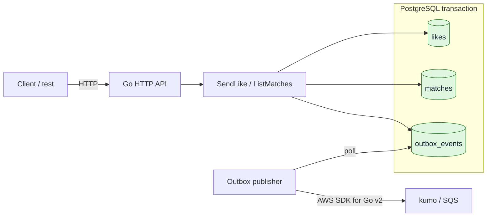
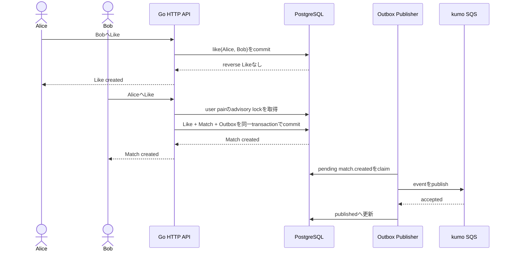

# 1:1 Mutual Matching System

マッチングアプリ型の「相互に好意を示した 2 人を 1 組の Match にする」仕組みを、Go とテストで小さく組み立てる学習用ワークスペースです。

- Workspace status: `in_progress`
- Active Section: `none`
- Next Section: `Section 7 — Transactional Outbox と SQS`（ready）
- Current files: `README.md`, `go.mod`, `go.sum`, learner-written Go files under `internal/matching`、`internal/postgres`、`internal/httpapi`, `compose.yaml`, migrations under `migrations`

## 学習の進め方

- AIが現在の振る舞いを固定するテストコードを書き、何を守るテストか、なぜ必要か、どの失敗を期待するかを説明する。
- 意図したRedを確認した後、AIが次に必要な実装と理由を小さく説明し、参考コードを会話に提示する。実装コード、SQL、migration、runtime設定は自分で入力する。
- 実装後はAIがコードを確認して対象テストを実行し、Greenまたは残っている差分を説明する。
- 各 Section の完了条件をテストで確認してから、次の Section を 1 つだけ開く。
- `次の Section へ` と依頼されたとき、AI は現在のコードとテスト結果を確認する。未完了なら修正せず、観測した差分とヒントを返す。
- 最後はコンパイルではなく、公開境界から永続化・非同期イベントまでの振る舞いをテストで再現する。

## このシステムで作るもの

ユーザー A が B に Like しただけでは Match は作らず、B も A に Like した時点で 2 人の Match を 1 件だけ作ります。

最終的には次を確認できる状態を目指します。

1. 一方向の Like は保存されるが、Match にはならない。
2. 逆方向の Like が存在すると、順序によらず同じ 2 人の Match が 1 件だけ成立する。
3. 同じ Like の再送、同時リクエスト、リトライでも Match は重複しない。
4. Like と Match は PostgreSQL に永続化される。
5. Match 成立とイベント記録は 1 つの DB トランザクションで確定する。
6. DB コミット後、`match.created` イベントが kumo 上の SQS に非同期配信される。
7. SQS が一時停止していても Match 成立は失われず、復旧後にイベントを配信できる。

これは待機中の 2 人を即時に組ませるキュー型マッチメイキングではありません。5 vs 5 の部屋編成、レーティング、検索・推薦は別ワークスペースで扱います。

## Scope

### 対象

- 既知のユーザー ID 間で Like を送る
- 相互 Like の検出
- 順序を持たない 2 人組の一意な Match
- 同一リクエストと並行実行に対する冪等性
- Match 一覧の取得
- Transactional Outbox から SQS へのイベント配信
- ドメイン、DB、HTTP、非同期境界、E2E のテスト

### 対象外

- ユーザー登録、認証、プロフィール
- 候補ユーザーの検索・推薦
- Unlike、ブロック、Match 解除
- チャット、Push 通知、メール送信
- 5 vs 5、ルーム、レーティングベースの組み分け
- 本番 AWS、Kubernetes、高可用性構成
- ベンチマークや大規模負荷試験

## ユースケースと不変条件

| 操作 | 期待結果 |
| --- | --- |
| A が B を Like | Like を 1 件保存し、Match は作らない |
| B が A を Like | A–B の Match と Outbox イベントを 1 件ずつ作る |
| A が B を再度 Like | 成功として扱ってよいが、状態は増えない |
| A が A 自身を Like | ドメインエラーとして拒否する |
| A→B と B→A が同時に到着 | 最終的に Match は 1 件だけ存在する |
| 同じ Match のイベント送信を再試行 | SQS 側の重複可能性を許容し、イベント ID で識別できる |

守りたい不変条件は次のとおりです。

- Like の向きは区別する。`A → B` と `B → A` は別の Like である。
- Match の向きは区別しない。`A–B` と `B–A` は同じ Match である。
- 自分自身への Like と、自分自身だけで構成された Match は存在しない。
- 同じ送信者・受信者の Like は最大 1 件である。
- 同じ 2 人の Match は最大 1 件である。
- Match が新規作成されたときだけ、対応する Outbox イベントを 1 件作る。
- PostgreSQL が Like、Match、未配信イベントの source of truth である。SQS は source of truth にしない。

## システム全体像



### 代表シーケンス



同期処理の成功条件は PostgreSQL のコミットです。SQS 送信を同じ処理の成功条件にはしません。これにより、キュー障害時にも成立済み Match を失わず、Outbox publisher が後で再試行できます。

## 外部システム

### PostgreSQL

- 用途: users、likes、matches、outbox_events の永続化と一意制約
- ローカル実行: Docker Compose で起動する
- テスト: モックではなく実際の PostgreSQL に対して migration、制約、transaction、並行実行を検証する
- 学習ポイント: アプリケーションの事前確認だけに頼らず、`CHECK`、`PRIMARY KEY`、`UNIQUE`、`FOREIGN KEY` でも不正状態を防ぐ

### kumo / Amazon SQS

- 用途: `match.created` を後続システムへ渡す非同期境界
- ローカル実行: kumo のコンテナを `4566` 番ポートで起動する
- クライアント: AWS SDK for Go v2 の SQS client にローカル endpoint を設定する
- テスト: キューの作成、メッセージ送信、受信内容、停止後の再送を kumo に対して検証する
- データ: 初期のテストでは kumo のデフォルトであるインメモリ動作を使い、テストごとに状態を作り直す

SQS Standard Queue は at-least-once delivery であり、重複受信の可能性があります。「必ず 1 回だけ届く」とは設計せず、安定したイベント ID と冪等な consumer を前提にします。このワークスペースでは publisher までを実装範囲とし、実際の通知 consumer は対象外です。

## 概念データモデル

この時点では設計上のレコードです。SQL ファイルはまだありません。

| Record | 主な情報 | 制約・役割 |
| --- | --- | --- |
| `users` | `id`, `created_at` | テスト fixture で用意する既知ユーザー |
| `likes` | `sender_id`, `receiver_id`, `created_at` | 方向あり。組を一意にし、自己 Like を禁止する |
| `matches` | `user_low_id`, `user_high_id`, `created_at` | 方向なし。常に小さい ID を先に保存し、組を一意にする |
| `outbox_events` | `id`, `event_type`, `payload`, `occurred_at`, `published_at` | DB commit とイベント発生を結び、未配信を再試行可能にする |

`SendLike(A, B)` の目標トランザクションは次の流れです。

1. A と B、および自己 Like でないことを検証する。
2. A→B を重複安全に保存する。
3. B→A が存在するか調べる。
4. 存在する場合、正規化した A–B の Match を重複安全に作る。
5. Match を新規作成できた場合だけ、同じトランザクションで Outbox event を作る。
6. commit 後に publisher が Outbox event を SQS へ送り、成功を記録する。

並行実行の正しさは「先に存在確認したから大丈夫」ではなく、DB 制約とトランザクションを含むテストで証明します。

## 目標ディレクトリ構成

以下は全 Section 終了時の候補です。現在存在するのは `README.md` だけです。実際の名前は各 Section の判断で調整できます。

```text
one-to-one-matching/
├── README.md
├── go.mod
├── sqlc.yaml
├── compose.yaml
├── cmd/
│   ├── api/
│   │   └── main.go
│   └── outbox-publisher/
│       └── main.go
├── internal/
│   ├── matching/
│   │   ├── pair.go
│   │   ├── service.go
│   │   └── *_test.go
│   ├── postgres/
│   │   ├── query/
│   │   │   ├── matching.sql
│   │   │   └── outbox.sql
│   │   ├── db/                 # sqlc generated; manual edit禁止
│   │   │   ├── db.go
│   │   │   ├── models.go
│   │   │   └── *.sql.go
│   │   ├── repository.go
│   │   └── repository_test.go
│   ├── httpapi/
│   │   ├── handler.go
│   │   └── handler_test.go
│   └── events/
│       ├── publisher.go
│       └── publisher_test.go
├── migrations/
│   ├── 001_init.up.sql
│   └── 002_create_outbox_events.up.sql
└── test/
    └── e2e/
        └── matching_test.go
```

## Section roadmap

| Section | State | 学ぶこと | 成果物 | 決定的なテスト |
| --- | --- | --- | --- | --- |
| 1. 2 人組の同一性 | `complete` | 値オブジェクト、方向あり/なし、正規化 | `UserID` と順序非依存な `Pair` | A–B と B–A が同一、自己・空 ID を拒否 |
| 2. メモリ上の相互 Like | `complete` | 状態遷移、Repository 境界、table-driven test | DB を使わない最小 matching service | 片方向では未成立、相互で 1 件、再送で増えない |
| 3. PostgreSQL の制約 | `complete` | schema、migration、DB が守る不変条件 | Docker PostgreSQL と初期 migration | 不正 Like・重複 Like・重複 Match を DB が拒否 |
| 4. 永続化と transaction | `complete` | Repository、atomicity、rollback | PostgreSQL 版 `SendLike` | 逆 Like で Match と Outbox が同時に作られる |
| 5. sqlc移行と並行実行 | `complete` | SQL-first data access、DB concurrency、lock/retry境界 | sqlc生成Queriesを使う競合耐性use case | 生成差分なし、同時実行後も両方向Like 2件、Match・event各1件 |
| 6. HTTP 境界 | `complete` | transport と domain の分離、status code | Like API と Match query API | HTTP 入力から DB の結果まで検証 |
| 7. Transactional Outbox と SQS | `ready` | dual write、at-least-once、再試行 | kumo SQS publisher | キュー停止中の event が復旧後に配信される |
| 8. システム E2E | `locked` | component 接続、観測可能な完了条件 | 最終シナリオテスト | HTTP→PostgreSQL→kumo SQS を実物で通す |

## Completed Section — Section 1: 2 人組の同一性を表す

### Question

方向を持つ Like と、方向を持たない Match を、型とテストでどう区別すれば重複を防げるでしょうか。

### Learn

- `UserID` を単なる文字列のまま扱う場合と、独自型にする場合の違い
- 2 つの ID の順序を正規化する `Pair` 値オブジェクト
- constructor で不変条件を守り、不正な値を作りにくくする考え方
- まずテストで振る舞いを固定し、内部表現は後から選ぶ進め方

### Decide

- 最初の `UserID` は文字列ベースとする（後で UUID に替えられる境界を持つ）。
- `Pair` は入力順ではなく、辞書順で正規化した 2 つの ID を保持する。
- 空 ID と同一 ID の組は constructor で拒否する。
- `Pair` のフィールドを外部から変更可能にするか、読み取りメソッドだけを公開するかを考える。

### Build

1. このディレクトリを独立した Go module として自分で初期化する。
2. `internal/matching` package を作る。
3. 実装より先に `UserID` と `Pair` の期待動作を table-driven test で書く。
4. テストを通す最小の実装を書く。
5. 名前や内部表現を整えても、同じテストが通ることを確認する。

### Completion

- Result: `UserID` と、入力順に依存しない `Pair` の不変条件を実装・検証した。
- Test policy: pure unit test には `t.Parallel()` を原則付ける。将来の共有 DB test は、状態を分離できる場合だけ並列化する。
- Evidence: `go test -count=1 ./...`、`go test -race -shuffle=on -count=10 ./...`、`go vet ./...` が成功した。

### 設計の焦点

この Section では `Pair` を Like に使い回しません。Like で `Pair` を使うと、A→B と B→A の方向が正規化によって消えてしまうためです。

- `UserID`: 1 人を表す、比較可能な値オブジェクト
- Like: 後の Section で `sender` と `receiver` を別々に持つ
- `Pair`: Match を構成する 2 人を順序なしで表す

ここでは `UserID` を非公開フィールドを持つ struct にします。`type UserID string` より記述は増えますが、呼び出し側が constructor を飛ばして空文字を直接変換しにくくなります。ただし Go の zero value は作れるため、`NewPair` 側でも空 ID を検証します。

### 手入力する順序

まず、この README があるディレクトリへ移動して module を初期化します。

```sh
go mod init github.com/konojunya/til/systems/one-to-one-matching
```

`internal/matching/pair_test.go` は AI が空ファイルとして作成済みです。以下の参考テストを自分で入力します。この時点では実装がないため、`go test ./internal/matching` がコンパイルエラーになるのが正常です。その失敗を確認してから実装へ進みます。

### 参考テスト案 — `internal/matching/pair_test.go`

以下は提案コードです。空ファイルはありますが、内容は書き込んでいません。

```go
package matching_test

import (
	"errors"
	"testing"

	"github.com/konojunya/til/systems/one-to-one-matching/internal/matching"
)

func TestNewUserID(t *testing.T) {
	t.Run("空でないIDを作れる", func(t *testing.T) {
		id, err := matching.NewUserID("alice")
		if err != nil {
			t.Fatalf("NewUserID() error = %v", err)
		}
		if got, want := id.String(), "alice"; got != want {
			t.Fatalf("UserID.String() = %q, want %q", got, want)
		}
	})

	t.Run("空IDを拒否する", func(t *testing.T) {
		_, err := matching.NewUserID("")
		if !errors.Is(err, matching.ErrEmptyUserID) {
			t.Fatalf("NewUserID() error = %v, want %v", err, matching.ErrEmptyUserID)
		}
	})
}

func TestNewPairNormalizesOrder(t *testing.T) {
	alice := mustUserID(t, "alice")
	bob := mustUserID(t, "bob")

	forward, err := matching.NewPair(alice, bob)
	if err != nil {
		t.Fatalf("NewPair(alice, bob) error = %v", err)
	}
	reverse, err := matching.NewPair(bob, alice)
	if err != nil {
		t.Fatalf("NewPair(bob, alice) error = %v", err)
	}

	if forward != reverse {
		t.Fatalf("NewPair() order changed identity: forward = %v, reverse = %v", forward, reverse)
	}
	if forward.Low() != alice || forward.High() != bob {
		t.Fatalf("NewPair() = (%v, %v), want (alice, bob)", forward.Low(), forward.High())
	}
}

func TestNewPairRejectsInvalidPair(t *testing.T) {
	alice := mustUserID(t, "alice")
	var empty matching.UserID

	tests := []struct {
		name    string
		first   matching.UserID
		second  matching.UserID
		wantErr error
	}{
		{name: "first ID is empty", first: empty, second: alice, wantErr: matching.ErrEmptyUserID},
		{name: "second ID is empty", first: alice, second: empty, wantErr: matching.ErrEmptyUserID},
		{name: "same user", first: alice, second: alice, wantErr: matching.ErrSameUser},
	}

	for _, tt := range tests {
		t.Run(tt.name, func(t *testing.T) {
			_, err := matching.NewPair(tt.first, tt.second)
			if !errors.Is(err, tt.wantErr) {
				t.Fatalf("NewPair() error = %v, want %v", err, tt.wantErr)
			}
		})
	}
}

func TestPairDistinguishesDifferentUsers(t *testing.T) {
	alice := mustUserID(t, "alice")
	bob := mustUserID(t, "bob")
	carol := mustUserID(t, "carol")

	aliceAndBob, err := matching.NewPair(alice, bob)
	if err != nil {
		t.Fatalf("NewPair(alice, bob) error = %v", err)
	}
	aliceAndCarol, err := matching.NewPair(alice, carol)
	if err != nil {
		t.Fatalf("NewPair(alice, carol) error = %v", err)
	}

	if aliceAndBob == aliceAndCarol {
		t.Fatal("different users produced the same Pair")
	}
}

func mustUserID(t *testing.T, value string) matching.UserID {
	t.Helper()

	id, err := matching.NewUserID(value)
	if err != nil {
		t.Fatalf("NewUserID(%q) error = %v", value, err)
	}
	return id
}
```

テストを入力したら、まず失敗を確認します。

```sh
go test ./internal/matching
```

ここで一度、自分なら `UserID` と `Pair` をどう実装するか考えてください。特に「なぜ Pair のフィールドを export しないのか」「なぜ Like には Pair を使わないのか」を言葉にできると、この Section の狙いが見えやすくなります。

### 参考実装案 — `internal/matching/pair.go`

自分の実装を試したあとで比較するための提案です。これもファイルには作成していません。

```go
package matching

import "errors"

var (
	ErrEmptyUserID = errors.New("user ID must not be empty")
	ErrSameUser    = errors.New("pair requires two different users")
)

type UserID struct {
	value string
}

func NewUserID(value string) (UserID, error) {
	if value == "" {
		return UserID{}, ErrEmptyUserID
	}
	return UserID{value: value}, nil
}

func (id UserID) String() string {
	return id.value
}

type Pair struct {
	low  UserID
	high UserID
}

func NewPair(first, second UserID) (Pair, error) {
	if first.value == "" || second.value == "" {
		return Pair{}, ErrEmptyUserID
	}
	if first == second {
		return Pair{}, ErrSameUser
	}
	if first.value > second.value {
		first, second = second, first
	}
	return Pair{low: first, high: second}, nil
}

func (p Pair) Low() UserID {
	return p.low
}

func (p Pair) High() UserID {
	return p.high
}
```

実装後は formatter とテストを実行します。

```sh
gofmt -w internal/matching/pair.go internal/matching/pair_test.go
go test ./internal/matching
go test ./...
```

`Pair` と `UserID` は unexported field だけで構成され、どちらも比較可能です。そのため Section 1 では `Pair` 同士を `==` / `!=` で比較できます。将来 slice、map、function など比較不可能な field を追加した場合、この性質は失われます。

### Tests

- `alice, bob` から作った Pair と `bob, alice` から作った Pair が等しい。
- Pair の一方に空 ID がある場合はエラーになる。
- 同じ ID 同士ではエラーになる。
- `alice, bob` と `alice, carol` は異なる。
- 正常な Pair から取得する 2 つの ID は常に正規化された順序になる。

### Done when

- 上の振る舞いが table-driven test で表現されている。
- 実装詳細ではなく公開された振る舞いをテストしている。
- `go test ./internal/matching` が成功する。
- `go test ./...` が成功する。

### Notes / evidence

- 2026-08-24: Section 1 を開始し、テスト先行の手順と参考コードを掲載した。
- 2026-08-24: 参考コードは一時 module で `go test ./...` と `go vet ./...` に成功。学習者の Go ファイルはまだ未作成のため、Section 完了判定は未実施。
- 2026-08-24: 学習者が `go mod init` を実行。`go list -m` で module path `github.com/konojunya/til/systems/one-to-one-matching` を確認。
- 2026-08-24: AI が最初のマイクロステップ用に zero-byte の `internal/matching/pair_test.go` を作成。内容は未入力。
- 2026-08-24: 学習者が最初の `UserID` test を入力。`go test ./internal/matching` は `undefined: matching` で失敗し、対象 package の import 修正待ち。意図した Red には未到達。
- 2026-08-24: import 修正後、`go test ./internal/matching` が `no non-test Go files` で失敗する意図した Red を確認。
- 2026-08-24: AI が次のマイクロステップ用に zero-byte の `internal/matching/pair.go` を作成。`UserID` 実装待ち。
- 2026-08-24: 学習者が `UserID` を実装。`go test ./internal/matching` の成功を確認し、最初の Green に到達。
- 2026-08-24: 学習者が Pair normalization test を追記。`go test ./internal/matching` が `undefined: matching.NewPair` で失敗する意図した Red を確認。
- 2026-08-24: 学習者が Pair normalization を実装。`go test ./internal/matching` の成功を確認。
- 2026-08-25: 学習者が invalid Pair test を追記。`go test ./internal/matching` が `undefined: matching.ErrSameUser` で失敗する意図した Red を確認。
- 2026-08-25: 学習者が Pair constructor の検証を実装。`go test ./internal/matching` の成功を確認。
- 2026-08-25: 異なる Pair の回帰 test を含め、`go test -count=1 ./...`、`go test -race -count=1 ./...`、`go vet ./...` の成功を確認。
- 2026-08-25: top-level test と独立した subtest に `t.Parallel()` を追加。`go test -race -shuffle=on -count=10 ./...` と `go vet ./...` の成功を確認。
- 2026-08-25: 完了条件を再検証し、Section 1 を `complete`、Section 2 を `active` に変更。

## Completed Section — Section 2: メモリ上の相互 Like

### Question

方向を持つ Like をどのように保存し、逆方向の Like が届いた瞬間だけ、順序を持たない Match を 1 件作ればよいでしょうか。

### Learn

- A→B と B→A を区別する方向付きの値
- 1 回の操作で状態が「未成立」から「成立済み」へ変わる状態遷移
- use case と保存方法を分ける Repository 境界
- 同じリクエストを繰り返しても結果が増えない冪等性
- 複数ケースで同じ契約を確認する table-driven test

### Decide

- `Like` は送信者と受信者を別々に保持し、`Pair` のような順序の正規化はしない。
- Section 2 ではデータベースを使わず、プロセス内メモリを保存先にして状態遷移へ集中する。
- 相互 Like が見つかったときだけ Section 1 の `Pair` を使って Match を表現する。
- 永続化方式に依存しない呼び出し方を先に作り、PostgreSQL への置き換えは後の Section で行う。

### Build

1. 送信者と受信者を保持する方向付き `Like` をテスト先行で作る。
2. Like と Match を保存・検索する最小の Repository 契約を決める。
3. Repository のメモリ実装を作る。
4. Like を保存し、逆 Like を調べ、必要なら Match を作る use case を実装する。
5. 一方向、相互、重複送信を table-driven test で検証する。

### Completion

- Result: 一方向Like、相互Like、成立後の2方向再送を、Repository境界を持つメモリ実装で再現した。
- Evidence: `go test -count=1 ./internal/matching`、`go test -race -shuffle=on -count=10 ./...`、`go vet ./...` が成功し、`gofmt` 差分もない。
- Concurrency scope: 各parallel testは別のRepositoryを使う。同じRepositoryへの同時書き込み耐性はSection 5で扱う。

### Tests

- A→B と B→A は異なる Like になる。
- 空の送信者・受信者と自己 Like を拒否する。
- 一方向 Like では Match は存在しない。
- 逆方向 Like が届くと同じ `Pair` の Match が 1 件成立する。
- 同じ Like や逆 Like を再送しても Like と Match の件数が増えない。

### Done when

- DB を使わずに一方向 Like、相互 Like、重複送信の状態遷移を再現できる。
- matching use case がメモリ保存の内部構造へ直接依存していない。
- `go test -count=1 ./internal/matching` が成功する。
- `go test -race -shuffle=on -count=10 ./...` が成功する。

### Notes / evidence

- 2026-08-25: Section 1 の完了確認後、Section 2 を開始。
- 2026-08-25: 方向を保持するテストを入力し、`undefined: matching.NewLike` となる意図したRedを確認。zero-byteの `internal/matching/like.go` を作成。
- 2026-08-25: 方向を保持する最小の `Like` を実装。`go test -count=1 ./internal/matching` のGreenと `gofmt` 差分なしを確認。
- 2026-08-25: 空IDと自己Likeを拒否するtable-driven testを追加。`undefined: matching.ErrSelfLike` となる意図したRedを確認。
- 2026-08-25: `NewLike` に空ID・自己Likeのvalidationを実装。`go test -count=1 ./internal/matching` のGreenと `gofmt` 差分なしを確認。zero-byteの `internal/matching/memory_repository_test.go` を作成。
- 2026-08-25: 保存方向と重複保存のRepository testを入力。`undefined: matching.NewMemoryRepository` となる意図したRedを確認。zero-byteの `internal/matching/memory_repository.go` を作成。
- 2026-08-25: `map[Like]struct{}` によるメモリRepositoryを実装。初回保存、重複保存、方向別検索のGreenと `gofmt` 差分なしを確認。
- 2026-08-25: 入力順の異なる `Pair` を1件だけ保存するtestを追加。`SaveMatch` / `HasMatch` 未実装による意図したRedを確認。
- 2026-08-25: `map[Pair]struct{}` によるMatch保存を実装。入力順に依存せず1件だけ保存されるGreenと `gofmt` 差分なしを確認。zero-byteの `internal/matching/service_test.go` を作成。
- 2026-08-25: 一方向Likeを保存しMatchを作らないservice testを入力。`undefined: matching.NewService` となる意図したRedを確認。zero-byteの `internal/matching/service.go` を作成。
- 2026-08-25: `SaveLike` だけに依存する最小serviceと結果型を実装。一方向LikeのGreenと `gofmt` 差分なしを確認。
- 2026-08-25: A→Bの後にB→Aを送る相互Like testを追加。2回目が `MatchCreated: false` となる意図したRedを確認。
- 2026-08-25: serviceが逆Likeを検索し、存在時に正規化した `Pair` を保存する状態遷移を実装。相互Like testのGreenと `gofmt` 差分なしを確認。
- 2026-08-25: Match成立後にA→BとB→Aを再送する冪等性testを追加。両方とも `LikeCreated: false`、`MatchCreated: false` になることを確認。
- 2026-08-25: `go test -count=1 ./internal/matching`、`go test -race -shuffle=on -count=10 ./...`、`go vet ./...` が成功。全Goファイルに `gofmt` 差分なし。Section 2の完了条件を満たした。
- 2026-08-25: Section 2を `complete`、Section 3を `active` に変更。

## Completed Section — Section 3: PostgreSQL の制約

### Question

アプリケーションのvalidationを迂回する書き込みや、将来の実装ミスがあっても、PostgreSQL自身にLikeとMatchの不変条件を守らせるにはどの制約が必要でしょうか。

### Learn

- Dockerで実PostgreSQLを再現可能に起動する方法
- migrationでschema変更を履歴として管理する考え方
- primary key、foreign key、`NOT NULL`、`CHECK`が守る責務の違い
- 方向付きLikeと、正規化された順序なしMatchをテーブルで表現する方法
- mockではなく実DBへ不正なSQLを送り、制約違反をintegration testで観測する方法

### Decide

- PostgreSQLはDocker Composeで起動し、Section 3では実DBに対してschema testを行う。
- 現在の `UserID` に合わせ、ID列はまず `text` とする。空文字はusersテーブルの`CHECK`で拒否する。
- likesは `(sender_id, receiver_id)` を方向付きの複合primary keyとし、自己Likeを`CHECK`で拒否する。
- matchesは `(user_low_id, user_high_id)` を複合primary keyとし、`user_low_id < user_high_id` を要求して非正規順と自己Matchを拒否する。
- usersを参照するforeign keyにより、存在しないユーザーのLikeとMatchを拒否する。
- PostgreSQL版Repository、transaction、OutboxはSection 4で扱い、このSectionではschema制約に集中する。
- 同じDB状態を共有するintegration testには安易に`t.Parallel()`を付けず、testごとの分離方法を決めてから並列化する。

### Build

1. PostgreSQLだけを起動する最小の`compose.yaml`を書く。
2. users、likes、matchesを作る初期migrationを書く。
3. GoのPostgreSQL driverとintegration testの接続・schema初期化処理を用意する。
4. 正常なLikeとMatchを実DBへ保存できることを確認する。
5. 空ID、未知ユーザー、自己Like、重複Like、非正規Match、重複MatchをDBが拒否することをtable-driven testで確認する。

### Completion

- Result: Docker PostgreSQLへ初期migrationを適用し、users、方向付きlikes、正規順matchesの不変条件を実DBの制約として実装・検証した。
- Test policy: integration testは`integration` build tagでunit testから分離し、各caseをtransactionでrollbackする。共有DBと同じfixture IDを使うため`t.Parallel()`は付けない。
- Evidence: unit/integration test、race・shuffle各10回、integrationを含むvet、`gofmt`、`go mod tidy -diff`がすべて成功。Docker PostgreSQLのhealthy、全constraint、test後の全テーブル0件も確認した。

### Tests

- 正常なユーザー、方向付きLike、正規化済みMatchを保存できる。
- 空のユーザーIDと存在しないユーザー参照を拒否する。
- 自己Likeと同一方向の重複Likeを拒否し、逆方向Likeは許可する。
- 自己Match、非正規順のMatch、同じPairの重複Matchを拒否する。
- 制約違反をGoのintegration testがエラーとして観測する。

### Done when

- `docker compose config`が成功し、PostgreSQLがhealthyになる。
- 初期migrationを空のDBへ適用できる。
- 実PostgreSQLを使うschema integration testが全制約を検証する。
- unit testとintegration testを分離して実行できる。
- `go test -count=1 ./...`と、Section 3で確定するintegration testコマンドが成功する。

### Notes / evidence

- 2026-08-25: Section 2の完了確認後、Section 3を開始。PostgreSQL RepositoryとtransactionはSection 4へ残し、schema制約を対象とした。
- 2026-08-25: 公式PostgreSQL imageの18.6 tagとPostgreSQL 18以降のvolume path変更を確認。zero-byteの`compose.yaml`を作成。
- 2026-08-25: learner-written `compose.yaml`について`docker compose config`成功、PostgreSQL 18.6のhealthy状態、localhost:5432の公開を確認。zero-byteの`internal/postgres/schema_test.go`を作成。
- 2026-08-25: pgxによる接続・Ping testが`integration` build tag付きで成功。通常のunit testと`gofmt`も成功し、zero-byteの`migrations/001_init.up.sql`を作成。
- 2026-08-25: users、方向付きlikes、正規順matchesの初期migrationを空DBへ適用。ID列の`COLLATE "C"`と`matches_users_ordered`制約を実DBで確認した。
- 2026-08-25: test transaction内で既知ユーザー、両方向Like 2件、正規順Match 1件を保存できることを確認。rollback後に全テーブルが0件へ戻ることも確認した。
- 2026-08-25: PostgreSQL接続処理をtest helperへ集約。helper利用後もintegration/unit testのGreenと`gofmt`差分なしを確認した。
- 2026-08-25: 空UserIDを`users_id_not_empty`、Like/Matchの未知ユーザー参照を各FOREIGN KEYが拒否することをSQLSTATEとconstraint名で確認した。
- 2026-08-25: 自己LikeをCHECK、同方向重複を複合PRIMARY KEYが拒否し、逆方向Likeは2件目として保存できることを確認した。
- 2026-08-25: 自己Matchと逆順Matchを`matches_users_ordered`、正規順Pairの重複を`matches_pkey`が拒否することを確認した。integration/unit test、vet、`gofmt`は成功したが、`go mod tidy -diff`で未整理差分を検出した。
- 2026-08-25: `go mod tidy`後の差分なしを確認。unit/integrationのrace・shuffle各10回、integrationを含むvet、全Goファイルの`gofmt`、Compose構文とPostgreSQL healthが成功し、Section 3を完了した。

## Completed Section — Section 4: 永続化と transaction

### Question

Section 2で分かれていた`SaveLike`、逆Like検索、`SaveMatch`、Outbox記録を、PostgreSQL上でどこまで1つのtransactionとして扱えば、途中失敗でも部分的なMatchを残さずに済むでしょうか。

### Learn

- `pgx.Tx`とconnection poolの役割の違い
- Repositoryを特定のtransactionへ束縛する`DBTX` interface
- `INSERT ... ON CONFLICT DO NOTHING`で作成有無を返す方法
- use case全体をtransactionで囲み、commitとrollbackを1か所で決める方法
- MatchとOutbox eventを同じtransactionへ入れてdual writeを避ける考え方
- test transactionによる後片付けと、検証対象であるapplication transactionの違い

### Decide

- PostgreSQL accessにはSection 3で追加した`pgx/v5`を使う。
- Repositoryは`pgx.Tx`とpoolの両方が満たせる小さな`DBTX` interfaceに依存する。
- Section 2の`matching.Repository`契約と`matching.Service`の状態遷移を再利用し、PostgreSQL用のtransaction境界からtransaction-bound Repositoryを渡す。
- LikeとMatchの重複は事前SELECTだけで判断せず、Section 3のPRIMARY KEYと`ON CONFLICT DO NOTHING`を使って作成有無を返す。
- Matchを新規作成した場合だけOutbox eventを記録し、Like、Match、Outboxを同じtransactionでcommitする。
- Outboxはイベント種類ごとに分けず、Matching ServiceのDB境界に1つの`outbox_events`を置く。今回は1 Matchにつき1つの`match.created`だけなので、aggregate identityはpayloadに保持し、専用の`aggregate_key`列はまだ設けない。
- 同時実行に対するlock順序やretryはSection 5へ残し、このSectionでは逐次実行と強制失敗時のatomicityを証明する。
- 共有DBと同じfixture IDを使うintegration testには`t.Parallel()`を付けない。

### Build

1. transaction-bound RepositoryでLikeの保存・重複判定を実装する。
2. 逆方向Likeの検索と、正規化済みMatchの保存を実装し、`matching.Repository`を満たす。
3. Outbox event用の追加migrationと最小の保存処理を作る。
4. callbackを1つの`pgx.Tx`で実行するtransaction境界を作る。
5. 既存`matching.Service`をtransaction内で実行し、新規Matchに対応するOutbox eventを同時に保存する。
6. 片方向Like、相互Like、再送、強制エラー時のrollbackを実DBで検証する。

### Completion

- Result: `pgx.Tx`へ束縛したPostgreSQL Repositoryとapplication serviceを実装し、Like、Match、Outboxを1つのtransactionで確定できるようにした。
- Transaction policy: callback成功時だけcommitし、domain処理またはOutbox保存の失敗時はそのcallback内の全DB操作をrollbackする。Matchを新規作成した場合だけ`match.created`をOutboxへ保存する。
- Evidence: unit/integration test、両方のrace、通常・integrationのvet、`gofmt`がすべて成功。片方向Like、相互Like、再送、Outbox制約違反時のrollbackを実PostgreSQLで確認した。

### Tests

- PostgreSQL Repositoryが方向付きLikeと正規化済みMatchについてmemory版と同じ作成有無を返す。
- 一方向LikeのcommitではLikeだけが残り、MatchとOutboxは作られない。
- 逆方向LikeのcommitでMatchとOutboxが1件ずつ同時に残る。
- 同じLikeの再送でLike、Match、Outboxが増えない。
- Outbox保存を強制的に失敗させると、そのtransactionのLikeとMatchも残らない。

### Done when

- PostgreSQL Repositoryが`matching.Repository`を満たす。
- PostgreSQL版`SendLike`の成功条件がDB transactionのcommitになる。
- Matchと対応するOutbox eventが片方だけ残らないことをintegration testで証明する。
- unit testとintegration testが成功し、Section 5の並行実行へ進める逐次実行の基準ができる。

### Notes / evidence

- 2026-08-25: Section 3を`0220de4`としてcommitし、Section 4を開始。既存`matching.Service`を再利用しつつ、その複数Repository操作をPostgreSQL transactionで囲む方針とした。
- 2026-08-25: PostgreSQL RepositoryのLike保存・重複判定testを入力。`undefined: NewRepository`だけとなる意図したcompile Redを確認し、zero-byteの`internal/postgres/repository.go`を作成した。
- 2026-08-25: `DBTX`へ束縛したRepositoryと`ON CONFLICT DO NOTHING`による`SaveLike`を実装。初回作成、重複時未作成、DB上1件のintegration testがGreenとなり、`gofmt`差分なしを確認した。
- 2026-08-25: 保存済みの方向付きLikeだけを見つけ、逆向きは未保存と判定するtestを追加。`repo.HasLike undefined`だけとなる意図したcompile Redを確認した。
- 2026-08-25: `SELECT EXISTS`で方向付きLikeを検索する`HasLike`を実装。対象が0件でも1件以上でもboolean 1行を返す理由をコードコメントへ記録し、Repository integration test全体のGreenと`gofmt`差分なしを確認した。
- 2026-08-25: 逆順の入力から正規化したPairを初回だけ保存し、再保存で増えないtestを追加。`repo.SaveMatch undefined`だけとなる意図したcompile Redを確認した。
- 2026-08-25: Pairのlow/highを`ON CONFLICT DO NOTHING`で保存する`SaveMatch`を実装。Repository integration test全体、ドメインunit test、`gofmt`がGreenとなり、zero-byteの`internal/postgres/outbox_test.go`を作成した。
- 2026-08-25: 未配信の`match.created`を保存してpayloadとpending状態を読めるschema testを入力。`relation "outbox_events" does not exist`となる意図したdatabase Redを確認し、zero-byteの`migrations/002_create_outbox_events.up.sql`を作成した。
- 2026-08-25: 汎用`outbox_events` migrationを適用。イベントID・種類・JSON object・発生日時・配信日時、各CHECK、未配信partial indexを実DBで確認し、integration test全体のGreenと`gofmt`差分なしを確認した。
- 2026-08-25: Repository経由でevent envelopeをOutboxへ保存するtestを追加。`undefined: OutboxEvent`と`repo.SaveOutboxEvent undefined`だけとなる意図したcompile Redを確認し、zero-byteの`internal/postgres/outbox.go`を作成した。
- 2026-08-25: `OutboxEvent`と`SaveOutboxEvent`を実装。Outboxを含むPostgreSQL Repository integration test全体のGreenと`gofmt`差分なしを確認し、次のtransaction境界を検証するzero-byteの`internal/postgres/transaction_test.go`を作成した。
- 2026-08-25: transaction成功時のcommitとcallback error時のrollbackを外側のconnectionから観測するtestを追加。失敗が2か所の`undefined: NewTransactor`だけとなる意図したcompile Redを確認し、zero-byteの`internal/postgres/transaction.go`を作成した。
- 2026-08-25: `Transactor`を実装。callback成功時のcommitとcallback error時のrollbackを含むPostgreSQL integration test全体のGreenと`gofmt`差分なしを確認し、片方向Likeのapplication transactionを検証するzero-byteの`internal/postgres/matching_service_test.go`を作成した。
- 2026-08-25: 片方向LikeではLikeだけをcommitし、Match、Outbox、event ID生成が発生しないapplication transaction testを追加。失敗が`undefined: NewMatchingService`だけとなる意図したcompile Redと`gofmt`差分なしを確認し、zero-byteの`internal/postgres/matching_service.go`を作成した。
- 2026-08-25: PostgreSQL用`MatchingService`からtransaction-bound Repositoryを既存の`matching.Service`へ渡す処理を実装。片方向Likeのapplication transaction testがGreenとなり、`gofmt`差分なしを確認した。
- 2026-08-25: 相互LikeでLike 2件、正規化済みMatch 1件、対応するpending Outbox 1件を要求するtestを追加。LikeとMatchの検証後に`event ID generator calls = 0, want 1`だけで失敗し、Outbox記録だけが未実装である意図したbehavior Redを確認した。
- 2026-08-25: `MatchCreated`がtrueの場合だけ正規化済みPairのpayloadと`match.created`をtransaction-bound RepositoryからOutboxへ保存する処理を実装。片方向Likeと相互Likeを含むPostgreSQL integration test全体のGreenと`gofmt`差分なしを確認した。
- 2026-08-25: 成立済みMatchへ両方向のLikeを再送しても`LikeCreated`と`MatchCreated`がfalseとなり、Like 2件、Match 1件、Outbox 1件から増えない冪等性testを追加。PostgreSQL integration test全体のGreenと`gofmt`差分なしを確認した。
- 2026-08-25: 空のevent IDで`outbox_events_id_not_empty` CHECK violationを発生させ、error chainにSQLSTATE `23514`を保持しつつ、そのtransactionの逆方向Like、Match、Outboxが0件へrollbackされ、先にcommit済みの片方向Likeだけが1件残ることを確認した。
- 2026-08-25: Section 4完了確認としてunit、unit race、integration、integration race、通常・integrationのvet、`gofmt`を実行し、すべてGreen。PostgreSQL版`SendLike`でLike、Match、Outboxのcommit/rollbackと再送時の冪等性を実DBで証明した。

## Completed Section — Section 5: sqlc移行と並行実行

### Question

普段使うsqlcのSQL-firstな書き味へRepositoryを移行しつつ、`A→B`と`B→A`がほぼ同時に別transactionへ到着したとき、両方のLikeは保存されたのに、互いの未commit Likeを見られずMatchを作らない状態をどう防ぐでしょうか。同方向の大量再送でもLike、Match、Outboxを増殖させず、複数processで同じ結果を保つにはどのDB concurrency controlが必要でしょうか。

### Learn

- `sqlc.yaml`、migration schema、named queryをsource of truthとしてpgx/v5対応Go codeを生成する流れ
- sqlc生成の`DBTX`、`Queries`、parameter/result struct、table modelがそれぞれ持つ役割
- 生成されたDB modelと、`matching.UserID`・`matching.Pair`などdomain modelを同一視せずRepositoryで変換する理由
- sqlcの`Queries.WithTx(tx)`で、同じgenerated query setをpoolとtransactionの両方へ束縛する方法
- Goのrace detectorが検出するメモリ上のdata raceと、PostgreSQL上のserialization anomalyの違い
- 単一の`pgx.Conn`と、複数transactionを並行実行できる`pgxpool.Pool`の役割の違い
- PostgreSQLのRead Committedではstatementごとにsnapshotが作られ、他transactionの未commit行は見えないこと
- PRIMARY KEYと`ON CONFLICT DO NOTHING`は重複を防げても、相互LikeからMatchを作り損ねるwrite skewまでは防げないこと
- 正規化したPairを競合単位にするtransaction-level advisory lockと、Serializable transaction + SQLSTATE `40001` retryのtrade-off
- goroutineの開始を揃え、最終DB状態と返り値の両方を繰り返し検証するconcurrency integration test

### Decide

- sqlcはGo 1.24以降の`tool` directiveでmoduleへversion固定し、`go tool sqlc generate`と`go tool sqlc vet`で実行する。現在の基準versionは公式latest docsと一致する`v1.31.1`とする。
- 設定はversion 2、engineはPostgreSQL、`sql_package`は既存driverと同じ`pgx/v5`、schema inputは`migrations`、query inputは`internal/postgres/query`、生成先は`internal/postgres/db`とする。
- learnerが手で書くsourceは`sqlc.yaml`と`.sql` queryであり、`internal/postgres/db`以下のgenerated Goは手編集しない。生成結果はrepositoryへcommitし、generate後に差分が出ないことを検証する。
- sqlc生成modelはDB表現として扱い、Section 1・2のdomain型とbusiness ruleは`internal/matching`に残す。`Repository`はgenerated Queriesを呼ぶadapterとして維持する。
- Section 4で手書きしたSQLを先にnamed queryへ移し、既存integration testを一切弱めずGreenへ戻してから、新しいconcurrency queryとtestへ進む。
- Section 4の既存SQLをnamed queryへ移す作業は新しいsystem behaviorを追加しないrefactoringなので、query追加とcode generationをまとめて進める。新しい並行制御はtest-firstの小さいstepへ戻す。
- concurrencyの正しさはprocess内の`sync.Mutex`へ依存せず、複数instanceで共有できるPostgreSQL側の仕組みで守る。
- concurrency testは`pgxpool.Pool`を使い、実際に複数connection・複数transactionを同時に動かす。
- まず現在のRead Committed実装で相互Likeの取りこぼしを再現し、そのRedを解消する最小の競合制御を選ぶ。
- 競合単位は入力方向ではなく、Section 1で正規化した同一Pairとする。
- concurrency Redの後、同じPairだけを直列化しtransaction終了時に自動解放されるtransaction-level advisory lockを採用する。Serializable + bounded retryは、transaction全体の再実行とevent ID再生成の扱いが増えるため今回は採用しない。
- advisory lock keyは入力方向に依存しないようSQLの`LEAST`/`GREATEST`でID順を揃え、2つの`hashtext`を`pg_advisory_xact_lock(integer, integer)`へ渡す。hash collisionは無関係なPairを余分に直列化し得るが、不正なMatchは作らない。
- PRIMARY KEYと`ON CONFLICT DO NOTHING`は、選んだ競合制御とは別に最後の重複防止線として残す。
- test内のevent ID生成回数はatomicに計測し、test code自身のdata raceを`go test -race`で検出できるようにする。
- 共有fixtureを使うtest関数自体には`t.Parallel()`を付けず、1つのtest内部で明示的にgoroutineを同期する。

### Design decision — Pair単位のtransaction-level advisory lock

#### Status

`Accepted`（2026-08-25）

#### Context: 制約だけでは防げなかった取りこぼし

PostgreSQLのデフォルトであるRead Committedでは、通常の`SELECT`はstatement開始前にcommitされたデータだけを見る。別transactionの未commit行は見えないため、次の順序が成立し得る。

```text
Transaction 1                         Transaction 2
INSERT Alice → Bob                    INSERT Bob → Alice
HasLike(Bob → Alice) = false          HasLike(Alice → Bob) = false
COMMIT                                COMMIT
```

この結果、両方向Likeは2件残るが、MatchとOutboxは0件になる。likesとmatchesのPRIMARY KEY、`ON CONFLICT DO NOTHING`は重複を防げても、「相互Likeを見つけてMatchへ進める」状態遷移の欠落までは防げない。

`concurrency_test.go`では、2つのconnectionを使い、pgx query tracerで両transactionを`HasLike`直前に揃えた。lock導入前はLike 2件、Match 0件、Outbox 0件、event ID生成0回となるRedを再現した。

#### Decision

`SendLike` transactionの先頭で、方向を持たない同一Pairを表すexclusiveなtransaction-level advisory lockを取得する。

```sql
SELECT pg_advisory_xact_lock(
    hashtext(LEAST(
        sqlc.arg(first_user_id)::text,
        sqlc.arg(second_user_id)::text
    )),
    hashtext(GREATEST(
        sqlc.arg(first_user_id)::text,
        sqlc.arg(second_user_id)::text
    ))
);
```

- `LEAST`/`GREATEST`により、`Alice → Bob`と`Bob → Alice`を同じlock keyへ正規化する。
- 2つの`hashtext`を`pg_advisory_xact_lock(integer, integer)`のapplication-defined keyとして使う。
- 先に取得したtransactionだけがLike保存と逆Like検索へ進み、もう一方は同じkeyのlock解放まで待機する。
- lockは未commitデータを見えるようにするものではない。2本目のtransactionを1本目のcommit後まで待たせ、Read Committedの次のstatement snapshotからcommit済みLikeを見えるようにする。
- `xact` lockはcommitまたはrollbackで自動解放されるため、明示的なunlockは行わない。
- Match作成とOutbox保存を含む現在のtransaction境界全体でlockを保持する。

#### Alternatives considered

| 選択肢 | Pros | Cons / 今回採用しなかった理由 |
| --- | --- | --- |
| PostgreSQLのPRIMARY KEYと`ON CONFLICT`だけ | 実装が単純で、重複行を確実に防げる | 重複は防げるが、互いの未commit Likeを見失ってMatchを作らない問題は解決しない |
| Goの`sync.Mutex` | 小さく実装でき、単一process内では分かりやすい | processごとにlockが分かれるため、複数instanceや別workerからの同時実行を守れない |
| users行を`SELECT FOR UPDATE` | PostgreSQL標準の行lockで、hash keyを作らなくてよい | Pair専用行がまだ存在せず、user行をlockすると同じuserを含む別Pairまで広く直列化する |
| Serializable transaction + SQLSTATE `40001`のbounded retry | 個別のlock規約を持たず、より一般的なserialization anomalyを検出できる | transaction全体の再実行、retry上限・backoff、context cancellation、event ID再生成回数の設計が必要になる。今回のPair競合だけには複雑さが大きい |
| Pair単位のtransaction-level advisory lock | schemaにlock用行を追加せず、同じPostgreSQLを使う複数process間でPairだけを直列化できる | applicationの全書き込み経路が同じlock規約を守る必要があり、待機中はDB connectionを占有する |

#### Why this option

今回守りたい競合単位は明確に1つのPairであり、transaction全体を一般的にretryする必要はまだない。advisory lockなら既存のRead CommittedとTransactional Outboxを維持したまま、Like保存より前に1回lockを取得するだけで状態遷移を直列化できる。

また、lockをPostgreSQLに置くためGo process内のmutexと異なり、同じDBへ接続するAPI instanceやworkerが増えても同じkeyで競合できる。Match行がまだ存在しない時点でも、application-defined keyなら「これから作るかもしれないPair」をlockできる。

#### Pros

- 同じPairだけを直列化し、異なるPairは並行処理できる。
- 複数process・複数application instanceで共有できる。
- lock管理用tableやmigrationを追加しなくてよい。
- commit/rollback時に自動解放され、session-level lockの解放漏れを避けられる。
- transaction retryを導入しないため、event ID生成やcallback副作用の再実行を考えなくてよい。
- PRIMARY KEY、CHECK、transaction、Outboxの既存防御をそのまま最後の安全線として残せる。

#### Cons and operational risks

- advisory lockはPostgreSQLが利用を強制しない。将来別のMatch作成経路を追加する場合も、同じPair lockをtransaction先頭で取得する規約が必要になる。
- hotなPairへのリクエストは待ち行列になり、待機中のtransactionがconnection poolを消費する。
- `hashtext` collisionでは無関係なPairが同じkeyになり、正しさは壊れないが不要な直列化が起きる可能性がある。
- 1transactionで複数のadvisory lockを取得する設計へ拡張すると、取得順が一定でなければdeadlockの原因になる。
- この可視性の説明は、statementごとにsnapshotを更新するRead Committedを前提にする。Repeatable Readへ変更する場合は同じ設計を再評価する。
- lock待機時間には上限がないため、request context、statement timeout、pool待機時間、`pg_locks`を使った監視が必要になる。

#### Revisit when

- Match処理を複数DBやmulti-primary構成へ分散し、1つのPostgreSQL lock managerを共有できなくなる。
- Pairごとの競合が多く、lock待機時間やpool枯渇が実運用上の問題になる。
- 1transactionで複数Pairや複数aggregateを更新する必要が生じ、lock順序が複雑になる。
- isolation levelをRepeatable ReadまたはSerializableへ変更する。
- Pair競合以外のserialization anomalyもまとめて扱う必要が生じ、bounded retryの方が一貫した設計になる。

#### Verification

- Before: 両方向Like 2件、Match 0件、Outbox 0件、event ID生成0回のRed。
- After: 両方向Like 2件、Match 1件、Outbox 1件、event ID生成1回のGreen。
- 回帰test: `TestMatchingServiceConcurrentMutualLikesCreateOneMatchAndOutbox`。

### Build

1. `go get -tool`でsqlcをmoduleへ固定し、version 2の`sqlc.yaml`、query directory、生成先を用意する。
2. Section 4の`SaveLike`、`HasLike`、`SaveMatch`、`SaveOutboxEvent`をnamed queryとして自分で書き、`go tool sqlc generate`でpgx/v5用Queriesとmodelを生成する。
3. 手書き`DBTX`とraw SQLをgenerated Queriesへ置き換え、`WithTx`を使うtransaction-bound Repositoryへ移行する。既存Section 4 integration testをすべてGreenへ戻す。
4. `pgxpool.Pool`を使うconcurrency integration testの接続・fixture helperを用意し、同じPairへの逆方向Like同時実行で現在の取りこぼしを観測する。
5. Pair単位のtransaction-level advisory lockとSerializable + retryを比較し、採用した競合制御SQLもsqlc named queryとして追加する。
6. 選んだ競合制御を`SendLike` transactionの先頭へ組み込み、逆方向Likeを直列化または安全にretryする。
7. 同方向の大量再送と両方向の混在実行後に、Like、Match、Outbox、event ID生成回数が増殖しないことを確認する。
8. `sqlc generate`の生成差分、`sqlc vet`、integration testの`-race`と複数回実行を通し、hang、deadlock、flaky failureがない基準を作る。

### Completion verification

- `go tool sqlc generate`前後のgenerated file hashが`81e70e8eac1d54bb0d55b5221c53d8e763bddf3e`で一致した。
- `go tool sqlc vet`、`go test ./...`、通常・integration build tagの`go vet`が成功した。
- 実PostgreSQLに対するintegration testが成功し、`go test -race -count=10 -tags=integration ./internal/postgres`も19.834秒で成功した。

### Tests

- `go tool sqlc generate`後にgenerated directoryへ未反映差分がなく、`go tool sqlc vet`が成功する。
- sqlc移行前からあるSection 4のRepository、transaction、Outbox、application service integration testが同じ期待値で成功する。
- 同方向Likeを多数同時送信しても、その方向のLikeは1件だけでMatchとOutboxは作られない。
- `A→B`と`B→A`を同時送信した後、両方向Like 2件、Match 1件、pending Outbox 1件だけが存在する。
- 同じPairへ両方向・重複を混在させても、MatchとOutbox eventは各1件から増えない。
- 競合待ちまたはretryがcontext cancellationを無視せず、transactionやconnectionを残さない。
- concurrency integration testが`-race`と複数回実行で安定して成功する。

### Done when

- PostgreSQL accessのSQLが`internal/postgres/query`へ集まり、Repository implementationに手書きquery literalが残らない。
- generated Goを手編集せず、moduleに固定した`go tool sqlc`から同じcodeを再生成できる。
- sqlc generated Queriesがpool直下と`WithTx`の両方で使われ、Section 4のatomicity testがすべて維持される。
- 複数connectionから同時に逆方向Likeを送ってもMatchを取りこぼさない。
- 同方向・両方向の重複リクエスト後もDBの件数が不変条件どおりになる。
- 競合制御がGo process内のmutexに依存せず、PostgreSQLを共有する複数instanceで機能する。
- lockまたはretryの範囲と失敗時の戻り方がtestで明示される。
- `go test -race -count=10 -tags=integration ./internal/postgres`が安定して成功する。

### Notes / evidence

- 2026-08-25: Section 4をcommit `3188060`として完了し、Section 5を開始。実装ファイルはまだ作らず、Read Committedで起こり得る相互Likeの取りこぼし、poolを使う並行test、Pair単位lockとSerializable retryの比較範囲を定めた。
- 2026-08-25: learnerが普段使うsqlcの書き味へSection 5で移行する方針を追加。Go `1.26.3`のmodule tool dependency、sqlc `v1.31.1`のversion 2 config、pgx/v5生成、`WithTx`が公式に利用できることを確認した。sqlc移行でSection 4のtestを維持してからconcurrency Redへ進む。
- 2026-08-25: sqlc移行の最初のsourceとしてzero-byteの`sqlc.yaml`と`internal/postgres/query/matching.sql`を作成。最初は`SaveLike :execrows`だけを生成し、既存RepositoryのRowsAffected semanticsとgenerated methodの対応を観察する。
- 2026-08-25: sqlc `v1.31.1`をmodule toolとして固定し、pgx/v5用の`SaveLike(ctx, SaveLikeParams) (int64, error)`とDB modelを生成。再生成差分なし、`sqlc vet`、通常test、実PostgreSQLを使うSection 4 integration testのGreenを確認した。
- 2026-08-25: `SELECT EXISTS`を`HasLike :one`として追加し、`HasLike(ctx, HasLikeParams) (bool, error)`を生成。0件または複数候補をboolean 1行へ集約する意図が生成コメントにも反映され、再生成一致、`sqlc vet`、通常test、integration testのGreenを確認した。
- 2026-08-25: 既存SQLのsqlc移行はsystem behaviorを変えないrefactoringとして、query追加とgenerateを一括で進める方針へ変更。Outbox query用のzero-byte `internal/postgres/query/outbox.sql`を作成した。
- 2026-08-25: `SaveMatch`と`SaveOutboxEvent`をまとめて生成し、`sqlc vet`、通常test、integration testのGreenを確認。ただし`$3::jsonb`はparameter名を推論できず`Column3 []byte`となったため、`sqlc.arg(payload)`でAPI名を補正してからquery set完成とする。
- 2026-08-25: Outbox queryの全parameterを`sqlc.arg`で命名し、`SaveOutboxEventParams`が`ID`、`EventType`、`Payload`として生成されることを確認。4つのqueryが揃い、再生成一致、`sqlc vet`、通常test、integration testがGreenとなった。
- 2026-08-25: RepositoryとOutbox保存をgenerated `db.Querier`呼び出しへ移し、adapter内のraw SQLと手書き`DBTX`を削除。通常・integration testと両方の`go vet`がGreenとなり、domain型からsqlc parameter型への変換境界をRepositoryに残した。
- 2026-08-25: generated `Queries.WithTx(tx)`をTransactorへ接続。`Querier`はRepositoryの呼び出し境界、具体型`*Queries`は`WithTx`を持つtransaction境界として使い分け、再生成一致、sqlc vet、通常・integration test、Go vetがGreenとなった。sqlc移行を完了し、zero-byteの`internal/postgres/concurrency_test.go`を作成した。
- 2026-08-25: 学習フローを、AIがテストを実装・説明してRedを作り、人間が提示コードを基にproduction実装し、AIがGreenを確認するマイクロステップへ変更した。
- 2026-08-25: AIがpgx query tracerで2つの`HasLike`を同期するconcurrency integration testを実装。両方向Likeは保存された一方、`MatchCreated`、matches、Outbox、event ID生成がすべて0となる意図したRedを確認し、Pair単位のtransaction-level advisory lockを採用した。zero-byteの`internal/postgres/locking.go`を作成した。
- 2026-08-25: learnerが方向非依存の2-part advisory lock key、generated `LockMatchingPair`、transaction先頭のlock取得を実装。concurrency testはGreenとなり、両方向Like 2件、Match 1件、Outbox 1件、event ID生成1回を確認した。再生成一致、sqlc vet、既存integration test、通常testもGreenとなった。
- 2026-08-25: AIが同方向のLikeを32件同時送信するconcurrency integration testを追加。全requestが成功し、`LikeCreated`は1回、Likeは1件だけとなり、Match、Outbox、event ID生成はいずれも0のGreenを確認した。Pair lockが同一Pairの処理順を揃え、Likeの複合primary keyと`ON CONFLICT DO NOTHING`が永続化層の最終的な重複防止を担う。
- 2026-08-25: AIが`A→B`と`B→A`を各16件ずつ同時送信するconcurrency integration testを追加。32 requestが成功し、`LikeCreated`は2回、`MatchCreated`は1回、DBはLike 2件、Match 1件、Outbox 1件、event ID生成1回へ収束するGreenを確認した。Matchのprimary keyだけでなく、`SaveMatch`のcreated結果を条件にOutboxを保存する境界もevent重複を防いでいる。
- 2026-08-25: AIが別transactionでPair lockを保持し、100ms timeout付き`SendLike`を待機させるintegration testを追加。`context.DeadlineExceeded`で中断され、Like、Match、Outbox、event ID生成はいずれも0、1 connectionに制限したpoolを直後に再利用できるGreenを確認した。待機queryのcontext cancellationと、error pathでのdeferred rollbackがconnectionを返却することを検証した。
- 2026-08-25: sqlc再生成前後のhash一致、`sqlc vet`、通常test、実PostgreSQL integration test、通常・integrationのGo vetを確認。race detector付きintegration suiteを10回反復して19.834秒で成功し、hang、deadlock、flaky failureがない基準を満たしたためSection 5を完了した。

## Completed Section — Section 6: HTTP境界

### Question

Section 5までに作った競合安全な`SendLike`とPostgreSQLのMatchを、HTTPの入力・status code・JSONという公開contractへどう変換すれば、transportとdomainを混ぜずに利用できるでしょうか。重複LikeをHTTP上でも冪等に扱い、domain errorやDB errorの詳細を外へ漏らさず、実際のPostgreSQLまで到達する振る舞いをどうテストすればよいでしょうか。

### HTTP contract

| Method / path | Success | Response | 意味 |
| --- | --- | --- | --- |
| `PUT /users/{senderID}/likes/{receiverID}` | `201 Created` | `{"like_created":true,"match_created":false}` | 方向付きLikeを新規作成した |
| `PUT /users/{senderID}/likes/{receiverID}` | `200 OK` | `{"like_created":false,"match_created":false}` | 同じLikeが既にあり、状態を増やさず処理した |
| `GET /users/{userID}/matches` | `200 OK` | `{"matches":[{"user_low_id":"alice","user_high_id":"bob"}]}` | 指定ユーザーを含むMatchを安定した順序で返す |

相互Likeを完成させた`PUT`も、対象の方向付きLikeを新規作成しているため`201 Created`とし、`match_created:true`でMatch成立を表す。JSON fieldはこのworkspace内で`snake_case`へ統一する。Matchが0件の場合も`matches`は`null`ではなく空配列`[]`を返す。

すべてのapplication errorは次のshapeへ固定し、SQLSTATE、table名、query、stack traceは公開しない。

```json
{
  "error": {
    "code": "SELF_LIKE",
    "message": "sender and receiver must be different"
  }
}
```

| Status | Error code | 条件 |
| --- | --- | --- |
| `422 Unprocessable Entity` | `INVALID_USER_ID` | pathから有効な`matching.UserID`を作れない |
| `422 Unprocessable Entity` | `SELF_LIKE` | senderとreceiverが同一 |
| `404 Not Found` | `USER_NOT_FOUND` | Like対象の既知ユーザーがPostgreSQLに存在しない |
| `405 Method Not Allowed` | `METHOD_NOT_ALLOWED` | 既知pathに対応しないmethodを送った |
| `500 Internal Server Error` | `INTERNAL_ERROR` | 公開可能なcategoryへ変換されていない内部error |

### Learn

- Go 1.22以降の`http.ServeMux`が持つmethod付きpatternと`Request.PathValue`
- `httptest`でhandlerだけを検証するunit testと、実PostgreSQLまで通すHTTP integration testの役割の違い
- HTTP request/response DTO、`matching.UserID`・`matching.Pair`、sqlc generated modelをそれぞれ別の境界に置く理由
- handlerが自分の利用に必要な小さいinterfaceを定義し、PostgreSQLの具体型へ依存しないconsumer-owned interface
- 冪等なresource作成に`PUT`を使い、新規作成と既存状態を`201`と`200`で区別する方法
- domain errorを安定したHTTP statusとmachine-readable error codeへ変換し、内部errorを漏らさない方法
- list responseを常に空配列または配列にし、DB取得順に依存せず決定的に返す理由
- request contextをapplication serviceへそのまま渡し、client切断やtimeoutをDB処理まで伝播させる流れ

### Decide

- HTTP frameworkは追加せず、現在のGo `1.26.3`で使える標準`net/http`、method付きServeMux pattern、`httptest`を使う。
- Likeはclientから見てURIで識別できる方向付きresourceなので、`PUT /users/{senderID}/likes/{receiverID}`を採用する。同じrequestの再送は状態を増やさない。
- Match一覧は`GET /users/{userID}/matches`とし、初期実装では学習fixture規模の全件を返す。productionへ広げる場合は公開前にcursor paginationを追加する。
- handlerは`SendLike`と`ListMatches`に必要な小さいinterfaceへ依存し、`postgres.Repository`、pgx、sqlc generated packageをimportしない。
- handlerで外部文字列を`matching.UserID`へ変換し、それ以降のapplication層は検証済みvalue objectを受け取る。
- success responseとerror responseは条件によってfield shapeを変えず、JSONの`Content-Type`を`application/json`へ統一する。
- `401 Unauthorized`は認証情報がない、または無効な場合に予約する。HTTPとして解釈できるがdomain validationを満たさないself Likeなどは`422 Unprocessable Entity`とし、認証をやり直すべきerrorと混同しない。
- known pathへのmethod違いもstructured JSONにするため、method付きpatternに加えて同じpathのfallback handlerを登録し、`Allow` headerを返す。
- PostgreSQLのforeign key violationはadapterまたはapplication境界で`USER_NOT_FOUND`に相当するerrorへ変換し、HTTP handlerからSQLSTATEを直接判定しない。
- Match一覧queryは`internal/postgres/query/matching.sql`へsqlc named queryとして追加し、`matching.Pair`へRepositoryで変換する。結果順はSQLで固定する。
- Section 6では認証・認可を扱わない。senderを認証済みuserと一致させる責務は将来の公開APIで別途追加する。

### Build

1. `internal/httpapi`のconsumer-owned interfaceと、`PUT /users/{senderID}/likes/{receiverID}`の片方向Like contract testを書く。
2. path parameterを`matching.UserID`へ変換し、request context付きで`SendLike`を呼び、`201`とJSONへ変換するhandlerを実装する。
3. 重複Likeの`200`、相互Likeの`201 + match_created:true`、validation error、未知user、内部error、method違いをtable-driven testで固定する。
4. Match一覧のsqlc named queryとRepository mappingを追加し、指定userを含むPairだけが決定的な順序で返るintegration testを通す。
5. `GET /users/{userID}/matches`の空配列・複数Match・structured errorをhandler testで固定する。
6. `httptest.Server`と実PostgreSQLを接続し、HTTPで片方向Like、逆方向Like、重複送信、Match一覧取得までを通すintegration testを作る。
7. 通常test、実PostgreSQL integration test、race detector、Go vetを実行し、Section 6のcontractと内部の競合安全性が同時に維持されることを確認する。

### Current micro-step

- Target: GET Match一覧とHTTP→PostgreSQL integrationをまとめて実装し、Section 6を完了する（complete）
- Purpose: HTTP実装は普遍的なtransport codeとしてまとめ、0件の空配列、複数PairのDTO変換、context伝播、structured error、method違い、実DBまでのPUT・GETシナリオを一括で固定する。
- Result: consumer-owned `MatchingApplication`、GET route、Pairからresponse DTOへの変換、空配列の正規化、structured error、method fallbackを実装した。PostgreSQL `MatchingService`はreadをRepositoryへ委譲し、HTTP packageはpgx・sqlc・SQLSTATEへ依存しない。
- Evidence: GET unit contract、HTTP→PostgreSQL integration、通常・integration suite、通常race 10回、integration race、通常・integration vetがGreen。HTTPの片方向Like、相互Like、再送、GET後もLike 2件、Match 1件、Outbox 1件を確認した。

### Tests

- handler unit testがPostgreSQLを使わず、path入力、application呼び出し、status、header、JSONだけを検証する。
- 同じLikeの2回目は`200`、新しいLikeは`201`となり、どちらも同じresponse shapeを返す。
- self Like、未知user、内部error、method違いが決めたstatusとstructured error codeへ変換される。
- Match一覧は指定userを含むPairだけを安定順で返し、0件では`matches: []`になる。
- HTTP integration testで相互Like後にLike 2件、Match 1件、pending Outbox 1件となり、GETから同じPairを取得できる。
- request contextがapplicationへ渡され、handlerが独自のbackground contextへ置き換えない。

### Done when

- HTTP packageがpgx、sqlc generated package、PostgreSQL errorの詳細へ直接依存しない。
- 公開するmethod、path、success/error JSON、status code、`Content-Type`、`Allow` headerがtestで固定される。
- HTTP DTOからdomain value object、application service、Repository、PostgreSQLまでの依存方向が一方向になる。
- handler unit testと実PostgreSQLを使うHTTP integration testが両方Greenになる。
- HTTP経由の再送と相互LikeでもSection 5のLike、Match、Outbox不変条件が崩れない。
- 通常・integration test、race detector、Go vetが成功する。

### Completion

- Result: `PUT /users/{senderID}/likes/{receiverID}`と`GET /users/{userID}/matches`を、domain/application/PostgreSQLから分離した標準`net/http`境界として実装した。
- Contract: 新規Likeは`201`、再送は`200`、相互成立は`match_created:true`。Match一覧は安定順で、0件でも`matches: []`。公開errorは固定JSONとし、内部DB詳細を漏らさない。
- Integration: `httptest.Server`から実PostgreSQLへ片方向Like、相互Like、再送、一覧取得を通し、Like 2件、Match 1件、pending Outbox 1件へ収束することを確認した。
- Verification: sqlc再生成hash不変、`sqlc vet`、通常test、通常race・shuffle 10回、実DB integration test、integration race、通常・integrationのGo vet、`gofmt`、`git diff --check`、`go mod tidy -diff`がすべてGreen。

### Notes / evidence

- 2026-08-26: AIが片方向Likeのhandler unit testを追加。`NewHandler`だけが未定義となる意図したcompile Redの後、learnerがconsumer-owned `LikeSender`、標準ServeMuxのPUT route、pathからの`UserID`生成、request context伝播、`201` JSON responseを実装した。対象testと通常test全体のGreen、`gofmt`差分なしを確認した。
- 2026-08-26: AIが重複Likeでもfalseの2 fieldを省略せず、同じJSON shapeを`200 OK`で返すunit testを追加。既存handlerが`201`を返すstatus差分だけの意図したRedを確認後、learnerが`LikeCreated`に応じて`201`と`200`を選ぶ処理を実装した。新規・重複の対象testと通常test全体のGreen、`gofmt`差分なしを確認した。
- 2026-08-26: AIがapplicationの`matching.ErrSelfLike`を`422`、`application/json`、`SELF_LIKE`と公開messageへ変換するunit testを追加。既存fallbackの`500` plain textとなる意図したRedを確認後、learnerが`errors.Is`による分類、error response DTO、success/error共通のJSON writerを実装した。対象test、HTTP package全体、通常test全体のGreen、`gofmt`差分なしを確認した。
- 2026-08-26: AIが未分類のapplication errorで内部文言を漏らさず、`500`、`application/json`、`INTERNAL_ERROR`とgeneric messageを返すunit testを追加。既存fallbackがplain textとなる意図したRedを確認後、learnerがfallbackも共通JSON writerへ移した。対象test、HTTP package全体、通常test全体のGreen、`gofmt`差分なしを確認した。
- 2026-08-26: method違い、未知ユーザーのapplication分類、相互Like成立responseをunit contractで固定した。PostgreSQLの`23503`は`matching.ErrUserNotFound`へ変換しつつ、元の`*pgconn.PgError`も内部診断用に保持した。
- 2026-08-26: sqlc `ListMatches` queryとRepository mappingを追加し、対象ユーザーがPairのlow/highどちら側でも取得し、無関係なPairを除外して安定順で返す実DBtestをGreenにした。初回の列名typoは`sqlc vet`では検出されず、実DBの`SQLSTATE 42703`で検出できた。
- 2026-08-26: GETの空配列、複数Pair、context伝播、内部error、method違いをhandler unit testで固定。HTTP→実PostgreSQLのintegration testで片方向Like、相互Like、再送、GETを通し、Like 2件、Match 1件、Outbox 1件を確認した。
- 2026-08-26: Section 6完了確認としてsqlc生成一致・vet、通常・integration test、通常race・shuffle 10回、integration race、通常・integration vet、gofmt、diff check、module metadata整合を確認し、Section 6を`complete`、Section 7を`ready`にした。

## 最終 acceptance criteria

最終 Section では、少なくとも次を成立させます。コマンド名は構成確定後に README と一致させます。

```text
docker compose up -d postgres kumo
go test ./...
go test -race ./...
go test -count=1 -tags=integration ./...
go test -count=1 -tags=e2e ./...
```

- 片方向 Like では Match が存在しない。
- 相互 Like で Match が 1 件成立する。
- 入力順、重複リクエスト、並行実行によって Match が増殖しない。
- Like・Match・Outbox の不変条件を実 PostgreSQL が守る。
- transaction 失敗時に Match だけ、または Outbox だけが残らない。
- SQS 停止中も成立済み Match と未配信 event が PostgreSQL に残る。
- 復旧後、未配信 event が kumo の SQS で観測できる。
- SQS の重複配信を許容する event identity がある。
- 最終 E2E test が HTTP → PostgreSQL → kumo SQS を通して再現する。

## Sources

- [kumo — lightweight AWS service emulator](https://github.com/sivchari/kumo)
- [PostgreSQL: Constraints](https://www.postgresql.org/docs/current/ddl-constraints.html)
- [PostgreSQL 18: Transaction Isolation](https://www.postgresql.org/docs/18/transaction-iso.html)
- [PostgreSQL 18: Explicit Locking](https://www.postgresql.org/docs/18/explicit-locking.html)
- [PostgreSQL 18: Advisory Lock Functions](https://www.postgresql.org/docs/18/functions-admin.html#FUNCTIONS-ADVISORY-LOCKS)
- [sqlc: Getting started with PostgreSQL](https://docs.sqlc.dev/en/latest/tutorials/getting-started-postgresql.html)
- [sqlc: Using Go and pgx](https://docs.sqlc.dev/en/latest/guides/using-go-and-pgx.html)
- [sqlc: Using transactions](https://docs.sqlc.dev/en/latest/howto/transactions.html)
- [Go: Tool dependencies](https://go.dev/doc/modules/managing-dependencies#tools)
- [Amazon SQS at-least-once delivery](https://docs.aws.amazon.com/AWSSimpleQueueService/latest/SQSDeveloperGuide/standard-queues-at-least-once-delivery.html)
- [AWS SDK for Go v2](https://docs.aws.amazon.com/sdk-for-go/v2/developer-guide/getting-started.html)
- [Go: Add a test](https://go.dev/doc/tutorial/add-a-test)
