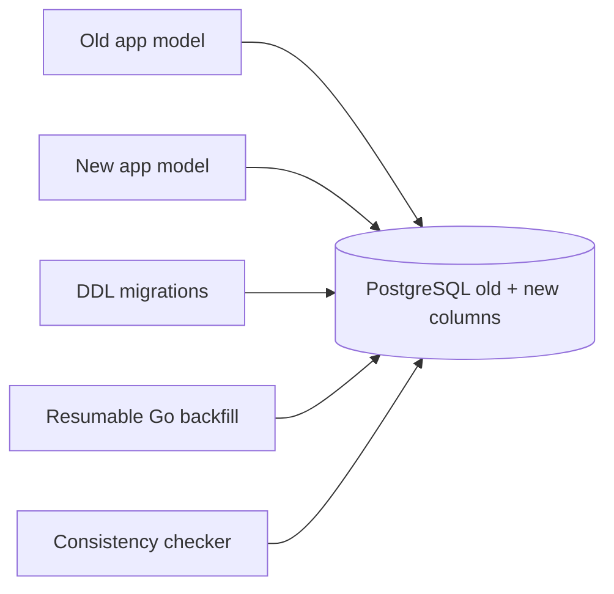

# Online Schema Migration and Backfill

稼働中の複数versionのGo applicationと互換性を保ちながら、PostgreSQL schemaと既存dataを段階的に変更するworkspaceです。

- Workspace status: `prepared`
- Active Section: `Section 1 — Expand/Contractの互換性計画`
- Current files: `README.md`のみ。これは意図した初期状態です。

## 学習の進め方

AIがold/new application modelを同時に動かすtestを書き、学習者がmigration、dual read/write、backfill、validationを実装します。DDLが一度成功しただけでは完了にしません。

## 最終成果

注文の旧`full_name` columnを`given_name`/`family_name`へ無停止で移行します。expand migration、互換code、resumable backfill、validation、constraint/index追加、old column contractを順に行い、各段階で旧/新versionのread/writeが壊れないことを実PostgreSQLで証明します。

## Scope / Non-goals

対象はexpand-and-contract、online DDL、dual write/read、batch backfill、checkpoint、constraint validation、rollback planです。DB engine upgrade、logical replicationによるDB移行、multi-region cutover、Aurora固有機能は対象外です。

## ユースケースと不変条件

- expand中は旧applicationが読み書きできる。
- transition中は旧columnと新columnが定義した変換規則で一致する。
- backfillは中断・再開しても同じrowを壊さない。
- batch処理は長時間lockと巨大transactionを避ける。
- validation完了前に`NOT NULL`相当の前提へ切り替えない。
- contractは旧versionが完全に停止した証拠の後だけ実行する。
- PostgreSQL schema/dataがsource of truth、migration historyが実行済み段階を記録する。

## システム全体像



## 外部システム

- PostgreSQL（Docker）: real lock、constraint、index build、MVCC、transactionを検証する。
- AWS/Redisは使わない。schema evolutionの中心課題に不要な境界を足さない。

## データモデルとtransaction境界

旧`customers(id,full_name)`から新`given_name/family_name`へ移行します。backfillはprimary key cursorとbatch単位の短いtransactionを使い、`backfill_runs`にcheckpointと件数を記録します。例題の名前分割は完全ではないため、変換不能recordを隔離するpolicyも扱います。

## 目標layout

```text
online-schema-migration/
├── README.md
├── go.mod
├── compose.yaml
├── migrations/{expand,contract}/
├── cmd/{old-app,new-app,backfill,validate}/
├── internal/{oldmodel,newmodel,postgres,backfill}/
└── test/integration/
```

## Section roadmap

| Section | State | 学ぶこと | 成果物 | 決定的なテスト |
| --- | --- | --- | --- | --- |
| 1. 互換性計画 | `active` | expand/transition/contract、version matrix | migration plan model | 各段階で許可するold/new read/writeを表にできる |
| 2. Expand migration | `locked` | additive DDL、lock、nullable | new columns/index | 既存dataと旧applicationを壊さず適用できる |
| 3. Compatible application | `locked` | dual write、fallback read、drift | old/new adapters | 旧書込と新書込の両方を新modelで読める |
| 4. Resumable backfill | `locked` | batch、cursor、checkpoint、retry | Go backfill worker | 中断再開後も全rowを一度分変換する |
| 5. Consistency validation | `locked` | mismatch検出、quarantine、counts | validator | driftを全件検出し正常dataを誤判定しない |
| 6. Constraint/index rollout | `locked` | NOT VALID、validation、concurrent index | enforced new schema | write継続中にconstraint/indexを安全に有効化 |
| 7. Contractとrollback | `locked` | deployment ordering、point of no return | old column removal | 旧version停止前はcontractを拒否する |
| 8. Full rehearsal | `locked` | repeatability、lock evidence | migration E2E | old traffic中に全段階を通しdataを失わない |

## Active Section — Expand/Contractの互換性計画

**Question:** DBとapplicationのversionが一時的にずれても、どのoperationが安全かを実装前に列挙できるか。

**Learn:** backward/forward compatibility、expand-and-contract、deploy order、irreversible change。

**Decide:** old/new schema、変換規則、dual write期間、contract開始条件、rollback可能点。

**Build:** MigrationPhase、AppVersion、Operation、CompatibilityMatrixをpure modelで作る。

**Current micro-step:** AIがexpand/transition/contract各段階でold/new read/writeの許可表を固定するtestを書いてRedを作る。

**Tests:** old app + expanded DB、new app + old DB、transition、contract後old app、unknown phase。

**Done when:** `go test ./internal/migrationplan -count=1`がGreenになり、危険なdeploy順をtestが拒否する。

**Notes/evidence:** まだなし。

## Final acceptance

- old/new adapter、real PostgreSQL migration、lock、backfill restart、drift validation、contract rehearsalが成功する。
- 各段階で旧/新processからread/writeし、data lossと長時間blocking lockがないことを観測する。
- migrationを空DBと既存data入りDBの両方へ繰り返し適用できる。

## Sources

- [PostgreSQL ALTER TABLE](https://www.postgresql.org/docs/current/sql-altertable.html)
- [PostgreSQL CREATE INDEX CONCURRENTLY](https://www.postgresql.org/docs/current/sql-createindex.html#SQL-CREATEINDEX-CONCURRENTLY)
- [PostgreSQL constraint validation](https://www.postgresql.org/docs/current/ddl-constraints.html)
