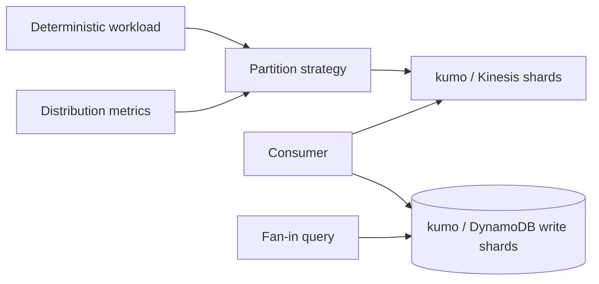
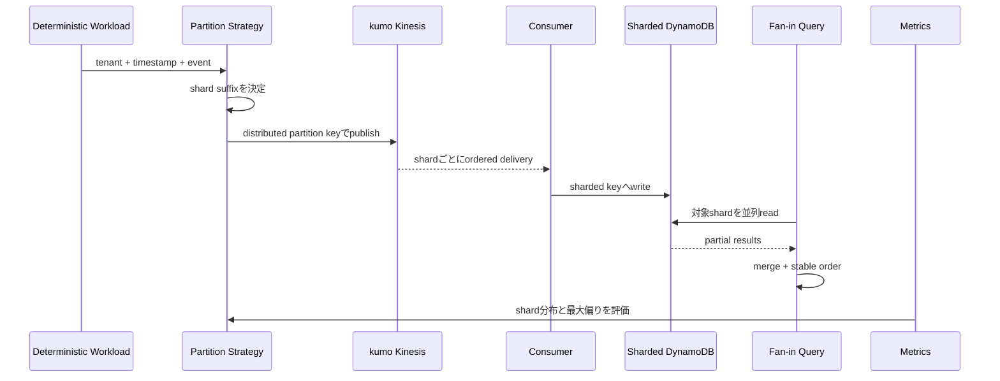

# Partition Key Design and Hot-Key Avoidance

DynamoDBとKinesisを題材に、tenant hot key、単調増加key、write sharding、順序保証と負荷分散のtrade-offを学ぶworkspaceです。

- Workspace status: `prepared`
- Active Section: `Section 1 — Workload分布を測る`
- Current files: `README.md`のみ。これは意図した初期状態です。

## 学習の進め方

AIが決定論的なworkloadと分布testを先に作り、学習者がkey strategy、shard選択、fan-in read、DynamoDB/Kinesis adapterを実装します。local emulatorのlatencyを実AWS capacityの証拠にはしません。

## 最終成果

大量eventを1つのtenantまたは時系列keyへ書くnaive設計と、hash/time bucketでwrite shardingする設計を比較します。分散後もidempotencyと必要な範囲の順序を守り、複数shardをcursor付きでmergeして読めるようにします。

## Scope / Non-goals

対象はpartition cardinality、skew metric、write sharding、fan-in read、Kinesis partition key、DynamoDB conditional write、reshardingです。実AWSのthroughput throttling、Spanner split内部、multi-region replication、cost benchmarkは対象外です。

## ユースケースと不変条件

- 同じlogical event IDを重複保存しない。
- shard数と入力が同じならkey割当は決定論的である。
- tenant内のtotal orderを捨てる場合、entity単位など必要なordering scopeを明示する。
- fan-in readは重複・欠落なくglobal sort orderを返す。
- shard version変更中もold/new keyのどちらにあるdataか判定できる。
- DynamoDB/Kinesisがlocal integration対象だが、分布品質はapplication側のcounter/testで証明する。

## システム全体像



### 代表シーケンス



## 外部システム

- kumo/Kinesis: partition keyごとのorderingとstream ingestionを観察する。
- kumo/DynamoDB: composite key、conditional put、複数partition queryを試す。
- kumoは実AWSのpartition capacity/throttlingを再現する負荷試験器ではない。最大bucket比率、Gini係数相当、fan-in correctnessを決定的にtestする。

## データモデルとtransaction境界

`Event(id,tenant_id,entity_id,occurred_at,payload)`、`PhysicalKey(strategy_version,tenant_id,time_bucket,shard)`、`Cursor`を扱います。ingestのidempotencyはevent ID、物理分散はshard key、query順序は`occurred_at + event_id`で分けて考えます。

## 目標layout

```text
partition-key-design/
├── README.md
├── go.mod
├── compose.yaml
├── cmd/{generator,ingest,query}/
├── internal/{workload,partitioning,stream,dynamodb,merge}/
└── test/{integration,e2e}/
```

## Section roadmap

| Section | State | 学ぶこと | 成果物 | 決定的なテスト |
| --- | --- | --- | --- | --- |
| 1. Workload分布 | `active` | skew、cardinality、metric | deterministic workload analyzer | naive tenant keyがhotになるfixtureを数値で示す |
| 2. Write sharding | `locked` | hash suffix、time bucket、stability | partition strategy | 同じeventは同じshard、全体は閾値内に分散 |
| 3. DynamoDB key schema | `locked` | PK/SK、conditional write、access pattern | sharded event store | duplicate eventを拒否しpartition単位でqueryできる |
| 4. Fan-in pagination | `locked` | k-way merge、cursor、bounded read | merged query | page境界をまたいでも重複・欠落がない |
| 5. Kinesis ordering scope | `locked` | partition key、ordering vs parallelism | stream publisher/consumer | 同entityは順序維持、tenant全体は並列化する |
| 6. Retryとidempotency | `locked` | duplicate delivery、checkpoint、effect | consumer receipt | retry後もDynamoDB itemは1 logical event分 |
| 7. Reshard migration | `locked` | strategy version、dual read、backfill | v1→v2 migration | 移行中のreadがold/new dataを一度ずつ返す |
| 8. E2E比較 | `locked` | measurement、trade-off説明 | naive/sharded scenario | 分布改善とread amplificationを同じfixtureで示す |

## Active Section — Workload分布を測る

**Question:** 「hot keyになりそう」を感覚ではなく、同じworkloadで比較可能な数値へどう落とすか。

**Learn:** key cardinality、frequency distribution、max/mean ratio、skew、実latencyとmodel評価の違い。

**Decide:** workload fixture、logical partition数、合格するskew閾値、時系列keyを含めるか。

**Build:** Event fixture generator、Partitioner interface、bucket counter、Distribution reportをpure Goで作る。

**Current micro-step:** AIが1つのlarge tenantへ偏るfixtureとnaive tenant-key strategyのhot bucketを示すtestを書いてRedを作る。

**Tests:** uniform、single hot tenant、monotonic IDs、empty workload、deterministic seed。

**Done when:** `go test ./internal/workload -count=1`がGreenになり、naive strategyのskewを再現可能な数値で説明できる。

**Notes/evidence:** まだなし。

## Final acceptance

- pure distribution、kumo DynamoDB/Kinesis integration、fan-in pagination、retry、migration、E2Eが成功する。
- naiveとshardedのmax bucket比率、ordering scope、read amplificationを同じfixtureで比較する。
- emulatorの処理時間を本番capacityの証拠として扱わない。

## Sources

- [DynamoDB partition key design](https://docs.aws.amazon.com/amazondynamodb/latest/developerguide/bp-partition-key-design.html)
- [DynamoDB write sharding](https://docs.aws.amazon.com/amazondynamodb/latest/developerguide/bp-partition-key-sharding.html)
- [Kinesis partition keys and sequence numbers](https://docs.aws.amazon.com/streams/latest/dev/key-concepts.html)
- [kumo](https://github.com/sivchari/kumo)
