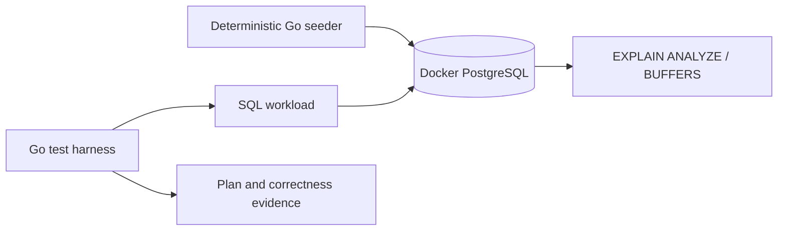

# PostgreSQL Performance and Contention Lab

同じdatasetとqueryを使い、index、pagination、MVCC、lock、partitioningがPostgreSQLの実行計画と挙動をどう変えるかを測るworkspaceです。

- Workspace status: `prepared`
- Active Section: `Section 1 — 再現可能なworkloadと測定契約`
- Current files: `README.md`のみ。これは意図した初期状態です。

## 学習の進め方

AIがcorrectnessとplan shapeを守るtest/harnessを書き、学習者がdataset、SQL、index、migrationを入力します。単発のwall-clock値だけで「速くなった」と結論づけません。

## 最終成果

注文検索API相当のqueryを題材に、`EXPLAIN (ANALYZE, BUFFERS)`を保存・比較します。複合/partial index、keyset pagination、MVCCとVACUUM、lock contention、deadlock、time-range partitioning/BRINを実際のDocker PostgreSQLで観察し、どの変更がどのworkloadに効くか説明できるartifactを作ります。

## Scope / Non-goals

対象はPostgreSQL query planning、index、pagination、statistics、MVCC、VACUUM、lock、deadlock、partitioningです。Aurora固有storage、cloud IOPS、replica/failover、OS/kernel tuning、本番規模benchmarkは対象外です。

## ユースケースと不変条件

- tuning前後でquery resultは同一である。
- datasetとrandom seedを固定し、同じ分布を再生成できる。
- performance assertionは主にplan node、rows、buffer傾向で行い、厳しすぎる時間testをCI gateにしない。
- indexは特定queryを速くする一方、write costとstorageを増やすことも記録する。
- transactionを開いたままにしたときのMVCC/lock影響を後片付けまでtestする。
- PostgreSQL実体が唯一の検証対象であり、mock repositoryでperformanceを証明しない。

## システム全体像



## 外部システム

- PostgreSQL（Docker）: versionを固定し、real planner、buffer、MVCC、lock tableを観察する。
- AWS/Redisは使わない。Auroraへ移植可能なSQL知識と、Auroraでは別検証が必要な境界を分ける。

## データモデルとtransaction境界

`customers`、`orders`、`order_items`、時系列の`events`を偏りのある分布でseedします。tenant、status、created_at、amountを組み合わせたqueryを用意します。各measurementは独立transactionまたは明示した長期transactionで実行します。

## 目標layout

```text
postgres-performance-lab/
├── README.md
├── go.mod
├── compose.yaml
├── migrations/
├── query/
├── cmd/seed/
├── internal/{workload,plancheck,postgres}/
├── evidence/
└── test/integration/
```

## Section roadmap

| Section | State | 学ぶこと | 成果物 | 決定的なテスト |
| --- | --- | --- | --- | --- |
| 1. Workloadと測定契約 | `active` | data distribution、再現性、correctness | seed specとquery case | 同じseedで同じ件数/分布/resultを作る |
| 2. EXPLAINと単一index | `locked` | scan、cost、actual、buffers | plan parser/evidence | Seq Scanから意図したIndex Scanへの変化を確認 |
| 3. 複合・partial index | `locked` | leftmost、selectivity、write cost | query別index比較 | filter/orderに合うindexだけが選ばれる |
| 4. Keyset pagination | `locked` | OFFSET cost、stable cursor、tie-break | cursor query | 深いpageでも欠落なく、OFFSET scan量を避ける |
| 5. MVCC・VACUUM・bloat | `locked` | snapshot、dead tuple、long TX | update/delete scenario | 長期TX有無でcleanup可能性の差を観測する |
| 6. Lockとdeadlock | `locked` | lock graph、timeout、順序 | concurrent transaction test | deadlockを再現し一貫lock順で回避する |
| 7. Partition・BRIN | `locked` | pruning、time range、maintenance | events table variants | range queryで不要partitionをscanしない |
| 8. Tuned API workload | `locked` | end-to-end budget、regression evidence | query service | result同一のままplan/buffer改善を比較できる |

## Active Section — 再現可能なworkloadと測定契約

**Question:** plannerの変化を比較できるよう、data量だけでなく偏りとquery結果をどう固定するか。

**Learn:** selectivity、cardinality、data skew、warm/cold cache、benchmarkとintegration testの役割分担。

**Decide:** PostgreSQL version、row数、tenant/status分布、random seed、保存するplan情報、CIでassertする項目。

**Build:** WorkloadSpec、deterministic fixture generator、expected distribution、query correctness caseを定義する。

**Current micro-step:** AIが固定seedからtenant/status別件数が再現されるtestを書き、seeder domainのRedを作る。

**Tests:** same seed、different seed、skew target、row count、zero workload、query result fixture。

**Done when:** `go test ./internal/workload -count=1`がGreenになり、同じdatasetを何度でも生成できる。

**Notes/evidence:** まだなし。

## Final acceptance

- real PostgreSQL integrationで全queryのcorrectness、plan evidence、lock/MVCC scenarioが成功する。
- before/after SQL、index size、write overhead、plan/buffer差をREADMEまたはevidenceに残す。
- `go test -race`とDB cleanupを含め、繰り返し実行しても測定fixtureが汚染されない。

## Sources

- [PostgreSQL EXPLAIN](https://www.postgresql.org/docs/current/using-explain.html)
- [PostgreSQL index types](https://www.postgresql.org/docs/current/indexes-types.html)
- [PostgreSQL multicolumn indexes](https://www.postgresql.org/docs/current/indexes-multicolumn.html)
- [PostgreSQL routine vacuuming](https://www.postgresql.org/docs/current/routine-vacuuming.html)
- [PostgreSQL table partitioning](https://www.postgresql.org/docs/current/ddl-partitioning.html)
