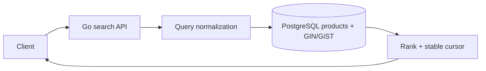
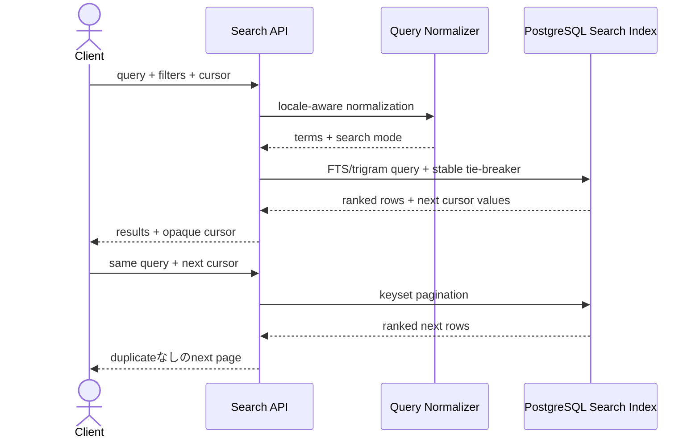

# PostgreSQL Search and Autocomplete

外部search serviceを使わず、PostgreSQLのfull-text searchと`pg_trgm`で商品検索・autocompleteを作り、適用限界を学ぶworkspaceです。

- Workspace status: `prepared`
- Active Section: `Section 1 — 検索queryとranking contract`
- Current files: `README.md`のみ。これは意図した初期状態です。

## 学習の進め方

AIがsmall corpusと期待順位のtestを書き、学習者がnormalization、SQL、index、pagination、HTTP境界を実装します。検索結果が返るだけでなくrankingとplanを証明します。

## 最終成果

商品名、説明、categoryを対象にkeyword検索し、重み付きranking、prefix autocomplete、typo候補、filter、stable paginationを提供します。index前後の`EXPLAIN`を比較し、日本語形態素解析が必要になる境界も記録します。

## Scope / Non-goals

対象は`tsvector/tsquery`、weight、GIN、`pg_trgm`、prefix、similarity、highlight、filter、keyset paginationです。OpenSearch、形態素解析engine、embedding/vector search、分散index、production relevance tuningは対象外です。

## ユースケースと不変条件

- 同じquery/corpus/configから同じ順位を返す。
- 非公開・在庫切れ商品をranking前後どちらでも漏らさない。
- score同点時はstable keyで順序を固定する。
- autocompleteは最低文字数と件数上限を持つ。
- user inputをSQLや`tsquery`として直接連結しない。
- page cursorをまたいでも重複・欠落しない。
- PostgreSQLの商品recordとsearch vectorがsource of truthである。

## システム全体像



### 代表シーケンス



## 外部システム

- PostgreSQL（Docker）: `tsvector`、GIN index、`pg_trgm` extension、real query planを検証する。
- AWS/外部search APIは使わない。PostgreSQL単体で十分なcaseと限界を明確にする。

## データモデルとtransaction境界

`products(id,name,description,category,status,search_document,updated_at)`を扱います。商品更新とsearch document更新を同じtransactionまたはgenerated columnで一致させます。rankingは`text_rank + trigram_score + deterministic_tie_break`として定義します。

## 目標layout

```text
postgres-search-autocomplete/
├── README.md
├── go.mod
├── compose.yaml
├── migrations/
├── cmd/api/
├── internal/{search,postgres,httpapi}/
├── testdata/catalog/
└── test/integration/
```

## Section roadmap

| Section | State | 学ぶこと | 成果物 | 決定的なテスト |
| --- | --- | --- | --- | --- |
| 1. Query/ranking contract | `active` | token、normalization、score、tie-break | SearchQueryとRankedHit | fixture上の順位と除外ruleが決定論的 |
| 2. Full-text document | `locked` | tsvector、weight、language config | indexed product schema | name一致がdescription一致より上位になる |
| 3. GIN indexとplan | `locked` | selectivity、EXPLAIN、write cost | search SQL/index | corpus増加後も意図したindex planを使う |
| 4. Trigram/autocomplete | `locked` | similarity、prefix、最低長 | suggestion query | typo/prefix候補を閾値と上限内で返す |
| 5. Filterとpagination | `locked` | rank+filter、cursor、tie | stable result paging | 更新なしなら全pageに重複・欠落がない |
| 6. Highlightと安全なquery | `locked` | ts_headline、escaping、limit | response mapper | 特殊文字や長大queryを安全に処理する |
| 7. 日本語と限界評価 | `locked` | tokenizer境界、trigram trade-off | comparison evidence | 日本語fixtureで可能/不可能をtest記録する |
| 8. HTTPとE2E | `locked` | public contract、plan evidence | search/autocomplete API | seed→search→cursor→suggestを実DBで通す |

## Active Section — 検索queryとranking contract

**Question:** SQL技法を選ぶ前に、何を一致とし、どのfieldを強くし、同点をどう並べるかを定義できるか。

**Learn:** relevance、normalization、field weight、business filter、stable tie-break。

**Decide:** query空白処理、case、field weight、score精度、同点順、非公開商品の扱い。

**Build:** SearchQuery、Candidate、RankingPolicy、RankedHitのpure modelを作る。

**Current micro-step:** AIがname一致をdescription一致より上位にし、非公開商品を除外し、同点をID順にするtestを書いてRedを作る。

**Tests:** exact/partial、multiple terms、empty query、tie、filter、score zero。

**Done when:** `go test ./internal/search -count=1`がGreenになり、期待順位をfixtureから説明できる。

**Notes/evidence:** まだなし。

## Final acceptance

- domain、real PostgreSQL、plan、pagination、special input、HTTP E2Eが成功する。
- index前後で結果が同一、scan/planが意図どおり変化することを記録する。
- PostgreSQLで十分なcaseと外部search engineが必要になるcaseをREADMEへ残す。

## Sources

- [PostgreSQL Full Text Search](https://www.postgresql.org/docs/current/textsearch.html)
- [PostgreSQL pg_trgm](https://www.postgresql.org/docs/current/pgtrgm.html)
- [PostgreSQL GIN indexes](https://www.postgresql.org/docs/current/gin.html)
