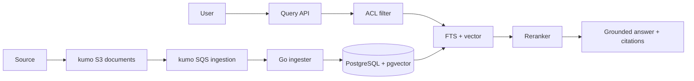

# RAG Document Lifecycle

頻繁に追加・更新・削除される社内文書に対し、access controlを守りながら根拠付きで検索・回答するRAG pipelineをGoで学ぶworkspaceです。

- Workspace status: `prepared`
- Active Section: `Section 1 — Document identityとversion lifecycle`
- Current files: `README.md`のみ。これは意図した初期状態です。

## 学習の進め方

AIがdocument lifecycleとretrieval品質を固定するtestを書き、学習者がingestion、chunking、hybrid search、reranking、ACL filter、citationを実装します。PostgreSQLのfull-text searchとpgvector、kumo S3/SQSを使い、外部embedding・LLM APIは必須にしません。

## 最終成果

文書をversion付きでingestし、検索可能なchunkへ変換します。keywordとvectorのhybrid searchをACL適用前提で実行し、取得した根拠だけからcitation付き回答を構成します。文書の更新・削除・権限変更が古いchunkやcacheへ確実に反映されます。

## Scope / Non-goals

対象はdocument lifecycle、chunking、hybrid retrieval、rerank、ACL、citation、update/delete、offline evaluationです。汎用chat UI、model fine-tuning、OCR、internet search、production-grade vector DB比較は対象外です。

## ユースケースと不変条件

- logical documentは複数versionを持てるが、検索対象はactive versionだけである。
- ACLで許可されないchunkはretrieval、rerank、prompt、citationのどこにも現れない。
- 回答中のclaimは取得したactive chunkのdocument/version/offsetへ結び付く。
- update完了後に旧versionを返さず、delete完了後にtombstone済み文書を返さない。
- chunkingとembedding modelのversion変更はreindexとして追跡する。
- retryやduplicate eventで同じversionのchunkを二重登録しない。
- 「見つからない」ときは推測で補わず、evidence不足を返せる。

## システム全体像



## 外部システム

- Docker PostgreSQL + pgvector: document metadata、ACL、full-text index、embedding、active/tombstone stateを保持する。
- kumo S3: raw document bodyとversioned artifactを保持する。
- kumo SQS: ingestion、reindex、delete cleanupをat-least-onceで配送する。
- local deterministic embedder/reranker: fixtureごとに安定したvectorとscoreを返す。任意でOllama adapterを追加できるがacceptanceには不要とする。

## データモデルとtransaction境界

`documents(tenant_id,id,active_version,state)`、`document_versions`、`chunks(document_id,version,chunk_no,text,search_vector,embedding,acl_hash)`、`principals`、`grants`、`ingestion_jobs`を扱います。object取得やembedding生成はDB transaction外で行い、完成したversion一式をtransactionでactiveへ切り替えます。deleteは先にtombstoneし、物理削除は非同期に行います。

## 目標layout

```text
rag-document-lifecycle/
├── README.md
├── go.mod
├── docker-compose.yml
├── migrations/
├── queries/
├── internal/{document,chunking,ingestion,retrieval,rerank,acl,citation,postgres}/
├── cmd/{ingester,api}/
└── test/{fixtures,integration,evaluation,e2e}/
```

## Section roadmap

| Section | State | 学ぶこと | 成果物 | 決定的なテスト |
| --- | --- | --- | --- | --- |
| 1. Document lifecycle | `active` | identity、version、active、tombstone | document domain | create/update/deleteの正しいversion遷移だけ許可する |
| 2. Chunking | `locked` | boundary、overlap、metadata、stable ID | chunker | 同じversionを常に同じchunkとoffsetへ分割する |
| 3. Ingestion | `locked` | async job、idempotency、atomic activation | indexer | failure中は旧versionを維持し完成時に一括切替する |
| 4. Hybrid retrieval | `locked` | FTS、vector、score fusion、top-k | retriever | keyword/vector片方だけでは拾えないfixtureを取得する |
| 5. Reranking | `locked` | candidate recall、rerank、latency budget | reranker | gold evidenceの順位を上げ、tieを安定させる |
| 6. Access control | `locked` | tenant、principal、group、filter timing | ACL-aware search | unauthorized chunkがcandidateにもscoreにも現れない |
| 7. Citationとlifecycle反映 | `locked` | grounding、version、delete、cache invalidation | answer composer | citationがactive sourceを指し更新・削除後に旧版を返さない |
| 8. Retrieval evaluation E2E | `locked` | gold set、recall@k、MRR、no-answer | release report | retrieval品質とACL/lifecycle regressionをgateで検知する |

## Active Section — Document identityとversion lifecycle

**Question:** 更新中も検索を壊さず、どのversionが公開中かをどう表すか。

**Learn:** logical identity、immutable version、active pointer、tombstone、index generation。

**Decide:** document ID、version採番、更新失敗時の扱い、削除のvisibility、reindexとcontent updateの違い。

**Build:** Document、DocumentVersion、LifecycleState、Activate/Delete transitionのpure modelを作る。

**Current micro-step:** AIが未完成versionをactiveにできず、更新失敗時は旧versionが残り、delete後は検索対象にならないtestを書いてRedを作る。

**Tests:** initial create、concurrent update、activation、failed ingestion、tombstone、duplicate version。

**Done when:** `go test ./internal/document -count=1`がGreenになり、更新・削除時のvisible versionを一意に説明できる。

**Notes/evidence:** まだなし。

## Final acceptance

- unit、PostgreSQL/pgvector、kumo S3/SQS、race、duplicate delivery、evaluation E2Eが成功する。
- gold query setが決めたrecall@k/MRRを満たし、ACL leakageが0件である。
- create→update→deleteの各checkpointでcitationが正しいversionを指し、旧chunkを返さない。
- evidenceがないqueryはcitationを捏造せずno-answerになる。

## Sources

- [PostgreSQL text search](https://www.postgresql.org/docs/current/textsearch.html)
- [PostgreSQL row security policies](https://www.postgresql.org/docs/current/ddl-rowsecurity.html)
- [pgvector](https://github.com/pgvector/pgvector)
- [Amazon S3 strong consistency](https://docs.aws.amazon.com/AmazonS3/latest/userguide/Welcome.html#ConsistencyModel)
- [kumo](https://github.com/sivchari/kumo)
