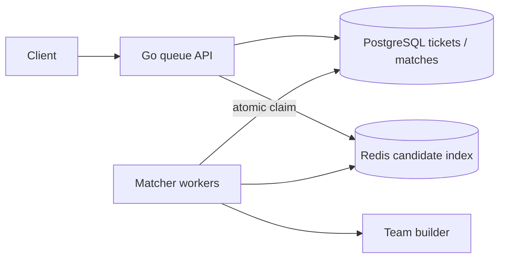
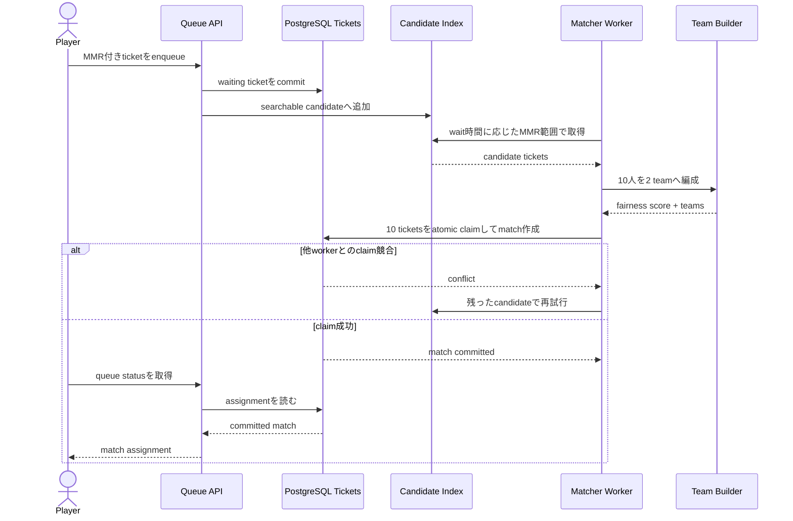

# Ranked 5 vs 5 Team Matchmaking

ランク制ゲームの待機プレイヤーを、待ち時間と実力差を考慮しながら5人対5人へ編成する仕組みを学ぶworkspaceです。

- Workspace status: `prepared`
- Active Section: `Section 1 — Matchmaking ticketと編成不変条件`
- Current files: `README.md`のみ。これは意図した初期状態です。

## 学習の進め方

AIが現在のmicro-stepのテストを書いてRedを説明し、学習者がproduction code、SQL、migration、runtime設定を入力します。Greenを確認するまで次の振る舞いへ進みません。

## 最終成果

soloまたはpartyでqueueに入ったプレイヤーから、各playerを一度だけ使った5対5のmatchを作ります。近いMMRを優先し、待機時間が伸びるほど許容差を広げ、両teamの平均MMRとparty配置の偏りを制限します。同時に複数workerが動いても二重matchを作りません。

## Scope / Non-goals

対象はticket、party、MMR window、team balance、cancel/timeout、並行claim、HTTP境界です。実際のgame server割当、ping測定、region間通信、anti-cheat、TrueSkill/Glickoのrating更新は対象外です。

## ユースケースと不変条件

- 1〜5人のpartyが1つのticketとして参加する。
- 1 matchは10人、各teamは5人ちょうどである。
- partyは分割しない。同じplayerを複数matchへ入れない。
- 待機直後は狭いMMR幅、長時間待機後は広い幅を使う。
- balance scoreが上限を超える組み合わせは成立させない。
- cancel済み・期限切れticketはclaimできない。
- PostgreSQLがticketと成立matchのsource of truth、Redisは候補探索用のderived indexである。

## システム全体像



### 代表シーケンス



## 外部システム

- PostgreSQL（Docker）: durable ticket、party member、match、assignmentと一意制約を所有する。
- Redis（Docker）: region/rankごとのsorted setで候補探索を速くする。消えてもPostgreSQLから再構築できる。
- AWSサービスは使わない。非同期AWSを足さなくても中心課題を再現できるためである。

## データモデルとtransaction境界

`tickets`、`ticket_members`、`matches`、`match_members`を概念recordとします。match確定transactionは対象ticketをclaimし、10人分のmembershipを一意制約付きで保存し、ticketをmatchedへ遷移させます。Redis更新はcommit後のderived state更新であり、失敗時はreconcileします。

## 目標layout

```text
ranked-team-matchmaking/
├── README.md
├── go.mod
├── compose.yaml
├── migrations/
├── internal/
│   ├── matchmaking/
│   ├── postgres/
│   ├── redisindex/
│   ├── worker/
│   └── httpapi/
└── test/e2e/
```

## Section roadmap

| Section | State | 学ぶこと | 成果物 | 決定的なテスト |
| --- | --- | --- | --- | --- |
| 1. Ticketと編成不変条件 | `active` | value object、party境界、team capacity | player/party/ticket/team model | 10人を超えず、partyを分割せず、重複playerを拒否 |
| 2. MMR検索window | `locked` | range expansion、待機時間、公平性 | 時間で広がるcandidate policy | 同じ時刻なら決定論的、待機で許容差だけが広がる |
| 3. 5対5 team builder | `locked` | 組合せ探索、評価関数、trade-off | balance score最小の2 team | party制約内で平均MMR差を閾値以下にする |
| 4. PostgreSQL source of truth | `locked` | schema、一意制約、state transition | durable queueとmatch records | DBが二重membershipと不正遷移を拒否 |
| 5. Redis candidate index | `locked` | sorted set、derived state、rebuild | rank/region候補index | DBから再構築後も同じcandidateを返す |
| 6. 並行workerのclaim | `locked` | row lock、SKIP LOCKED、競合 | 複数matcher worker | 同じticket群からmatchは最大1件 |
| 7. Cancel・timeout・reconcile | `locked` | race、期限、部分失敗 | queue整合worker | cancelとmatchが競合してもplayerを取り残さない |
| 8. HTTPとE2E | `locked` | public boundary、観測可能な結果 | enqueue/cancel/status API | 10人登録から公平な1 match成立まで通る |

## Active Section — Ticketと編成不変条件

**Question:** partyを分割せず、playerの重複とteam capacity違反を型の境界でどう防ぐか。

**Learn:** immutable value、aggregate、constructor validation、アルゴリズム前に不正状態を除く意味。

**Decide:** ID表現、soloを1人partyとして扱うか、MMRの数値範囲、同一party内の重複検出場所。

**Build:** Player、Party、Ticket、Teamの最小modelを順に作る。

**Current micro-step:** AIが「空player ID、空party、6人party、重複playerを拒否する」testを書き、そのRedから最初のdomain実装を始める。

**Tests:** 有効な1〜5人party、境界値、入力順、重複、zero value。

**Done when:** `go test ./internal/matchmaking -run 'TestNewParty' -count=1`で不変条件がGreenになる。

**Notes/evidence:** まだなし。

## Final acceptance

- unit、PostgreSQL integration、Redis rebuild、race/shuffle、HTTP E2Eが成功する。
- 競合worker、cancel、retryを含めても1 playerは高々1つの成立matchにだけ所属する。
- 狭いMMR候補を優先し、待機によるwindow拡大がtest clockで再現できる。

## Sources

- [PostgreSQL explicit locking](https://www.postgresql.org/docs/current/explicit-locking.html)
- [Redis sorted sets](https://redis.io/docs/latest/develop/data-types/sorted-sets/)
- [Redis transactions](https://redis.io/docs/latest/develop/interact/transactions/)
