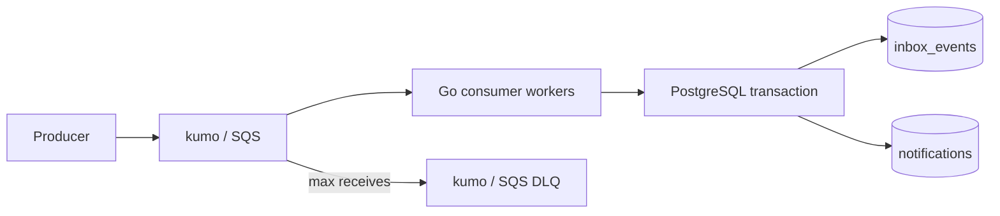
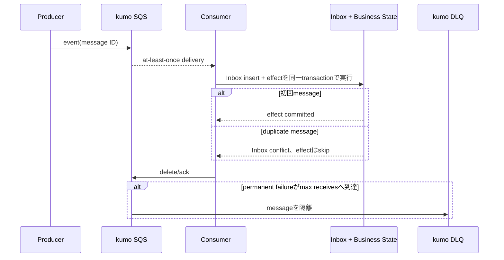

# Reliable Event Consumer

SQSのat-least-once deliveryを前提に、重複、retry、poison message、consumer crashがあってもbusiness effectを一度分に収束させるworkspaceです。

- Workspace status: `prepared`
- Active Section: `Section 1 — Event envelopeと処理結果`
- Current files: `README.md`のみ。これは意図した初期状態です。

## 学習の進め方

AIが重複やfailureを再現するtestを書き、学習者がconsumer、Inbox schema、SQS設定を実装します。「1回受信できた」だけでは完了にしません。

## 最終成果

`match.created`のようなeventをkumo上のSQSから受信し、通知recordをPostgreSQLへ作ります。同じmessageを複数回受けてもside effectは1件だけになり、transient failureは再試行、恒久failureはDLQへ移動し、crash後にも安全に再処理できます。

## Scope / Non-goals

対象はevent envelope、Inbox pattern、transactional side effect、visibility timeout、retry、DLQ、concurrency、graceful shutdownです。通知の実送信、exactly-once transport、Kafka consumer group、大規模throughput tuningは対象外です。

## ユースケースと不変条件

- `event_id`が同じeventは何回届いてもbusiness effectを1件だけ作る。
- Inbox receiptとbusiness effectは同じDB transactionで確定する。
- DB commit前に失敗したmessageはdeleteせず、再受信可能にする。
- DB commit後にprocessが落ち、SQS deleteが失敗しても再受信はno-opになる。
- validation errorとtransient errorを区別する。
- 規定回数失敗したpoison messageはDLQで観測できる。
- PostgreSQLが処理済みeventとside effectのsource of truth、SQSはtransportである。

## システム全体像



### 代表シーケンス



## 外部システム

- PostgreSQL（Docker）: `event_id`のunique Inboxとbusiness side effectを同じtransactionで保存する。
- kumo/SQS: Standard Queue、visibility timeout、redrive policy、DLQ、message attributesをAWS SDK for Go v2で試す。

## データモデルとtransaction境界

`EventEnvelope(id,type,occurred_at,payload_version,payload)`、`inbox_events(event_id,received_at)`、`notifications(event_id,recipient,kind)`を扱います。consumer transactionはInbox insertとside effectをatomicにします。SQS message deleteはcommit後なのでDB transactionには含められません。

## 目標layout

```text
reliable-event-consumer/
├── README.md
├── go.mod
├── compose.yaml
├── migrations/
├── cmd/consumer/
├── internal/{events,consumer,postgres,sqsworker}/
└── test/e2e/
```

## Section roadmap

| Section | State | 学ぶこと | 成果物 | 決定的なテスト |
| --- | --- | --- | --- | --- |
| 1. Event envelope | `active` | stable identity、version、validation | event parserと処理分類 | malformed/unknown eventを明示的に分類する |
| 2. Inbox transaction | `locked` | consumer-side idempotency、atomicity | Inbox+side effect repository | 同じeventを2回処理してeffectは1件 |
| 3. SQS receive/delete | `locked` | at-least-once、visibility、ack timing | polling worker | commit成功時だけmessageをdeleteする |
| 4. Crash window | `locked` | commit/ack間のfailure、recovery | failure injection | commit後crash→再受信でもeffectは増えない |
| 5. RetryとDLQ | `locked` | transient/permanent、redrive | retry policyとDLQ | poison messageが規定回数後にDLQへ入る |
| 6. Concurrencyとshutdown | `locked` | worker pool、lease、context cancel | bounded consumer | duplicate並行処理とcancelでlock/leakを残さない |
| 7. E2E | `locked` | 実境界の接続、観測 | producer fixture→consumer | queue投入からDB effectとDLQを確認できる |

## Active Section — Event envelopeと処理結果

**Question:** retry可能なfailureと捨てるべきinvalid eventを、曖昧な`error`だけにせずどう表すか。

**Learn:** stable event ID、schema version、deserialization boundary、retry classification。

**Decide:** 必須field、event typeの表現、payload versionの扱い、未知versionをDLQ候補にするか。

**Build:** EventEnvelopeのdecode/validateと、processed/retryable/permanentの結果型を作る。

**Current micro-step:** AIが有効event、空ID、未知type、壊れたpayloadのtable-driven testを書き、decode境界のRedを作る。

**Tests:** malformed JSON、missing field、unknown version、同一ID、error wrapping。

**Done when:** `go test ./internal/events -count=1`がGreenになり、各failureの再試行可否がtest名から読める。

**Notes/evidence:** まだなし。

## Final acceptance

- PostgreSQLとkumoを使うintegration、duplicate/concurrency、crash injection、DLQ、race testが成功する。
- commit-before-deleteのwindowを再現し、再配信後もside effectが1件に収束する。
- invalid messageが無限retryせずDLQからevent IDと理由を観測できる。

## Sources

- [Amazon SQS delivery guarantees](https://docs.aws.amazon.com/AWSSimpleQueueService/latest/SQSDeveloperGuide/standard-queues-at-least-once-delivery.html)
- [Amazon SQS visibility timeout](https://docs.aws.amazon.com/AWSSimpleQueueService/latest/SQSDeveloperGuide/sqs-visibility-timeout.html)
- [Amazon SQS dead-letter queues](https://docs.aws.amazon.com/AWSSimpleQueueService/latest/SQSDeveloperGuide/sqs-dead-letter-queues.html)
- [kumo](https://github.com/sivchari/kumo)
