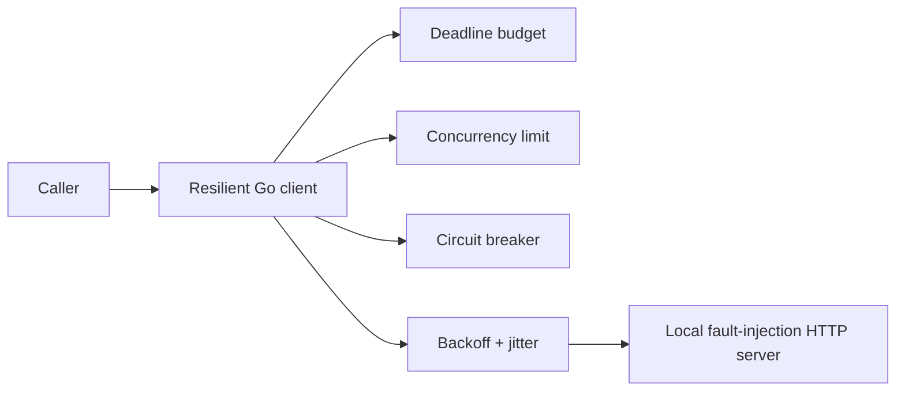
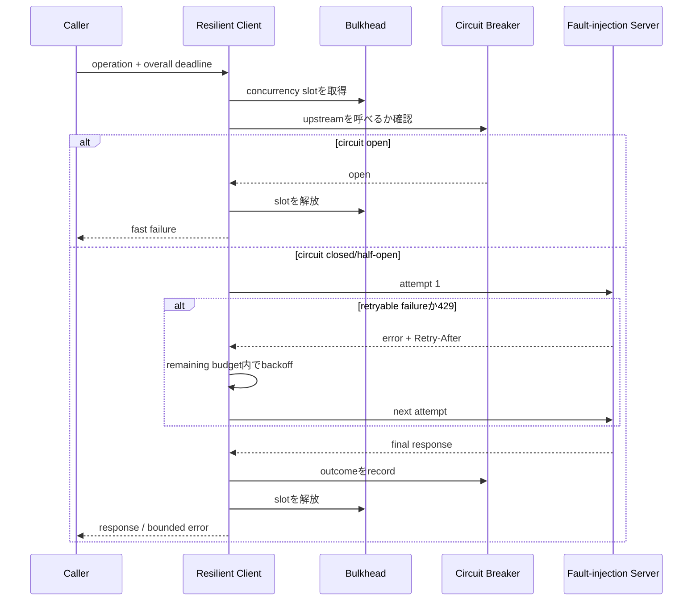

# Resilient HTTP Client

外部APIや内部serviceの遅延・切断・過負荷を増幅せず、timeout budget、retry、circuit breaker、bulkheadで制御するGo HTTP clientを学ぶworkspaceです。

- Workspace status: `prepared`
- Active Section: `Section 1 — Request budgetとretry safety`
- Current files: `README.md`のみ。これは意図した初期状態です。

## 学習の進め方

AIが`httptest.Server`とcustom transportでfailureを注入し、学習者がpolicy、client wrapper、breaker、metricsを実装します。実外部APIやcredentialは使いません。

## 最終成果

operationごとのdeadline内でHTTP requestを実行し、安全なfailureだけをjitter付きでretryします。連続失敗時はcircuitを開き、同時実行数をbulkheadで制限し、slow response bodyやcancel後のgoroutine leakを防ぎます。attemptと最終結果を観測できます。

## Scope / Non-goals

対象はtimeout、context、retry、idempotency、backoff、circuit breaker、bulkhead、body limit、observabilityです。service mesh、DNS/load balancer実装、TLS実装、multi-region routing、production SDK全機能は対象外です。

## ユースケースと不変条件

- 全attemptは1つのoperation deadlineを共有し、retryごとにbudgetをリセットしない。
- non-idempotent operationをidentityなしに自動retryしない。
- retry回数とbackoff待機を含めてdeadlineを超えない。
- response bodyは必ずcloseし、size上限を設ける。
- circuit open中はnetwork callをせず速く失敗する。
- bulkhead待機もcontext cancelで解除される。
- retryable classificationと最終error chainを呼び出し側が観測できる。

## システム全体像



### 代表シーケンス



## 外部システム

- Go `httptest.Server`とcustom `RoundTripper`: delay、EOF、connection reset、429、5xx、巨大bodyをlocalに再現する。
- PostgreSQL、Redis、AWSは使わない。HTTP client behaviorを決定論的にtestするためである。

## データモデルとtransaction境界

永続dataはありません。`OperationPolicy(timeout,max_attempts,backoff,idempotent,max_body,concurrency)`、`AttemptResult`、`CircuitState`を扱います。clock、sleeper、random sourceを注入してsleepなしのtestを可能にします。

## 目標layout

```text
resilient-http-client/
├── README.md
├── go.mod
├── internal/{policy,retry,breaker,bulkhead,httpclient}/
├── test/faultserver/
└── examples/
```

## Section roadmap

| Section | State | 学ぶこと | 成果物 | 決定的なテスト |
| --- | --- | --- | --- | --- |
| 1. Budgetとretry safety | `active` | deadline、idempotency、classification | operation policy | unsafe requestを自動retryせず全attemptがbudget内 |
| 2. Timeoutとcontext | `locked` | connect/header/body、cancel、leak | bounded transport | 遅い各phaseをdeadlineで停止しresourceを回収する |
| 3. Backoffとjitter | `locked` | retry storm、fake clock、Retry-After | retry executor | 決定的randomでdelay上限とattempt列を検証する |
| 4. Response safety | `locked` | body close、size limit、partial read | response decoder | 巨大/途中切断bodyでmemory/leakを増やさない |
| 5. Circuit breaker | `locked` | closed/open/half-open、window | breaker | failure閾値でopenしprobe成功でclosedへ戻る |
| 6. Bulkhead | `locked` | concurrency isolation、queue、cancel | per-upstream limiter | slow upstreamが全goroutineを占有しない |
| 7. Observability | `locked` | attempt metrics、error chain、redaction | hooks/metrics | secretを出さずattempt理由とlatencyを記録する |
| 8. Failure E2E | `locked` | policy composition、recovery | reusable client | 429→5xx→successと長期障害をlocal serverで再現 |

## Active Section — Request budgetとretry safety

**Question:** retryによってdeadlineを引き延ばしたり、unsafe operationを二重実行しないpolicyをどう表すか。

**Learn:** idempotent method、idempotency key、operation budget、attempt timeout、retryable error。

**Decide:** retry対象status/error、methodだけで判断するか、max attempts、budget配分、default policy。

**Build:** Operation、Policy、RetryDecision、RemainingBudgetのpure modelを作る。

**Current micro-step:** AIがGETは一時errorでretry可能、identityなしPOSTは不可、budget不足なら次attemptを開始しないtestを書いてRedを作る。

**Tests:** GET/POST、idempotency key、deadline境界、max attempts、429/5xx/4xx、context cancelled。

**Done when:** `go test ./internal/policy -count=1`がGreenになり、retry decisionの理由を返せる。

**Notes/evidence:** まだなし。

## Final acceptance

- policy、fault server、race、cancel/leak、breaker、bulkhead、composition E2Eが成功する。
- retryを重ねても最初のoperation deadlineを超えず、unsafe effectを二重実行しない。
- upstream停止時にopen circuitとbulkheadでcaller全体の枯渇を防ぐ。

## Sources

- [Go net/http Client](https://pkg.go.dev/net/http#Client)
- [HTTP idempotent methods RFC 9110](https://www.rfc-editor.org/rfc/rfc9110.html#name-idempotent-methods)
- [AWS Builders' Library: timeouts, retries and backoff with jitter](https://aws.amazon.com/builders-library/timeouts-retries-and-backoff-with-jitter/)
