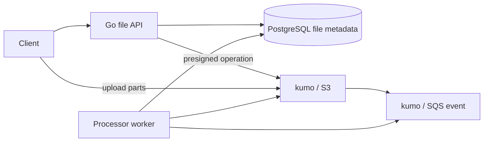
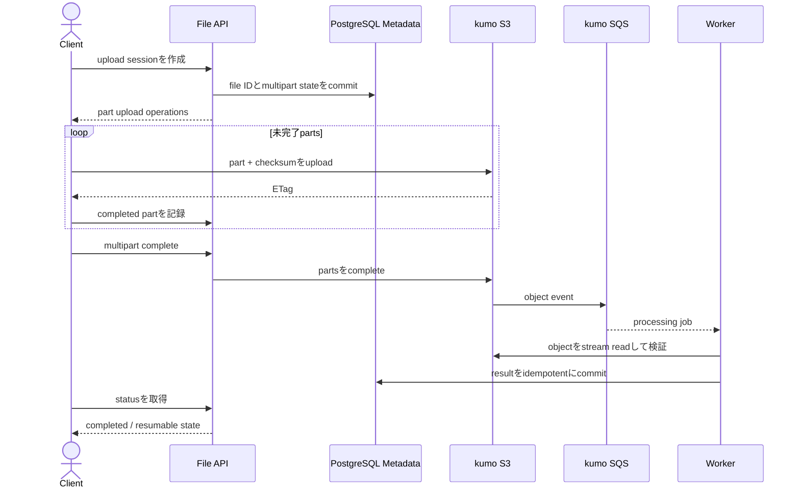

# Resumable File Upload and Processing

大きなfileをS3へ直接uploadし、checksum検証後に非同期workerで処理してprivate downloadを提供するworkspaceです。

- Workspace status: `prepared`
- Active Section: `Section 1 — File lifecycleとobject identity`
- Current files: `README.md`のみ。これは意図した初期状態です。

## 学習の進め方

AIがupload stateと重複eventのtestを書き、学習者がmetadata、presigned request、S3/SQS adapter、worker、runtime設定を実装します。binary codecや実video transcodeは扱いません。

## 最終成果

clientがupload sessionを作り、kumo/S3へsingleまたはmultipart uploadします。serverがsize/checksumを検証してcompleteし、S3 eventを受けたworkerがidempotentに処理済objectを作ります。中断uploadをcleanupし、authorized userだけが短命download URLを取得できます。

## Scope / Non-goals

対象はpresigned URL、multipart、checksum、metadata/object整合、event-driven processing、cleanup、private downloadです。virus detection service、image/video codec、CDN、Elemental、internet upload性能は対象外です。

## ユースケースと不変条件

- upload session発行前にobject keyをserver側で決める。
- requested owner以外はcomplete/downloadできない。
- DBがcompletedになる前のobjectを公開しない。
- declared size/checksumとS3 objectが一致しないuploadを拒否する。
- 同じS3 eventを再処理してもderived objectを重複作成しない。
- original objectと処理結果のidentity/versionを追跡する。
- PostgreSQLがfile lifecycle、S3がbinary objectのsource of truthである。

## システム全体像



### 代表シーケンス



## 外部システム

- PostgreSQL（Docker）: file owner、upload state、expected checksum、object key、processing stateを保存する。
- kumo/S3: original/derived object、multipart upload、presigned operationをAWS SDK for Go v2で扱う。
- kumo/SQS: object-created eventの重複可能な非同期配送を再現する。

## データモデルとtransaction境界

`files(id,owner_id,object_key,status,size,checksum,version)`、`upload_parts`、`processing_jobs(event_id,file_id,status)`を扱います。DB session作成とS3 uploadはatomicではないため、状態照合とcleanupで収束させます。processing completionはevent receiptとmetadata更新を冪等にします。

## 目標layout

```text
resumable-file-processing/
├── README.md
├── go.mod
├── compose.yaml
├── migrations/
├── cmd/{api,processor,cleanup}/
├── internal/{files,postgres,s3store,sqsevents,processor,httpapi}/
└── test/e2e/
```

## Section roadmap

| Section | State | 学ぶこと | 成果物 | 決定的なテスト |
| --- | --- | --- | --- | --- |
| 1. File lifecycle | `active` | state machine、identity、ownership | File domain | pending→uploaded→processing→readyだけを許す |
| 2. Metadata store | `locked` | schema、idempotency、authorization | PostgreSQL repository | ownerとstatus/versionをDB制約込みで守る |
| 3. Presigned single upload | `locked` | direct upload、key、expiry | S3 upload session | clientがAPIを経由せずobjectを保存できる |
| 4. Multipart resume | `locked` | part number、ETag、abort、resume | multipart coordinator | 中断後に既存partから再開しcompleteできる |
| 5. Complete verification | `locked` | checksum、size、partial failure | completion use case | mismatch objectをreadyにしない |
| 6. S3 event processing | `locked` | duplicate event、Inbox、derived object | SQS processor | 同じevent再送で処理結果は1件だけ |
| 7. Cleanupとprivate download | `locked` | orphan、expiry、short-lived access | sweeper/download API | abandoned uploadを消し非ownerを拒否する |
| 8. E2E | `locked` | DB/object/queueの収束 | full upload scenario | multipart→event→ready→downloadをkumoで通す |

## Active Section — File lifecycleとobject identity

**Question:** DB record、S3 object、processing resultが別々に存在しても、1つのlogical fileとして安全に追跡できるか。

**Learn:** state machine、server-generated key、immutable identity、originalとderived state。

**Decide:** status、object key形式、checksum algorithm、version、owner ID、再upload semantics。

**Build:** File、ObjectKey、Checksum、UploadTransitionのpure domainを作る。

**Current micro-step:** AIがpending fileだけをuploadedへ進め、owner・key・checksum欠落を拒否するtestを書いてRedを作る。

**Tests:** valid lifecycle、skip transition、duplicate complete、owner mismatch、checksum形式、zero value。

**Done when:** `go test ./internal/files -count=1`がGreenになり、全state transitionを説明できる。

**Notes/evidence:** まだなし。

## Final acceptance

- PostgreSQL、kumo S3/SQS、multipart、checksum mismatch、duplicate event、cleanup、HTTP E2Eが成功する。
- DB/S3の片方だけ成功するfailureを注入し、reconcile後にreadyまたはcleanedへ収束する。
- unauthorized downloadと期限切れpresigned operationを拒否する。

## Sources

- [Amazon S3 presigned URLs](https://docs.aws.amazon.com/AmazonS3/latest/userguide/using-presigned-url.html)
- [Amazon S3 multipart upload](https://docs.aws.amazon.com/AmazonS3/latest/userguide/mpuoverview.html)
- [Amazon S3 checking object integrity](https://docs.aws.amazon.com/AmazonS3/latest/userguide/checking-object-integrity.html)
- [kumo](https://github.com/sivchari/kumo)
