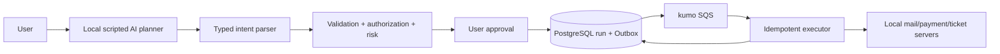

# Safe Agent Tool Execution

AIが送金、メール、ticket作成など副作用のあるtoolを提案しても、validation、authorization、approval、idempotency、budgetを通常のGo codeで保証して安全に実行する仕組みを学ぶworkspaceです。

- Workspace status: `prepared`
- Active Section: `Section 1 — Tool intentとeffect risk`
- Current files: `README.md`のみ。これは意図した初期状態です。

## 学習の進め方

AIが先に「実行してはいけないtrace」をtestで固定し、学習者がplan/execute分離、policy、approval、executorを実装します。LLM役はlocal scripted planner、外部tool役はlocal HTTP server、非同期実行はPostgreSQL Outboxとkumo SQSで再現します。

## 最終成果

model outputを直接実行せず、typed tool intentへparseしてpolicyを評価し、必要ならuser approvalを取得してからeffectを一度だけ実行します。timeoutやduplicate deliveryでも二重作用を防ぎ、loop・token・時間・費用・tool call予算を超えたagent runを停止し、誰が何を承認・実行したか追跡できます。

## Scope / Non-goals

対象はtool contract、input validation、authn/authz、risk、approval、idempotency、Outbox/Inbox、retry、budget、auditです。汎用agent framework、prompt injection完全防御、実銀行/メール/SaaS接続、model trainingは対象外です。

## ユースケースと不変条件

- modelはtool intentを提案するだけで、policy decisionとeffect commitを決定しない。
- schema不正、権限不足、期限切れapproval、改変されたargumentはexecutorへ渡さない。
- approvalはtool名、正規化argument、actor、policy versionへ結び付け、内容変更時は無効にする。
- 1つのidempotency keyにつき外部effectは高々1回だけcommitされる。
- retryable failureとpermanent failureを区別し、曖昧なtimeout後は照会してからretryする。
- step、tool call、elapsed time、token、costのいずれかのbudget到達で停止する。
- secretとPIIをredactしつつ、decisionとeffect IDをauditできる。

## システム全体像



## 外部システム

- Docker PostgreSQL: run、intent、policy decision、approval、execution、idempotency、Outbox/Inbox、audit logを保持する。
- kumo SQS: approved executionをat-least-onceでworkerへ配送する。
- local scripted planner: malformed argument、tool loop、same call repeat、instruction injectionを決定的に返す。
- local tool servers: payment、mail、ticketのsuccess、timeout、unknown commit、duplicate keyを再現する。

## データモデルとtransaction境界

`agent_runs`、`tool_intents(argument_hash,risk)`、`policy_decisions`、`approvals(expires_at,approved_hash)`、`executions(idempotency_key,state,external_effect_id)`、`outbox_events`、`inbox_messages`、`audit_entries`を扱います。approval確定とOutbox enqueueは同一DB transaction、外部effectは別transactionです。executorはidempotency keyでclaimし、曖昧なresponse時はprovider lookupを行います。

## 目標layout

```text
safe-agent-tool-execution/
├── README.md
├── go.mod
├── docker-compose.yml
├── migrations/
├── internal/{intent,policy,approval,budget,execution,outbox,audit,postgres}/
├── cmd/{api,executor}/
└── test/{toolserver,fixtures,integration,e2e}/
```

## Section roadmap

| Section | State | 学ぶこと | 成果物 | 決定的なテスト |
| --- | --- | --- | --- | --- |
| 1. Tool intentとrisk | `active` | typed contract、effect class、argument hash | intent domain | read/write/irreversibleを分類し不正argumentを拒否する |
| 2. Validationとauthorization | `locked` | schema、identity、tenant、resource policy | policy engine | modelが要求しても権限外resourceをdenyする |
| 3. Approval binding | `locked` | informed consent、expiry、TOCTOU | approval token | 承認後のargument改変と期限切れを拒否する |
| 4. Idempotent execution | `locked` | identity、claim、unknown outcome、reconcile | execution state machine | timeout/duplicateでもexternal effectが1回だけ起きる |
| 5. Transactional dispatch | `locked` | Outbox、Inbox、at-least-once、retry/DLQ | SQS executor | crash境界ごとの再開でeffectを欠落・重複させない |
| 6. Run budgetsとloop停止 | `locked` | repeated trace、time/token/cost/tool budget | run controller | 同じtool loopと各budget超過を理由付きで停止する |
| 7. Auditとredaction | `locked` | provenance、decision trace、PII/secret | audit trail | raw secretを残さず1回のeffectをend-to-end追跡する |
| 8. Dangerous-effect E2E | `locked` | deny/approve/execute/reconcile | safe agent boundary | injection、改変、duplicate、timeout、loopを全て安全側へ倒す |

## Active Section — Tool intentとeffect risk

**Question:** modelの自由な出力を、実行可否をcodeで判定できるdataへどう変換するか。

**Learn:** tool schema、canonicalization、effect classification、risk、model/code責任分離。

**Decide:** read-only/reversible/irreversibleの分類、unknown field、amount/address上限、argument hashの正規化規則。

**Build:** ToolDefinition、ToolIntent、EffectClass、RiskLevel、CanonicalArgumentsをpure modelとして作る。

**Current micro-step:** AIがvalid read、送金amount不正、unknown tool、余分なfield、key順が違っても同じargument hashになるtestを書いてRedを作る。

**Tests:** parse、schema、canonical hash、effect classification、risk escalation。

**Done when:** `go test ./internal/intent -count=1`がGreenになり、model outputをまだ外部実行せずriskまで確定できる。

**Notes/evidence:** まだなし。

## Final acceptance

- unit、PostgreSQL、kumo SQS、race、cancel、local tool server、crash matrix、E2E testが成功する。
- unauthorized、unapproved、expired、argument-tampered intentでexternal effectが0件である。
- approved requestをduplicate deliveryとunknown timeoutで実行してもeffectが1件だけである。
- infinite tool traceが全budget内で停止し、stop reasonとaudit trailを返す。

## Sources

- [OpenAI function calling](https://developers.openai.com/api/docs/guides/function-calling)
- [OWASP Top 10 for LLM Applications](https://owasp.org/www-project-top-10-for-large-language-model-applications/)
- [Amazon SQS at-least-once delivery](https://docs.aws.amazon.com/AWSSimpleQueueService/latest/SQSDeveloperGuide/standard-queues-at-least-once-delivery.html)
- [kumo](https://github.com/sivchari/kumo)
