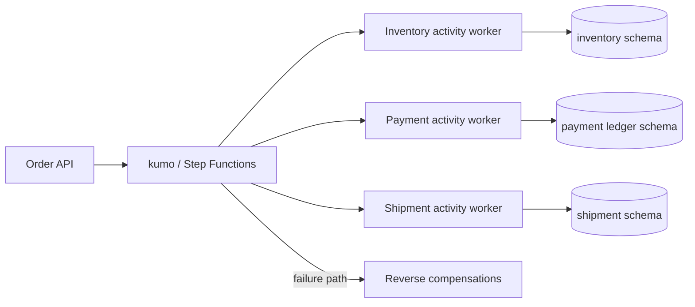

# Saga Compensation with Step Functions

注文、在庫、支払い、配送のように単一DB transactionで囲めない処理を、Sagaと補償transactionで整合させるworkspaceです。

- Workspace status: `prepared`
- Active Section: `Section 1 — Sagaの状態と補償順序`
- Current files: `README.md`のみ。これは意図した初期状態です。

## 学習の進め方

AIがfailure scenarioを先にtestとして書き、学習者が各serviceのcommand、schema、Step Functions定義、workerを実装します。happy pathだけではSectionを完了しません。

## 最終成果

注文受付後に在庫予約、支払い確保、配送枠予約を順に実行します。途中で失敗したら完了済みstepだけを逆順に補償し、retryやworker再起動があっても二重確保・二重返金を起こしません。kumo上のStep Functions ActivityをGo workerが処理します。

## Scope / Non-goals

対象はorchestration型Saga、idempotent command、compensation、retry、timeout、unknown outcome、execution queryです。実決済gateway、配送会社API、2-phase commit、強いglobal consistencyは対象外です。支払いはローカルledgerで模擬します。

## ユースケースと不変条件

- 成功時はinventory、payment、shipmentの各reservationがconfirmedになる。
- shipment失敗時はpaymentをreleaseし、inventoryを戻す。
- 未実行stepのcompensationは呼ばない。補償は完了stepの逆順で行う。
- forward commandとcompensation commandは同じidempotency keyで再実行可能にする。
- timeout時に結果不明なら、状態照会なしに逆操作を決めつけない。
- 各service DBが自身の状態のsource of truth、Step Functionsはworkflow進行のsource of truthである。

## システム全体像



## 外部システム

- PostgreSQL（Docker）: 1 instance内の分離schemaで3serviceの所有権を模擬する。serviceをまたぐSQL transactionは禁止する。
- kumo/Step Functions: state machine、execution、Activity task、callback、retry/catchをAWS SDK for Go v2で試す。
- 外部決済・配送APIは使わない。failureとunknown outcomeを制御できるlocal adapterにする。

## データモデルとtransaction境界

`orders`、`inventory_reservations`、`payment_authorizations`、`shipment_reservations`、各serviceの`processed_commands`を概念recordとします。1 Activityは自serviceの状態とcommand receiptだけを1 transactionでcommitします。Saga全体を囲むDB transactionは存在しません。

## 目標layout

```text
saga-compensation/
├── README.md
├── go.mod
├── compose.yaml
├── state-machine/
├── migrations/
├── cmd/{api,inventory-worker,payment-worker,shipment-worker}/
├── internal/{saga,inventory,payment,shipment,activities,httpapi}/
└── test/e2e/
```

## Section roadmap

| Section | State | 学ぶこと | 成果物 | 決定的なテスト |
| --- | --- | --- | --- | --- |
| 1. Saga状態と補償順序 | `active` | forward/compensation、state machine | pure Saga plan | failure位置ごとに完了stepだけを逆順補償 |
| 2. Service-owned transaction | `locked` | ownership、local atomicity、冪等command | 3つのlocal service | 同一command再送でもresourceが増減しない |
| 3. Step Functions Activity | `locked` | orchestration、task token、callback | ASLとGo activity worker | workerがtaskを取得しsuccess/failureを返す |
| 4. Happy path execution | `locked` | state transition、output contract | complete order workflow | 全step成功で注文と3 reservationがconfirmed |
| 5. Compensation path | `locked` | Catch、逆順、補償失敗 | rollback workflow | shipment失敗でpayment/inventoryがreleaseされる |
| 6. Retry・timeout・unknown | `locked` | retry policy、heartbeat、結果照会 | resilient activities | timeout後も二重chargeせず最終状態を決められる |
| 7. Resumeと重複execution | `locked` | execution identity、recovery、audit | status/reconcile path | 同じorderの重複開始がbusiness effectを増やさない |
| 8. HTTPとE2E | `locked` | public boundary、failure injection | create/status API | 成功と補償をkumo+PostgreSQLでend-to-end確認 |

## Active Section — Sagaの状態と補償順序

**Question:** どのforward stepまで成功したかから、必要な補償だけを安全な順序で導けるか。

**Learn:** orchestration型Saga、compensable/pivot/retryable transaction、補償はrollbackと同一ではないこと。

**Decide:** step名、成功状態、補償可能性、paymentをpivotにするか、補償失敗をどの状態で残すか。

**Build:** SagaStep、execution history、次のforward action、failure時のcompensation planをpure domainとして作る。

**Current micro-step:** AIが「最初に失敗」「在庫後に失敗」「支払い後に失敗」の補償plan testを書き、順序を固定する。

**Tests:** 空history、不正なstep順、重複completion、逆順補償、補償済みstepの再計画。

**Done when:** `go test ./internal/saga -run 'TestCompensationPlan' -count=1`がGreenになる。

**Notes/evidence:** まだなし。

## Final acceptance

- domain、各serviceのPostgreSQL integration、kumo Step Functions integration、race、HTTP E2Eが成功する。
- 任意のstepでfailureを注入し、期待した補償後状態とworkflow historyを確認できる。
- retry、duplicate、worker restartでもbusiness effectが一度分に収束する。

## Sources

- [AWS Prescriptive Guidance: Saga orchestration pattern](https://docs.aws.amazon.com/prescriptive-guidance/latest/cloud-design-patterns/saga-orchestration.html)
- [Step Functions Activities](https://docs.aws.amazon.com/step-functions/latest/dg/concepts-activities.html)
- [Step Functions error handling](https://docs.aws.amazon.com/step-functions/latest/dg/concepts-error-handling.html)
- [kumo](https://github.com/sivchari/kumo)
