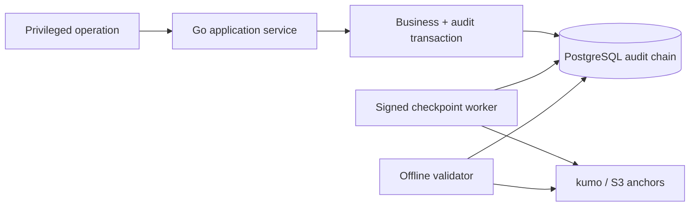

# Tamper-evident Audit Log

重要操作をappend-onlyに記録し、hash chainと署名checkpointで削除・改変を後から検出できるaudit logを学ぶworkspaceです。

- Workspace status: `prepared`
- Active Section: `Section 1 — Audit eventの最小情報とredaction`
- Current files: `README.md`のみ。これは意図した初期状態です。

## 学習の進め方

AIが改変、欠落、secret混入を検出するtestを書き、学習者がevent model、PostgreSQL append、hash chain、checkpoint、query/exportを実装します。tamper-proofではなくtamper-evidentである境界を明記します。

## 最終成果

権限変更やadmin操作をactor、tenant、request、reason、target、result付きで保存します。各entryを前hashへ連結し、batch rootをEd25519署名してkumo/S3へcheckpointします。validatorがrow改変・削除・並べ替えを検出し、secret/個人情報を安全にredactしたexportを作ります。

## Scope / Non-goals

対象はappend-only event、canonical encoding、hash chain、signed checkpoint、redaction、retention、query/exportです。法令適合の保証、SIEM、WORM hardware、秘密鍵本番管理、完全なDB管理者攻撃防御は対象外です。

## ユースケースと不変条件

- actor、action、target、result、request ID、occurred_atを必須にする。
- password、token、raw credential、不要なpayloadを記録しない。
- append順序とprevious hashを一意にする。
- event payload、順序、欠落の変更でchain validationが失敗する。
- checkpoint署名はprivate keyなしに作り直せずpublic keyで検証できる。
- audit append失敗時に重要operationをfail closedにするか明示する。
- PostgreSQL audit entriesがprimary log、S3 checkpointが外部検証anchorである。

## システム全体像



## 外部システム

- PostgreSQL（Docker）: sequence、canonical event、previous/current hash、append権限を保存する。
- kumo/S3: signed checkpointをDBとは別境界へ保存し、validatorが照合する。
- Go標準`crypto/ed25519`: test keyでcheckpointを署名する。本番key managementは対象外。

## データモデルとtransaction境界

`audit_entries(sequence,event_id,actor,tenant,action,target,result,request_id,canonical_payload,previous_hash,entry_hash)`と`audit_checkpoints`を扱います。重要business updateとaudit appendは同じPostgreSQL transactionでcommitします。checkpointはcommit済みrangeを非同期署名します。

## 目標layout

```text
tamper-evident-audit-log/
├── README.md
├── go.mod
├── compose.yaml
├── migrations/
├── cmd/{api,checkpointer,verify,export}/
├── internal/{audit,redaction,postgres,checkpoint,s3store,httpapi}/
└── test/e2e/
```

## Section roadmap

| Section | State | 学ぶこと | 成果物 | 決定的なテスト |
| --- | --- | --- | --- | --- |
| 1. Audit event/redaction | `active` | minimum data、classification、canonical form | AuditEvent | credential fieldを拒否/redactし安定byte列を作る |
| 2. Atomic audit append | `locked` | business/audit transaction、fail policy | PostgreSQL writer | business更新とauditが共にcommit/rollbackする |
| 3. Hash chain | `locked` | sequence、previous hash、canonical bytes | chained entries | payload/順序/欠落改変をvalidatorが検出する |
| 4. Concurrent append | `locked` | serialization、advisory/row lock、throughput | atomic sequence allocator | 並行appendでも1本の連続chainになる |
| 5. Signed checkpoint | `locked` | external anchor、Ed25519、key version | S3 checkpoint | 改変DBから同じ署名を再生成できず検証失敗 |
| 6. Query/export | `locked` | access control、pagination、redaction | audit API/export | tenant/actor/time検索でsecretを出さない |
| 7. Retention/key rotation | `locked` | archive、verification continuity、version | lifecycle policy | archive/rotation後も残存chainを検証できる |
| 8. Tamper E2E | `locked` | attacker model、recovery、evidence | verification scenario | update/delete/reorderの全改変を検出する |

## Active Section — Audit eventの最小情報とredaction

**Question:** 調査に必要な情報を残しながら、credentialや不要な個人情報を永続logへ入れない境界をどう作るか。

**Learn:** audit vs application log、data minimization、canonical serialization、redactionとrejection。

**Decide:** 必須field、許可metadata、禁止key、payload size、canonical JSON、fail closed対象action。

**Build:** AuditEvent、Actor、Target、MetadataPolicy、CanonicalBytesをpure domainで作る。

**Current micro-step:** AIが必須fieldを検証し、password/token系metadataを拒否またはredactし、field順に依存しないbyte列を作るtestを書いてRedを作る。

**Tests:** missing actor/reason、secret keys、nested metadata、oversize、stable canonical form、timestamp。

**Done when:** `go test ./internal/audit -count=1`がGreenになり、raw credentialをeventとして構築できない。

**Notes/evidence:** まだなし。

## Final acceptance

- domain、PostgreSQL atomic append/concurrency、S3 checkpoint、redaction、tamper scenarios、HTTP E2Eが成功する。
- row update/delete/reorderとcheckpoint差替えをfixtureで試し、少なくとも1検証層が必ず失敗する。
- audit logがbusiness event storeやdebug logの代替ではないことをREADMEへ記録する。

## Sources

- [NIST Secure Hash Standard FIPS 180-4](https://csrc.nist.gov/pubs/fips/180-4/upd1/final)
- [Go crypto/ed25519](https://pkg.go.dev/crypto/ed25519)
- [PostgreSQL privileges](https://www.postgresql.org/docs/current/ddl-priv.html)
- [kumo](https://github.com/sivchari/kumo)
