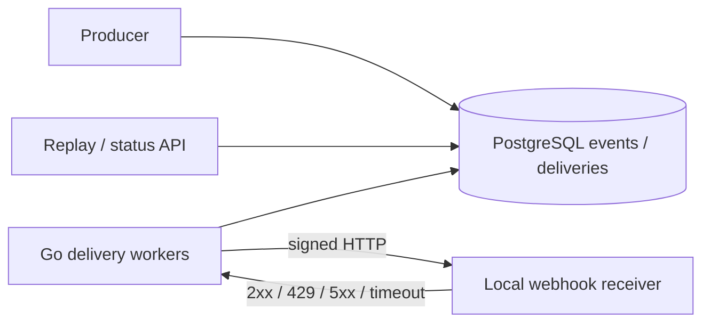
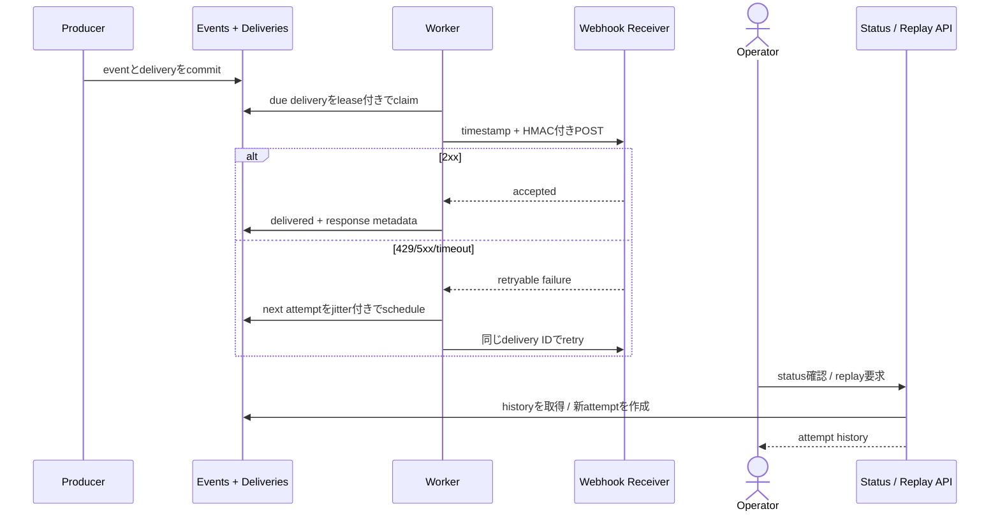

# Reliable Webhook Delivery

system eventを顧客のHTTP endpointへ署名付きで配送し、timeout、429、5xx、重複、endpoint障害を扱うworkspaceです。

- Workspace status: `prepared`
- Active Section: `Section 1 — Delivery eventと署名対象`
- Current files: `README.md`のみ。これは意図した初期状態です。

## 学習の進め方

AIがlocal receiverとfailure scenarioのtestを書き、学習者がevent、signature、delivery store、worker、retry policyを実装します。外部SaaSや実顧客endpointは使いません。

## 最終成果

subscriptionごとにevent deliveryを作り、HMAC署名付きHTTP requestを送ります。receiver timeoutや5xxはjitter付きでretryし、429の`Retry-After`を尊重します。delivery history、manual replay、secret rotation、連続失敗endpointの一時停止を提供します。

## Scope / Non-goals

対象はsignature、delivery log、retry、idempotency、ordering policy、replay、endpoint healthです。顧客登録UI、internet公開、OAuth、任意code実行、global delivery networkは対象外です。

## ユースケースと不変条件

- event IDとpayloadはdelivery attempt間で変えない。
- signatureはtimestamp、event ID、raw bodyを同じbyte列で検証できる。
- delivery成功後のautomatic retryは行わない。
- timeout時は結果不明なので同じevent IDで再送する。
- subscriptionごとにattempt historyをappendし、上書きしない。
- secretを保存・log出力せず、rotation中はcurrent/previousを検証可能にする。
- PostgreSQLがevent、subscription、delivery stateのsource of truthである。

## システム全体像



### 代表シーケンス



## 外部システム

- PostgreSQL（Docker）: subscription、immutable event、delivery、attempt、next retryを保存する。
- local Go HTTP receiver: success、delay、connection close、429、5xxを制御する。外部API登録は不要。
- AWSは使わない。HTTP failureとdurable retryが中心課題であり、transport追加は不要である。

## データモデルとtransaction境界

`subscriptions(id,url,secret_version,status)`、`webhook_events(id,type,payload)`、`deliveries(event_id,subscription_id,status,next_attempt_at)`、`delivery_attempts`を扱います。event作成とdelivery作成はatomicにし、network callはDB transaction外で行います。attempt結果だけを短いtransactionで記録します。

## 目標layout

```text
webhook-delivery/
├── README.md
├── go.mod
├── compose.yaml
├── migrations/
├── cmd/{api,worker}/
├── internal/{webhooks,signing,postgres,delivery,httpapi}/
└── test/{receiver,e2e}/
```

## Section roadmap

| Section | State | 学ぶこと | 成果物 | 決定的なテスト |
| --- | --- | --- | --- | --- |
| 1. Eventと署名対象 | `active` | canonical bytes、identity、timestamp | immutable webhook event | 同じ入力から同じ署名対象を作り改変を検出する |
| 2. HMAC signature | `locked` | MAC、constant-time比較、rotation | signer/verifier | body・timestamp・IDのどれを変えても検証失敗 |
| 3. Delivery store | `locked` | fan-out、atomicity、history | PostgreSQL schema | eventと全subscription deliveryが共にcommitする |
| 4. HTTP attempt | `locked` | timeout、body limit、result分類 | delivery client | 2xx/429/5xx/切断を正しく分類する |
| 5. Retry policy | `locked` | backoff、jitter、Retry-After | scheduled retry | fake clockで次attempt時刻と上限を検証する |
| 6. Orderingとendpoint health | `locked` | per-subscription順序、circuit breaker | delivery coordinator | 連続失敗でpauseし他endpointを巻き込まない |
| 7. Replayとsecret rotation | `locked` | audit、manual recovery、key version | replay/status API | replayは新delivery IDで同じeventを配送する |
| 8. E2E | `locked` | durable external boundary | local receiver scenario | timeout→retry→2xxと署名検証を実DBで通す |

## Active Section — Delivery eventと署名対象

**Question:** retryしてもreceiverが同じlogical eventと判断でき、途中proxyやdecode方法に左右されない署名対象をどう作るか。

**Learn:** immutable event ID、raw body、canonicalizationを避ける設計、timestamp replay window。

**Decide:** header名、署名version、timestamp精度、payload serialization、event ID形式。

**Build:** WebhookEvent、EncodedDelivery、SigningInputをpure domainで作る。

**Current micro-step:** AIがevent ID・timestamp・raw bodyから安定した署名対象byte列を作るtestを書いてRedを作る。

**Tests:** body内空白、field順、空ID、timestamp、payload mutation、同一retry。

**Done when:** `go test ./internal/webhooks -count=1`がGreenになり、retryで署名対象が変わらない。

**Notes/evidence:** まだなし。

## Final acceptance

- signing、PostgreSQL、HTTP failure、retry、concurrency、manual replay、E2Eが成功する。
- commit後crash、receiver成功後ack前crashを再現し、同じevent IDで安全に再送する。
- secretやraw credentialがlog・delivery historyに残らない。

## Sources

- [HMAC RFC 2104](https://www.rfc-editor.org/rfc/rfc2104.html)
- [HTTP Message Signatures RFC 9421](https://www.rfc-editor.org/rfc/rfc9421.html)
- [Retry-After semantics RFC 9110](https://www.rfc-editor.org/rfc/rfc9110.html#name-retry-after)
- [AWS Builders' Library: timeouts, retries and backoff with jitter](https://aws.amazon.com/builders-library/timeouts-retries-and-backoff-with-jitter/)
