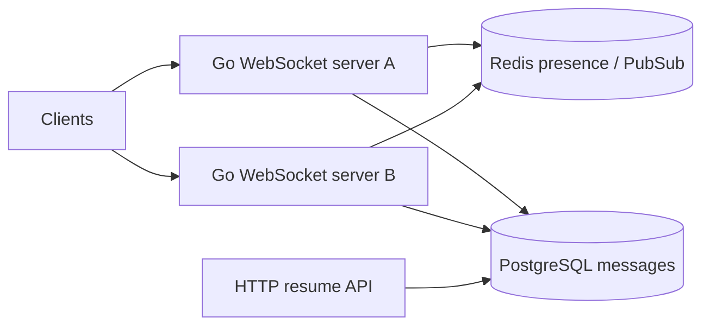
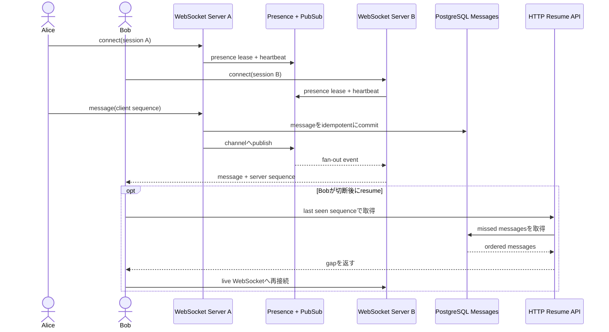

# WebSocket Presence and Chat Delivery

複数のGo server間でonline presenceとchat messageを扱い、reconnect、slow consumer、offline resumeを安全に処理するworkspaceです。

- Workspace status: `prepared`
- Active Section: `Section 1 — Session generationとpresence lifecycle`
- Current files: `README.md`のみ。これは意図した初期状態です。

## 学習の進め方

AIがfake connection/clockから始め、後半でreal WebSocket・Redis・PostgreSQL integration testを書きます。学習者がsession、hub、message store、fan-out、backpressureを実装します。

## 最終成果

userが複数deviceから接続し、heartbeatでpresenceを更新します。messageはPostgreSQLへ永続化してからRedis Pub/Subでonline connectionへfan-outし、offline/reconnect時はcursorから欠落分を取得します。古いconnection、duplicate delivery、slow consumer、server shutdownを扱います。

## Scope / Non-goals

対象はWebSocket lifecycle、heartbeat、TTL presence、multi-device、durable message、fan-out、resume cursor、backpressure、graceful shutdownです。E2E暗号化、media message、push通知、global ordering、巨大room fan-outは対象外です。

## ユースケースと不変条件

- userのonline状態は1 connectionではなく有効session集合から導く。
- 新generation接続後、古いconnectionのheartbeatで状態を巻き戻さない。
- messageはPostgreSQL commit後だけonline fan-outする。
- duplicate fan-outを受けてもclient-visible message IDは同じである。
- offline期間のmessageをcursorから重複・欠落なくresumeできる。
- slow connectionはbounded queueを超えてserver全体を止めない。
- PostgreSQLがmessageのsource of truth、Redis presence/PubSubはephemeral stateである。

## システム全体像



### 代表シーケンス



## 外部システム

- PostgreSQL（Docker）: room membership、ordered message、read cursorを保存する。
- Redis（Docker）: session TTL、server routing、Pub/Sub fan-outを保持する。消失してもmessageは失わない。
- Go WebSocket library: protocol framingを再実装せずapplication lifecycleに集中する。

## データモデルとtransaction境界

`sessions(user_id,device_id,generation,server_id,expires_at)`はRedis上のephemeral model、`messages(room_id,sequence,id,sender,payload)`と`read_cursors`はPostgreSQLに保存します。message insertでroom sequenceを確定してcommit後にpublishします。

## 目標layout

```text
websocket-presence/
├── README.md
├── go.mod
├── compose.yaml
├── migrations/
├── cmd/server/
├── internal/{presence,chat,postgres,redishub,websocket,httpapi}/
└── test/e2e/
```

## Section roadmap

| Section | State | 学ぶこと | 成果物 | 決定的なテスト |
| --- | --- | --- | --- | --- |
| 1. Session/presence lifecycle | `active` | heartbeat、TTL、generation、multi-device | pure presence model | stale heartbeatで新sessionを上書きしない |
| 2. Redis presence | `locked` | TTL、atomic refresh、disconnect race | presence repository | 複数deviceの1つ切断ではofflineにならない |
| 3. Durable messages | `locked` | room sequence、idempotency、transaction | PostgreSQL message store | 並行sendでもsequenceが一意で連続する |
| 4. Pub/Sub fan-out | `locked` | multi-server routing、duplicate、ephemeral bus | Redis hub | 別server接続userへcommitted messageが届く |
| 5. Reconnect/resume | `locked` | cursor、offline gap、pagination | history API | disconnect中messageを重複・欠落なく取得する |
| 6. Backpressure | `locked` | bounded queue、drop/disconnect policy | connection writer | slow clientが他connectionを停止させない |
| 7. Read receipt/shutdown | `locked` | monotonic cursor、drain、context | receipt/lifecycle | receipt後退を拒否しshutdown中messageを失わない |
| 8. E2E | `locked` | real sockets、2 server、recovery | chat scenario | connect→send→offline→resumeを実境界で通す |

## Active Section — Session generationとpresence lifecycle

**Question:** reconnectと複数deviceがあるとき、古いconnection eventで新しいonline stateを消さないために何をidentityにするか。

**Learn:** session generation、lease/TTL、heartbeat、ephemeral state、logical user presence。

**Decide:** user/device/session ID、generation、heartbeat interval、expiry、multi-device online判定。

**Build:** Session、PresenceSet、Connect/Heartbeat/Disconnect/Expire transitionをpure domainで作る。

**Current micro-step:** AIが同deviceのnew generation接続後にold disconnect/heartbeatを無視するtestを書いてRedを作る。

**Tests:** first connect、reconnect、stale event、multi-device、一部expire、all expire、clock境界。

**Done when:** `go test ./internal/presence -count=1`がGreenになり、user online判定がsession集合から導かれる。

**Notes/evidence:** まだなし。

## Final acceptance

- domain、real WebSocket、PostgreSQL/Redis、2 server、slow consumer、resume、shutdown、race E2Eが成功する。
- Redis再起動でpresenceが一時消えてもmessage historyを失わず再接続で回復する。
- duplicate/stale connection eventとparallel sendで順序・identityを壊さない。

## Sources

- [WebSocket Protocol RFC 6455](https://www.rfc-editor.org/rfc/rfc6455.html)
- [Redis Pub/Sub](https://redis.io/docs/latest/develop/pubsub/)
- [Redis key expiration](https://redis.io/docs/latest/develop/data-types/strings/#key-expiration)
